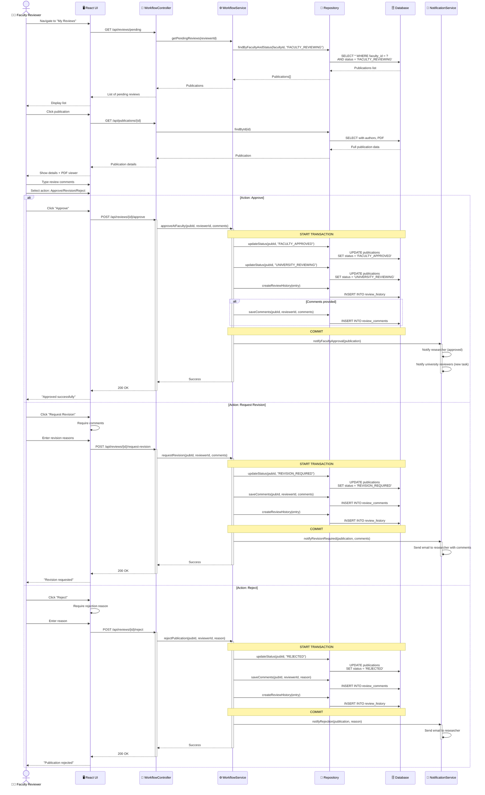

# Sequence Diagram: Faculty Review Process

> 📊 **Diagram ID**: SEQ-03  
> 🎯 **Use Case**: UC-D2-05 - Faculty Review  
> 👤 **Actor**: Faculty Reviewer  
> ⚙️ **Key**: Review, Approve/Reject/Request Revision

---

## 📊 Sequence Diagram



---

## 📋 Three Actions

### 1. Approve ✅
- Status: `FACULTY_REVIEWING` → `FACULTY_APPROVED` → `UNIVERSITY_REVIEWING`
- Notification: Researcher (approved) + University Reviewers (new task)
- Comments optional

### 2. Request Revision 📝
- Status: `FACULTY_REVIEWING` → `REVISION_REQUIRED`
- Researcher can re-edit → resubmit
- Comments **required**

### 3. Reject ❌
- Status: `FACULTY_REVIEWING` → `REJECTED`
- Final rejection (cannot resubmit without SuperAdmin)
- Reason **required**

---

## 🗄️ Database Changes

### Approve
```sql
-- Status transitions
UPDATE publications SET status = 'FACULTY_APPROVED' WHERE id = ?;
UPDATE publications SET status = 'UNIVERSITY_REVIEWING' WHERE id = ?;

-- History
INSERT INTO review_history (publication_id, from_status, to_status, actor_id, action, comments)
VALUES (?, 'FACULTY_REVIEWING', 'UNIVERSITY_REVIEWING', ?, 'APPROVE', ?);
```

### Request Revision
```sql
UPDATE publications SET status = 'REVISION_REQUIRED' WHERE id = ?;

INSERT INTO review_comments (publication_id, reviewer_id, comment_type, comment_text)
VALUES (?, ?, 'REVISION_REQUEST', ?);

INSERT INTO review_history ...
```

### Reject
```sql
UPDATE publications SET status = 'REJECTED' WHERE id = ?;

INSERT INTO review_comments (publication_id, reviewer_id, comment_type, comment_text)
VALUES (?, ?, 'REJECTION_REASON', ?);

INSERT INTO review_history ...
```

---

**Related**: FR-APR-005 to APR-009, US-FCR-002 to FCR-005  
**Created**: 10/02/2026
