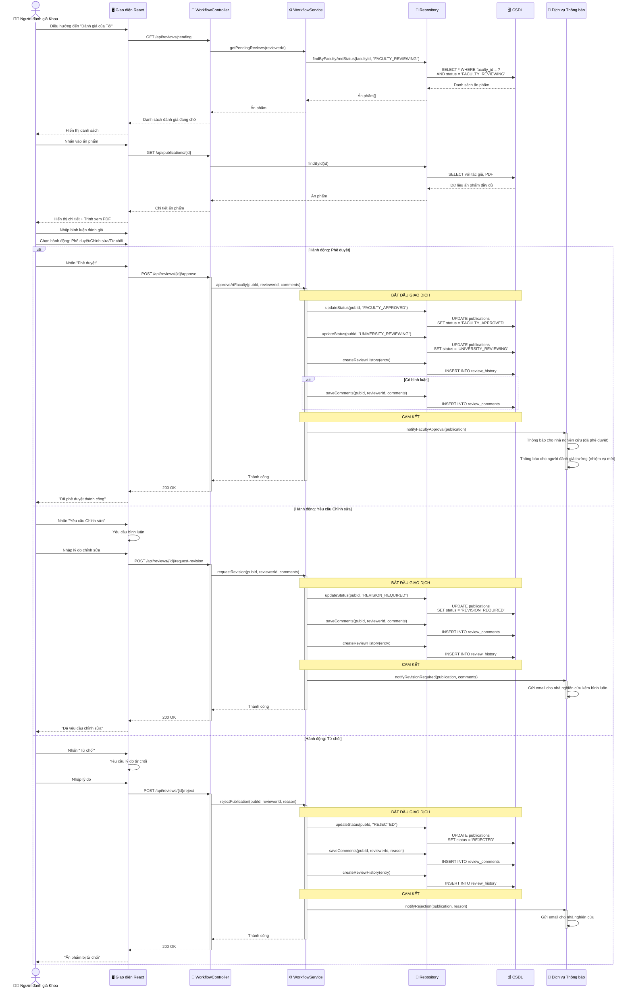

# Biểu đồ Tuần tự: Quy trình Đánh giá cấp Khoa

> 📊 **ID Biểu đồ**: SEQ-03  
> 🎯 **Ca Sử Dụng**: UC-D2-05 - Đánh giá Khoa  
> 👤 **Tác nhân**: Người đánh giá Khoa  
> ⚙️ **Chính**: Đánh giá, Phê duyệt/Từ chối/Yêu cầu Chỉnh sửa

---

## 📊 Biểu đồ Tuần tự



---

## 📋 Ba Hành Động

### 1. Phê duyệt ✅
- Trạng thái: `FACULTY_REVIEWING` → `FACULTY_APPROVED` → `UNIVERSITY_REVIEWING`
- Thông báo: Nhà nghiên cứu (đã phê duyệt) + Người đánh giá Trường (nhiệm vụ mới)
- Bình luận tùy chọn

### 2. Yêu cầu Chỉnh sửa 📝
- Trạng thái: `FACULTY_REVIEWING` → `REVISION_REQUIRED`
- Nhà nghiên cứu có thể chỉnh sửa lại → gửi lại
- Bình luận **bắt buộc**

### 3. Từ chối ❌
- Trạng thái: `FACULTY_REVIEWING` → `REJECTED`
- Từ chối cuối cùng (không thể gửi lại nếu không có SuperAdmin)
- Lý do **bắt buộc**

---

## 🗄️ Thay Đổi Cơ Sở Dữ Liệu

### Phê duyệt
```sql
-- Chuyển đổi trạng thái
UPDATE publications SET status = 'FACULTY_APPROVED' WHERE id = ?;
UPDATE publications SET status = 'UNIVERSITY_REVIEWING' WHERE id = ?;

-- Lịch sử
INSERT INTO review_history (publication_id, from_status, to_status, actor_id, action, comments)
VALUES (?, 'FACULTY_REVIEWING', 'UNIVERSITY_REVIEWING', ?, 'APPROVE', ?);
```

### Yêu cầu Chỉnh sửa
```sql
UPDATE publications SET status = 'REVISION_REQUIRED' WHERE id = ?;

INSERT INTO review_comments (publication_id, reviewer_id, comment_type, comment_text)
VALUES (?, ?, 'REVISION_REQUEST', ?);

INSERT INTO review_history ...
```

### Từ chối
```sql
UPDATE publications SET status = 'REJECTED' WHERE id = ?;

INSERT INTO review_comments (publication_id, reviewer_id, comment_type, comment_text)
VALUES (?, ?, 'REJECTION_REASON', ?);

INSERT INTO review_history ...
```

---

**Liên quan**: FR-APR-005 đến APR-009, US-FCR-002 đến FCR-005  
**Ngày tạo**: 10/02/2026
