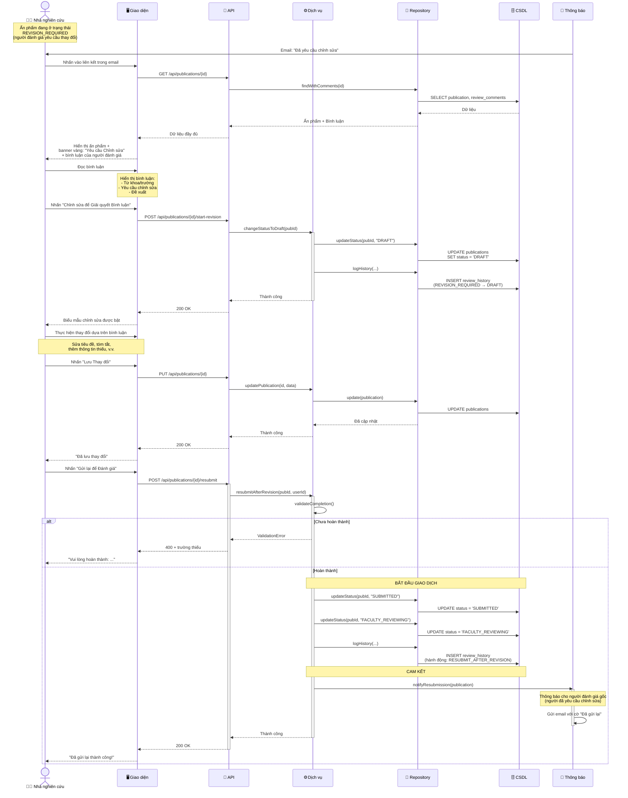
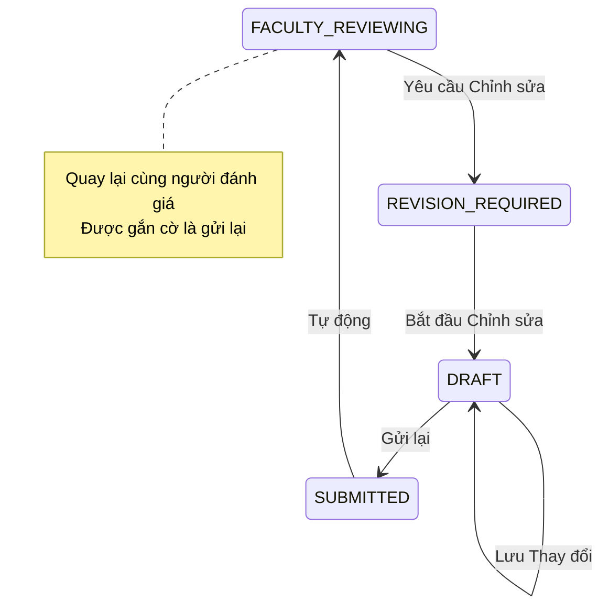

# Biểu đồ Tuần tự: Luồng Yêu cầu Chỉnh sửa

> 📊 **ID Biểu đồ**: SEQ-05  
> 🎯 **Luồng Thay Thế**: Yêu cầu Chỉnh sửa  
> 👤 **Tác nhân**: Người đánh giá → Nhà nghiên cứu  
> ⚙️ **Kết quả**: Nhà nghiên cứu chỉnh sửa và gửi lại

---

## 📊 Biểu đồ Tuần tự



---

## 📋 Các Bước Luồng

### 1. Thông báo
- Nhà nghiên cứu nhận email: "Đã yêu cầu chỉnh sửa"
- Email chứa:
  - Bình luận của người đánh giá
  - Liên kết đến ấn phẩm
  - Hạn chót (nếu có - P2)

### 2. Xem Bình luận
- Trạng thái ấn phẩm = `REVISION_REQUIRED`
- Giao diện hiển thị banner vàng: "Yêu cầu Chỉnh sửa"
- Hiển thị tất cả bình luận đánh giá từ người đánh giá

### 3. Bắt đầu Chỉnh sửa
- Nhấn "Chỉnh sửa để Giải quyết Bình luận"
- Trạng thái chuyển lại thành `DRAFT`
- Biểu mẫu chỉnh sửa được bật
- Bình luận vẫn hiển thị để tham khảo

### 4. Thực hiện Thay đổi
- Nhà nghiên cứu giải quyết từng bình luận
- Có thể đánh dấu bình luận là "Đã giải quyết" (P2)
- Lưu thay đổi dần dần

### 5. Gửi lại
- Nhấn "Gửi lại để Đánh giá"
- Hệ thống xác thực hoàn thành (giống như lần gửi đầu tiên)
- Trạng thái: `DRAFT` → `SUBMITTED` → `FACULTY_REVIEWING`
- Cờ: Đây là lần gửi lại (không phải mới)

### 6. Đánh giá lại
- Quay lại **cùng người đánh giá**
- Người đánh giá có thể thấy:
  - Bình luận gốc
  - Những gì đã thay đổi (diff - P2)
  - Đây là một bản gửi lại sau chỉnh sửa

---

## 📧 Thông báo Email

### Đến Nhà nghiên cứu (Yêu cầu Chỉnh sửa)
```
Chủ đề: Yêu cầu chỉnh sửa - {title}

Thân gửi {researcher_name},

Người đánh giá đã yêu cầu chỉnh sửa cho ấn phẩm của bạn:

Tiêu đề: {title}
Người đánh giá: {reviewer_name}
Ngày: {timestamp}

Bình luận:
{comments}

Vui lòng thực hiện các thay đổi cần thiết và gửi lại.

Xem ấn phẩm: {url}

Trân trọng,
UFPMS
```

### Đến Người đánh giá (Đã gửi lại)
```
Chủ đề: Ấn phẩm đã được gửi lại - {title}

Thân gửi {reviewer_name},

Ấn phẩm bạn yêu cầu chỉnh sửa đã được gửi lại:

Tiêu đề: {title}
Nhà nghiên cứu: {researcher_name}
Đã gửi lại: {timestamp}

Bình luận gốc: {original_comments}

Vui lòng đánh giá: {url}

Trân trọng,
UFPMS
```

---

## 🗄️ Thay Đổi Cơ Sở Dữ Liệu

### Bắt đầu Chỉnh sửa
```sql
UPDATE publications 
SET status = 'DRAFT'
WHERE id = ? AND status = 'REVISION_REQUIRED';

INSERT INTO review_history (
    publication_id, from_status, to_status,
    actor_id, action
) VALUES (
    ?, 'REVISION_REQUIRED', 'DRAFT',
    ?, 'START_REVISION'
);
```

### Gửi lại Sau khi Chỉnh sửa
```sql
UPDATE publications 
SET status = 'FACULTY_REVIEWING'
WHERE id = ? AND status = 'DRAFT';

INSERT INTO review_history (
    publication_id, from_status, to_status,
    actor_id, action, is_resubmission
) VALUES (
    ?, 'DRAFT', 'FACULTY_REVIEWING',
    ?, 'RESUBMIT_AFTER_REVISION', TRUE
);
```

---

## 🔄 Chuyển đổi Trạng thái



---

## 💡 Quy Tắc Nghiệp Vụ

1. **Nhà nghiên cứu có thể chỉnh sửa không giới hạn lần** khi ở trạng thái DRAFT
2. **Cho phép nhiều lần chỉnh sửa**: Người đánh giá có thể yêu cầu chỉnh sửa lại
3. **Theo dõi hạn chót** (P2): Gửi nhắc nhở nếu không gửi lại trong X ngày
4. **Số lần chỉnh sửa**: Theo dõi số lần đã chỉnh sửa (để phân tích)

---

**Liên quan**: FR-APR-008, FR-APR-003, US-RES-012, US-FCR-004  
**Ngày tạo**: 10/02/2026
