# Sequence Diagram: Revision Request Flow

> 📊 **Diagram ID**: SEQ-05  
> 🎯 **Alternative Flow**: Request Revision  
> 👤 **Actors**: Reviewer → Researcher  
> ⚙️ **Result**: Researcher edits and resubmits

---

## 📊 Sequence Diagram

```mermaid
sequenceDiagram
    actor Researcher as 👨‍🔬 Researcher
    participant UI as 🖥️ UI
    participant API as 🔌 API
    participant Service as ⚙️ Service
    participant Repo as 💾 Repo
    participant DB as 🗄️ DB
    participant Notif as 📧 Notif
    
    Note over Researcher: Publication is in<br/>REVISION_REQUIRED state<br/>(reviewer requested changes)
    
    %% Step 1: Receive notification
    Notif->>Researcher: Email: "Revision requested"
    Researcher->>UI: Click link in email
    
    %% View revision requirements
    UI->>API: GET /api/publications/{id}
    API->>Repo: findWithComments(id)
    Repo->>DB: SELECT publication, review_comments
    DB-->>Repo: Data
    Repo-->>API: Publication + Comments
    API-->>UI: Full data
    UI-->>Researcher: Show publication +<br/>yellow banner: "Revision Required"<br/>+ reviewer comments
    
    %% Read comments
    Researcher->>UI: Read comments
    Note over UI: Display comments:<br/>- From faculty/university<br/>- Revision requirements<br/>- Suggestions
    
    %% Edit to address
    Researcher->>UI: Click "Edit to Address Comments"
    UI->>API: POST /api/publications/{id}/start-revision
    API->>Service: changeStatusToDraft(pubId)
    activate Service
    Service->>Repo: updateStatus(pubId, "DRAFT")
    Repo->>DB: UPDATE publications<br/>SET status = 'DRAFT'
    Service->>Repo: logHistory(...)
    Repo->>DB: INSERT review_history<br/>(REVISION_REQUIRED → DRAFT)
    Service-->>API: Success
    deactivate Service
    API-->>UI: 200 OK
    UI-->>Researcher: Edit form enabled
    
    %% Make changes
    Researcher->>UI: Make changes based on comments
    Note over Researcher,UI: Fix title, abstract,<br/>add missing info, etc.
    
    Researcher->>UI: Click "Save Changes"
    UI->>API: PUT /api/publications/{id}
    API->>Service: updatePublication(id, data)
    Service->>Repo: update(publication)
    Repo->>DB: UPDATE publications
    Repo-->>Service: Updated
    Service-->>API: Success
    API-->>UI: 200 OK
    UI-->>Researcher: "Changes saved"
    
    %% Resubmit
    Researcher->>UI: Click "Resubmit for Review"
    UI->>API: POST /api/publications/{id}/resubmit
    activate API
    API->>Service: resubmitAfterRevision(pubId, userId)
    activate Service
    
    %% Validate completion again
    Service->>Service: validateCompletion()
    
    alt Incomplete
        Service-->>API: ValidationError
        API-->>UI: 400 + missing fields
        UI-->>Researcher: "Please complete: ..."
    else Complete
        Note over Service,DB: START TRANSACTION
        
        %% Status transitions
        Service->>Repo: updateStatus(pubId, "SUBMITTED")
        Repo->>DB: UPDATE status = 'SUBMITTED'
        
        Service->>Repo: updateStatus(pubId, "FACULTY_REVIEWING")
        Repo->>DB: UPDATE status = 'FACULTY_REVIEWING'
        
        %% Log resubmission
        Service->>Repo: logHistory(...)
        Repo->>DB: INSERT review_history<br/>(action: RESUBMIT_AFTER_REVISION)
        
        Note over Service,DB: COMMIT
        
        %% Notify same reviewers
        Service->>Notif: notifyResubmission(publication)
        activate Notif
        Note over Notif: Notify original reviewer<br/>(same person who requested revision)
        Notif->>Notif: Send email with "Resubmitted" flag
        deactivate Notif
        
        Service-->>API: Success
        deactivate Service
        API-->>UI: 200 OK
        deactivate API
        UI-->>Researcher: "Resubmitted successfully!"
    end
```



---

## 📋 Flow Steps

### 1. Notification
- Researcher receives email: "Revision requested"
- Email contains:
  - Reviewer comments
  - Link to publication
  - Deadline (if any - P2)

### 2. View Comments
- Publication status = `REVISION_REQUIRED`
- UI shows yellow banner: "Revision Required"
- Display all review comments from reviewer(s)

### 3. Start Revision
- Click "Edit to Address Comments"
- Status changes back to `DRAFT`
- Edit form enabled
- Comments still visible for reference

### 4. Make Changes
- Researcher addresses each comment
- Can mark comments as "Addressed" (P2)
- Save changes incrementally

### 5. Resubmit
- Click "Resubmit for Review"
- System validates completion (same as initial submission)
- Status: `DRAFT` → `SUBMITTED` → `FACULTY_REVIEWING`
- Flag: This is a resubmission (not new)

### 6. Re-Review
- Goes back to **same reviewer**
- Reviewer can see:
  - Original comments
  - What changed (diff - P2)
  - This is a revision resubmission

---

## 📧 Email Notifications

### To Researcher (Revision Requested)
```
Subject: Revision requested - {title}

Hello {researcher_name},

The reviewer has requested revisions to your publication:

Title: {title}
Reviewer: {reviewer_name}
Date: {timestamp}

Comments:
{comments}

Please make necessary changes and resubmit.

View publication: {url}

Best regards,
UFPMS
```

### To Reviewer (Resubmitted)
```
Subject: Publication resubmitted - {title}

Hello {reviewer_name},

The publication you requested revisions for has been resubmitted:

Title: {title}
Researcher: {researcher_name}
Resubmitted: {timestamp}

Original comments: {original_comments}

Please review: {url}

Best regards,
UFPMS
```

---

## 🗄️ Database Changes

### Start Revision
```sql
UPDATE publications 
SET status = 'DRAFT'
WHERE id = ? AND status = 'REVISION_REQUIRED';

INSERT INTO review_history (
    publication_id, from_status, to_status,
    actor_id, action
) VALUES (
    ?, 'REVISION_REQUIRED', 'DRAFT',
    ?, 'START_REVISION'
);
```

### Resubmit After Revision
```sql
UPDATE publications 
SET status = 'FACULTY_REVIEWING'
WHERE id = ? AND status = 'DRAFT';

INSERT INTO review_history (
    publication_id, from_status, to_status,
    actor_id, action, is_resubmission
) VALUES (
    ?, 'DRAFT', 'FACULTY_REVIEWING',
    ?, 'RESUBMIT_AFTER_REVISION', TRUE
);
```

---

## 🔄 State Transitions


---

## 💡 Business Rules

1. **Researcher can edit unlimited times** while in DRAFT
2. **Multiple revisions allowed**: Reviewer can request revision again
3. **Deadline tracking** (P2): Send reminders if not resubmitted in X days
4. **Revision count**: Track how many times revised (for analytics)

---

**Related**: FR-APR-008, FR-APR-003, US-RES-012, US-FCR-004  
**Created**: 10/02/2026
