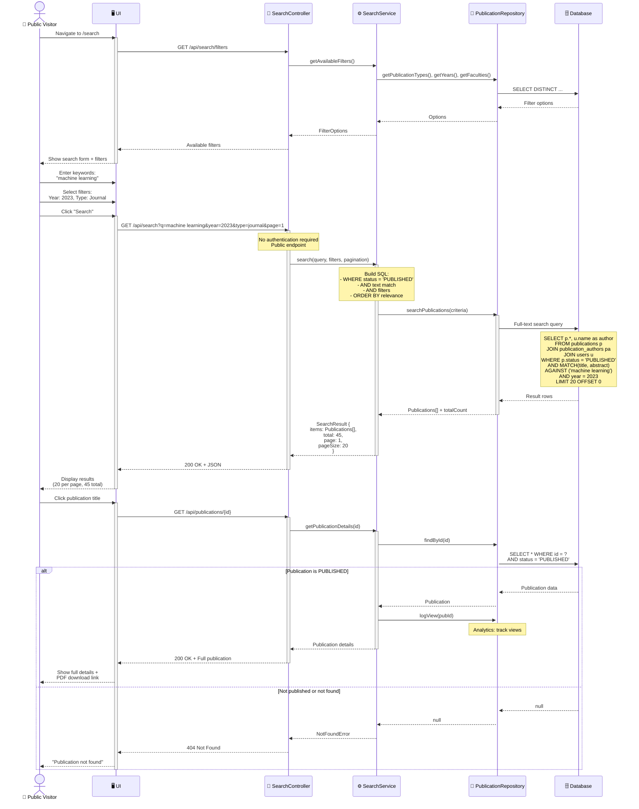

# Sequence Diagram: Search Publications

> 📊 **Diagram ID**: SEQ-06  
> 🎯 **Use Case**: UC-D3-01 - Search Publications  
> 👤 **Actor**: Public Visitor (unauthenticated)  
> ⚙️ **Key**: Public access, visibility filtering

---

## 📊 Sequence Diagram



---

## 📋 Search Features

### 1. Full-Text Search
- Search in: title, abstract, keywords
- MySQL `MATCH ... AGAINST` or ElasticSearch (P2)
- Ranking by relevance

### 2. Filters
- **Year**: dropdown or range
- **Publication Type**: Journal, Conference,Book Chapter
- **Faculty**: All faculties
- **Quartile**: Q1, Q2, Q3, Q4 (if available)
- **Has PDF**: checkbox

### 3. Pagination
- 20 results per page (default)
- Page navigation
- Show total count

---

## 🔒 Visibility Rule

**CRITICAL**: CHỈ publications với `status = 'PUBLISHED'` mới visible cho public

```sql
-- Always include this WHERE clause for public search
WHERE status = 'PUBLISHED'
```

**For logged-in researchers**:
```sql
-- Can see PUBLISHED + own publications
WHERE status = 'PUBLISHED' 
   OR owner_id = {current_user_id}
```

---

## 📊 Search Query Example

```sql
SELECT 
    p.id,
    p.title,
    p.year,
    p.journal,
    p.publication_type,
    p.doi,
    GROUP_CONCAT(u.name) as authors,
    MATCH(p.title, p.abstract) AGAINST ('machine learning') as relevance
FROM publications p
LEFT JOIN publication_authors pa ON p.id = pa.publication_id
LEFT JOIN users u ON pa.user_id = u.id
WHERE p.status = 'PUBLISHED'
  AND MATCH(p.title, p.abstract) AGAINST ('machine learning' IN NATURAL LANGUAGE MODE)
  AND p.year = 2023
  AND p.publication_type = 'JOURNAL'
GROUP BY p.id
ORDER BY relevance DESC, p.year DESC
LIMIT 20 OFFSET 0;
```

---

## 📈 Response Format

```json
{
  "query": "machine learning",
  "filters": {
    "year": 2023,
    "type": "journal"
  },
  "results": {
    "items": [
      {
        "id": 123,
        "title": "Machine Learning for...",
        "authors": ["Nguyen Van A", "Tran Thi B"],
        "year": 2023,
        "journal": "IEEE Transactions...",
        "doi": "10.1234/example",
        "relevance": 0.95
      }
    ],
    "pagination": {
      "page": 1,
      "pageSize": 20,
      "total": 45,
      "totalPages": 3
    }
  }
}
```

---

## 🚀 Performance Optimization

### Database Indexes
```sql
-- Full-text index
CREATE FULLTEXT INDEX idx_search ON publications(title, abstract, keywords);

-- Filter indexes
CREATE INDEX idx_year ON publications(year);
CREATE INDEX idx_type ON publications(publication_type);
CREATE INDEX idx_status ON publications(status);

-- Composite index for common queries
CREATE INDEX idx_status_year ON publications(status, year);
```

### Caching (P1)
- Cache filter options (rarely change)
- Cache popular searches (Redis)
- Cache publication details (frequently viewed)

---

**Related**: FR-SRC-001 to FR-SRC-005, US-VIW-001, US-VIW-005  
**Created**: 10/02/2026
