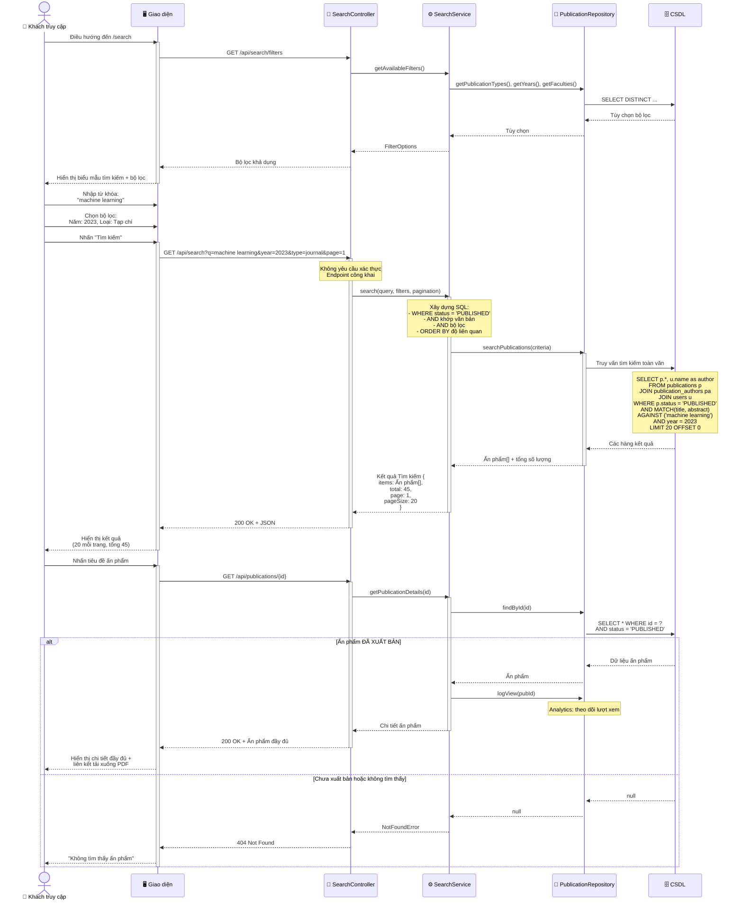

# Biểu đồ Tuần tự: Tìm kiếm Ấn phẩm

> 📊 **ID Biểu đồ**: SEQ-06  
> 🎯 **Ca Sử Dụng**: UC-D3-01 - Tìm kiếm Ấn phẩm  
> 👤 **Tác nhân**: Khách truy cập (chưa đăng nhập)  
> ⚙️ **Chính**: Truy cập công khai, lọc khả năng hiển thị

---

## 📊 Biểu đồ Tuần tự



---

## 📋 Tính năng Tìm kiếm

### 1. Tìm kiếm Toàn văn
- Tìm trong: tiêu đề, tóm tắt, từ khóa
- MySQL `MATCH ... AGAINST` hoặc ElasticSearch (P2)
- Xếp hạng theo mức độ liên quan

### 2. Bộ lọc
- **Năm**: danh sách thả xuống hoặc khoảng
- **Loại Ấn phẩm**: Tạp chí, Hội nghị, Chương Sách
- **Khoa**: Tất cả các khoa
- **Hạng**: Q1, Q2, Q3, Q4 (nếu có)
- **Có PDF**: hộp kiểm

### 3. Phân trang
- 20 kết quả mỗi trang (mặc định)
- Điều hướng trang
- Hiển thị tổng số lượng

---

## 🔒 Quy tắc Hiển thị

**QUAN TRỌNG**: CHỈ publications với `status = 'PUBLISHED'` mới hiển thị cho công chúng

```sql
-- Luôn bao gồm mệnh đề WHERE này cho tìm kiếm công khai
WHERE status = 'PUBLISHED'
```

**Cho nhà nghiên cứu đã đăng nhập**:
```sql
-- Có thể xem ĐÃ XUẤT BẢN + ấn phẩm của chính mình
WHERE status = 'PUBLISHED' 
   OR owner_id = {current_user_id}
```

---

## 📊 Ví dụ Truy vấn Tìm kiếm

```sql
SELECT 
    p.id,
    p.title,
    p.year,
    p.journal,
    p.publication_type,
    p.doi,
    GROUP_CONCAT(u.name) as authors,
    MATCH(p.title, p.abstract) AGAINST ('machine learning') as relevance
FROM publications p
LEFT JOIN publication_authors pa ON p.id = pa.publication_id
LEFT JOIN users u ON pa.user_id = u.id
WHERE p.status = 'PUBLISHED'
  AND MATCH(p.title, p.abstract) AGAINST ('machine learning' IN NATURAL LANGUAGE MODE)
  AND p.year = 2023
  AND p.publication_type = 'JOURNAL'
GROUP BY p.id
ORDER BY relevance DESC, p.year DESC
LIMIT 20 OFFSET 0;
```

---

## 📈 Định dạng Phản hồi

```json
{
  "query": "machine learning",
  "filters": {
    "year": 2023,
    "type": "journal"
  },
  "results": {
    "items": [
      {
        "id": 123,
        "title": "Học Máy trong...",
        "authors": ["Nguyen Van A", "Tran Thi B"],
        "year": 2023,
        "journal": "Giao dịch IEEE...",
        "doi": "10.1234/example",
        "relevance": 0.95
      }
    ],
    "pagination": {
      "page": 1,
      "pageSize": 20,
      "total": 45,
      "totalPages": 3
    }
  }
}
```

---

## 🚀 Tối ưu hóa Hiệu năng

### Chỉ mục Cơ sở dữ liệu
```sql
-- Chỉ mục toàn văn
CREATE FULLTEXT INDEX idx_search ON publications(title, abstract, keywords);

-- Chỉ mục bộ lọc
CREATE INDEX idx_year ON publications(year);
CREATE INDEX idx_type ON publications(publication_type);
CREATE INDEX idx_status ON publications(status);

-- Chỉ mục phức hợp cho các truy vấn phổ biến
CREATE INDEX idx_status_year ON publications(status, year);
```

### Bộ nhớ đệm (Caching - P1)
- Cache tùy chọn bộ lọc (ít thay đổi)
- Cache tìm kiếm phổ biến (Redis)
- Cache chi tiết ấn phẩm (thường xuyên xem)

---

**Liên quan**: FR-SRC-001 đến FR-SRC-005, US-VIW-001, US-VIW-005  
**Ngày tạo**: 10/02/2026
