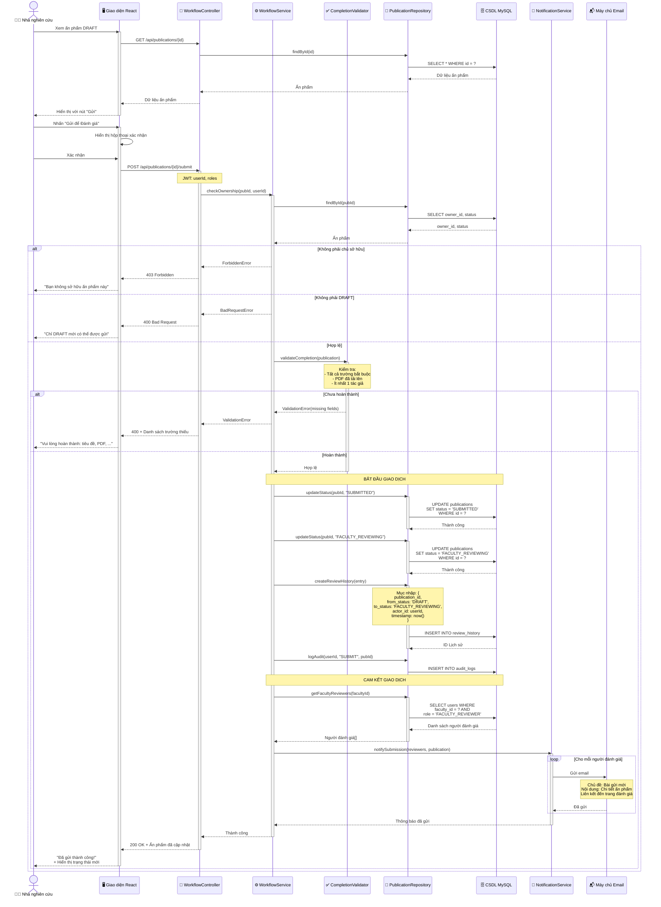
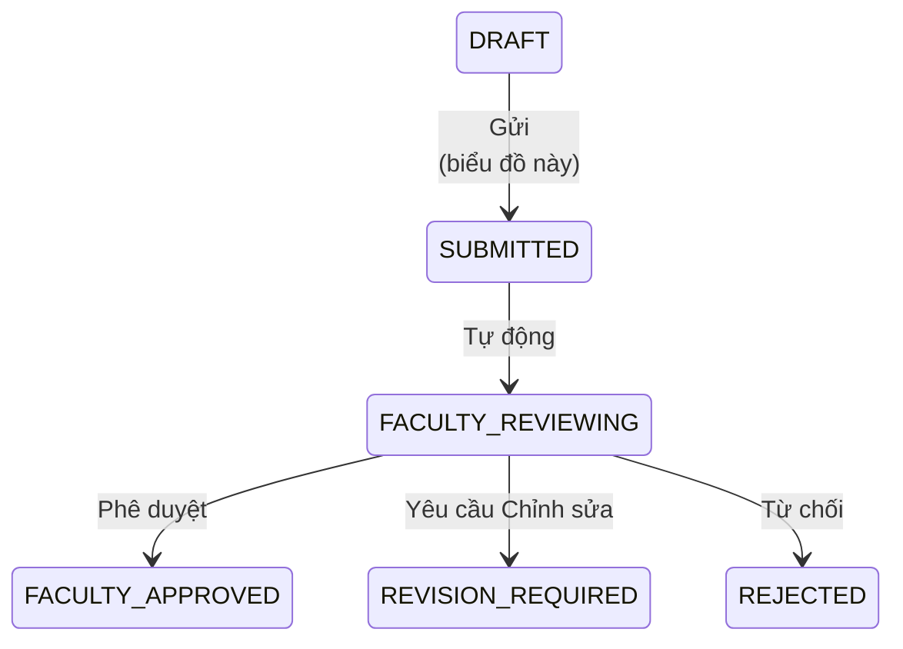

# Biểu đồ Tuần tự: Gửi để Đánh giá

> 📊 **ID Biểu đồ**: SEQ-02  
> 🎯 **Ca Sử Dụng**: UC-D2-01 - Gửi để Đánh giá  
> 👤 **Tác nhân**: Nhà nghiên cứu  
> ⚙️ **Thành phần**: Giao diện, Bộ điều khiển, Dịch vụ Quy trình, Dịch vụ Thông báo, Cơ sở dữ liệu

---

## 🎯 Kịch bản

Nhà nghiên cứu gửi ấn phẩm từ DRAFT → SUBMITTED → FACULTY_REVIEWING và kích hoạt thông báo.

---

## 📊 Biểu đồ Tuần tự



---

## 📋 Các Bước Luồng

### 1. Xem Ấn phẩm
- Nhà nghiên cứu điều hướng đến ấn phẩm DRAFT
- Hệ thống hiển thị ấn phẩm với nút "Gửi để Đánh giá"
- Nút chỉ hiển thị nếu trạng thái = DRAFT và người dùng là chủ sở hữu

### 2. Hành động Gửi
- Người dùng nhấn "Gửi để Đánh giá"
- Hộp thoại xác nhận: "Bạn có chắc chắn không? Bạn không thể chỉnh sửa sau khi gửi."
- Người dùng xác nhận

### 3. Ủy quyền
- Kiểm tra người dùng là chủ sở hữu: `publication.owner_id === userId`
- Kiểm tra trạng thái là DRAFT: `publication.status === 'DRAFT'`

### 4. Xác thực Hoàn thành
**Bắt buộc**:
- ✅ Tiêu đề
- ✅ Loại ấn phẩm
- ✅ Năm
- ✅ Tên Tạp chí/Hội nghị
- ✅ Ít nhất 1 tác giả
- ✅ PDF đã tải lên

**Tùy chọn** (cảnh báo nếu thiếu):
- DOI, ISSN
- Tóm tắt, Từ khóa

### 5. Chuyển đổi Trạng thái (Nguyên tử)
```
DRAFT → SUBMITTED → FACULTY_REVIEWING
```

**Tại sao 2 bước?**
- `SUBMITTED`: Được hệ thống ghi nhận
- `FACULTY_REVIEWING`: Chuyển ngay cho người đánh giá

**Giao dịch đảm bảo**:
- Cả hai cập nhật trạng thái đều thành công cùng nhau
- Lịch sử đánh giá được ghi lại
- Hoàn tác nếu bất kỳ bước nào thất bại

### 6. Thông báo
- Truy vấn tất cả người dùng `FACULTY_REVIEWER` trong cùng khoa
- Gửi email cho mỗi người đánh giá:
  - Chủ đề: "Bài gửi ấn phẩm mới"
  - Nội dung: Tiêu đề ấn phẩm, tên nhà nghiên cứu
  - Liên kết: Liên kết trực tiếp đến trang đánh giá
- Hoạt động bất đồng bộ (không chặn phản hồi)

---

## ✅ Điều kiện Tiên quyết

- Người dùng đã được xác thực
- Người dùng sở hữu ấn phẩm HOẶC là Quản trị viên Cấp cao
- Trạng thái ấn phẩm = DRAFT
- Tất cả các trường bắt buộc đã điền
- PDF đã tải lên

---

## 🚨 Các Kịch Bản Lỗi

### 400 Bad Request - Chưa hoàn thành
```json
{
  "error": "Lỗi Xác thực",
  "message": "Ấn phẩm chưa hoàn thành",
  "missing_fields": ["abstract", "pdf"]
}
```

### 400 Bad Request - Sai Trạng thái
```json
{
  "error": "Yêu cầu Không hợp lệ",
  "message": "Chỉ ấn phẩm DRAFT mới có thể được gửi. Trạng thái hiện tại: SUBMITTED"
}
```

### 403 Forbidden - Không phải Chủ sở hữu
```json
{
  "error": "Bị cấm",
  "message": "Bạn không phải là chủ sở hữu của ấn phẩm này"
}
```

### 404 Not Found
```json
{
  "error": "Không tìm thấy",
  "message": "Không tìm thấy ấn phẩm"
}
```

---

## 🗄️ Thay Đổi Cơ Sở Dữ Liệu

### Bảng publications
```sql
UPDATE publications
SET status = 'FACULTY_REVIEWING',
    submitted_at = NOW(),
    updated_at = NOW()
WHERE id = ? AND status = 'DRAFT'
```

### Bảng review_history
```sql
INSERT INTO review_history (
    publication_id, from_status, to_status,
    actor_id, action, timestamp
) VALUES (
    ?, 'DRAFT', 'FACULTY_REVIEWING',
    ?, 'SUBMIT', NOW()
)
```

### Bảng audit_logs
```sql
INSERT INTO audit_logs (
    user_id, action, entity_type, entity_id, timestamp
) VALUES (?, 'SUBMIT', 'PUBLICATION', ?, NOW())
```

---

## 📧 Thông báo Email

**Đến**: Tất cả người đánh giá khoa  
**Chủ đề**: `Bài gửi ấn phẩm mới - {publication_title}`  
**Nội dung**:
```
Xin chào {reviewer_name},

Một ấn phẩm mới đã được gửi để đánh giá:

Tiêu đề: {publication_title}
Tác giả: {researcher_name}
Đã gửi: {timestamp}

Vui lòng đánh giá tại: {review_url}

Trân trọng,
Hệ thống UFPMS
```

---

## 🔄 Biểu đồ Trạng thái



---

## 🔗 Biểu đồ Liên Quan

- **Trước**: [seq_create_publication.md](./seq_create_publication.md)
- **Tiếp theo**: [seq_faculty_review.md](./seq_faculty_review.md)
- **Biểu đồ Ca Sử Dụng**: [../UseCase/module_02_approval.md](../UseCase/module_02_approval.md#uc-m2-001-submit-for-review)

---

**Liên quan**: FR-APR-001, US-RES-010  
**Ngày tạo**: 10/02/2026
