# Sequence Diagram: Submit for Review

> 📊 **Diagram ID**: SEQ-02  
> 🎯 **Use Case**: UC-D2-01 - Submit for Review  
> 👤 **Actor**: Researcher  
> ⚙️ **Components**: UI, Controller, Workflow Service, Notification Service, Database

---

## 🎯 Scenario

Researcher submit publication từ DRAFT → SUBMITTED → FACULTY_REVIEWING và trigger notifications.

---

## 📊 Sequence Diagram

```mermaid
sequenceDiagram
    actor Researcher as 👨‍🔬 Researcher
    participant UI as 🖥️ React UI
    participant API as 🔌 WorkflowController
    participant Service as ⚙️ WorkflowService
    participant Validator as ✅ CompletionValidator
    participant Repo as 💾 PublicationRepository
    participant DB as 🗄️ MySQL Database
    participant Notif as 📧 NotificationService
    participant Email as 📬 Email Server
    
    %% View publication
    Researcher->>UI: View DRAFT publication
    activate UI
    UI->>API: GET /api/publications/{id}
    API->>Repo: findById(id)
    Repo->>DB: SELECT * WHERE id = ?
    DB-->>Repo: Publication data
    Repo-->>API: Publication
    API-->>UI: Publication data
    UI-->>Researcher: Display with "Submit" button
    deactivate UI
    
    %% Submit action
    Researcher->>UI: Click "Submit for Review"
    activate UI
    UI->>UI: Show confirmation dialog
    Researcher->>UI: Confirm
    
    UI->>API: POST /api/publications/{id}/submit
    activate API
    Note over API: JWT: userId, roles
    
    %% Authorization check
    API->>Service: checkOwnership(pubId, userId)
    activate Service
    Service->>Repo: findById(pubId)
    Repo->>DB: SELECT owner_id, status
    DB-->>Repo: owner_id, status
    Repo-->>Service: Publication
    
    alt Not owner
        Service-->>API: ForbiddenError
        API-->>UI: 403 Forbidden
        UI-->>Researcher: "You don't own this publication"
    else Not DRAFT
        Service-->>API: BadRequestError
        API-->>UI: 400 Bad Request
        UI-->>Researcher: "Only DRAFT can be submitted"
    else Valid
        %% Validate completion
        Service->>Validator: validateCompletion(publication)
        activate Validator
        
        Note over Validator: Check:<br/>- All required fields<br/>- PDF uploaded<br/>- At least 1 author
        
        alt Incomplete
            Validator-->>Service: ValidationError(missing fields)
            Service-->>API: ValidationError
            API-->>UI: 400 + Missing fields list
            UI-->>Researcher: "Please complete: title, PDF, ..."
        else Complete
            Validator-->>Service: Valid
            deactivate Validator
            
            %% Begin transaction
            Note over Service,DB: START TRANSACTION
            
            %% Update status
            Service->>Repo: updateStatus(pubId, "SUBMITTED")
            activate Repo
            Repo->>DB: UPDATE publications<br/>SET status = 'SUBMITTED'<br/>WHERE id = ?
            DB-->>Repo: Success
            deactivate Repo
            
            Service->>Repo: updateStatus(pubId, "FACULTY_REVIEWING")
            activate Repo
            Repo->>DB: UPDATE publications<br/>SET status = 'FACULTY_REVIEWING'<br/>WHERE id = ?
            DB-->>Repo: Success
            deactivate Repo
            
            %% Log to review history
            Service->>Repo: createReviewHistory(entry)
            activate Repo
            Note over Repo: Entry: {<br/>  publication_id,<br/>  from_status: 'DRAFT',<br/>  to_status: 'FACULTY_REVIEWING',<br/>  actor_id: userId,<br/>  timestamp: now()<br/>}
            Repo->>DB: INSERT INTO review_history
            DB-->>Repo: History ID
            deactivate Repo
            
            %% Audit log
            Service->>Repo: logAudit(userId, "SUBMIT", pubId)
            Repo->>DB: INSERT INTO audit_logs
            
            Note over Service,DB: COMMIT TRANSACTION
            
            %% Get faculty reviewers
            Service->>Repo: getFacultyReviewers(facultyId)
            activate Repo
            Repo->>DB: SELECT users WHERE<br/>faculty_id = ? AND<br/>role = 'FACULTY_REVIEWER'
            DB-->>Repo: Reviewer list
            Repo-->>Service: Reviewers[]
            deactivate Repo
            
            %% Send notifications (async)
            Service->>Notif: notifySubmission(reviewers, publication)
            activate Notif
            
            loop For each reviewer
                Notif->>Email: Send email
                Note over Email: Subject: New submission<br/>Body: Publication details<br/>Link to review page
                Email-->>Notif: Sent
            end
            
            Notif-->>Service: Notifications sent
            deactivate Notif
            
            Service-->>API: Success
            deactivate Service
            
            API-->>UI: 200 OK + Updated publication
            deactivate API
            
            UI-->>Researcher: "Submitted successfully!"<br/>+ Show new status
            deactivate UI
        end
    end
```



---

## 📋 Flow Steps

### 1. View Publication
- Researcher navigates to DRAFT publication
- System displays publication with "Submit for Review" button
- Button only visible if status = DRAFT and user is owner

### 2. Submit Action
- User clicks "Submit for Review"
- Confirmation dialog: "Are you sure? You cannot edit after submission."
- User confirms

### 3. Authorization
- Check user is owner: `publication.owner_id === userId`
- Check status is DRAFT: `publication.status === 'DRAFT'`

### 4. Completion Validation
**Required**:
- ✅ Title
- ✅ Publication type
- ✅ Year
- ✅ Journal/Conference name
- ✅ At least 1 author
- ✅ PDF uploaded

**Optional** (warning if missing):
- DOI, ISSN
- Abstract, Keywords

### 5. State Transition (Atomic)
```
DRAFT → SUBMITTED → FACULTY_REVIEWING
```

**Why 2 steps?**
- `SUBMITTED`: Acknowledged by system
- `FACULTY_REVIEWING`: Immediately forwarded to reviewers

**Transaction ensures**:
- Both status updates succeed together
- Review history logged
- Rollback if any step fails

### 6. Notification
- Query all `FACULTY_REVIEWER` users in the same faculty
- Send email to each reviewer:
  - Subject: "New publication submission"
  - Body: Publication title, researcher name
  - Link: Direct link to review page
- Async operation (doesn't block response)

---

## ✅ Preconditions

- User is authenticated
- User owns the publication OR is SuperAdmin
- Publication status = DRAFT
- All required fields filled
- PDF uploaded

---

## 🚨 Error Scenarios

### 400 Bad Request - Incomplete
```json
{
  "error": "Validation Error",
  "message": "Publication incomplete",
  "missing_fields": ["abstract", "pdf"]
}
```

### 400 Bad Request - Wrong State
```json
{
  "error": "Bad Request",
  "message": "Only DRAFT publications can be submitted. Current status: SUBMITTED"
}
```

### 403 Forbidden - Not Owner
```json
{
  "error": "Forbidden",
  "message": "You are not the owner of this publication"
}
```

### 404 Not Found
```json
{
  "error": "Not Found",
  "message": "Publication not found"
}
```

---

## 🗄️ Database Changes

### publications table
```sql
UPDATE publications
SET status = 'FACULTY_REVIEWING',
    submitted_at = NOW(),
    updated_at = NOW()
WHERE id = ? AND status = 'DRAFT'
```

### review_history table
```sql
INSERT INTO review_history (
    publication_id, from_status, to_status,
    actor_id, action, timestamp
) VALUES (
    ?, 'DRAFT', 'FACULTY_REVIEWING',
    ?, 'SUBMIT', NOW()
)
```

### audit_logs table
```sql
INSERT INTO audit_logs (
    user_id, action, entity_type, entity_id, timestamp
) VALUES (?, 'SUBMIT', 'PUBLICATION', ?, NOW())
```

---

## 📧 Email Notification

**To**: All faculty reviewers  
**Subject**: `New publication submission - {publication_title}`  
**Body**:
```
Hello {reviewer_name},

A new publication has been submitted for review:

Title: {publication_title}
Author: {researcher_name}
Submitted: {timestamp}

Please review at: {review_url}

Best regards,
UFPMS System
```

---

## 🔄 State Diagram


---

## 🔗 Related Diagrams

- **Previous**: [seq_create_publication.md](./seq_create_publication.md)
- **Next**: [seq_faculty_review.md](./seq_faculty_review.md)
- **Use Case Diagram**: [../UseCase/module_02_approval.md](../UseCase/module_02_approval.md#uc-m2-001-submit-for-review)

---

**Related**: FR-APR-001, US-RES-010  
**Created**: 10/02/2026
