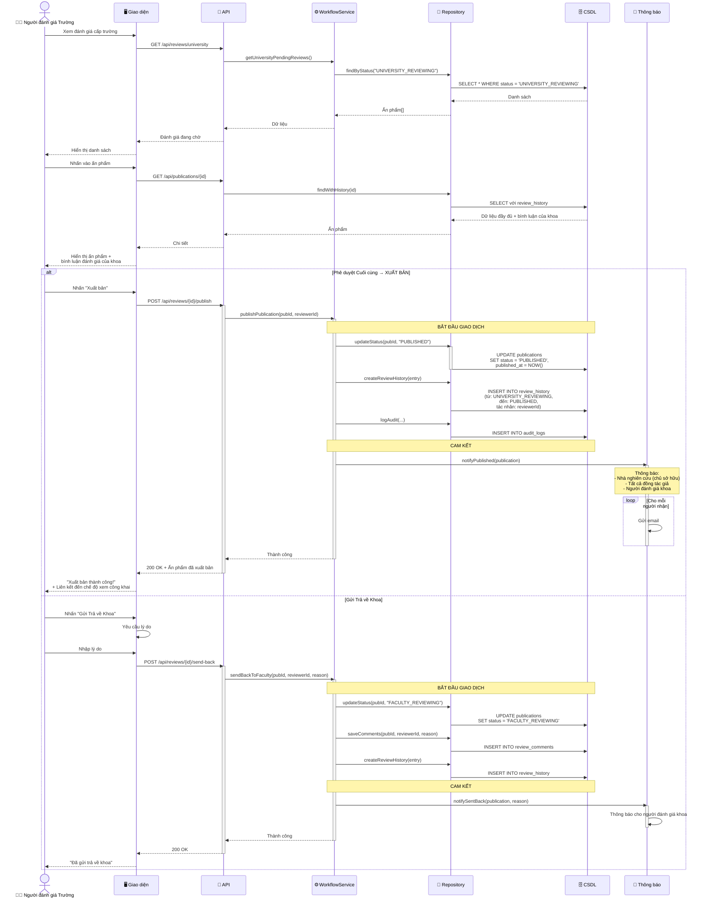

# Biểu đồ Tuần tự: Phê duyệt Cuối cùng của Trường

> 📊 **ID Biểu đồ**: SEQ-04  
> 🎯 **Ca Sử Dụng**: UC-D2-11 - Phê duyệt Cuối cùng của Trường  
> 👤 **Tác nhân**: Người đánh giá Trường  
> ⚙️ **Kết quả**: ĐÃ XUẤT BẢN hoặc gửi trả về Khoa

---

## 📊 Biểu đồ Tuần tự



---

## 📋 Hai Hành Động

### 1. Phê duyệt Cuối cùng → Xuất bản ✅
**Tác dụng**:
- Trạng thái: `UNIVERSITY_REVIEWING` → `PUBLISHED`
- Dấu thời gian `published_at` được thiết lập
- Ấn phẩm trở nên **hiển thị công khai**

**Thông báo**:
1. Nhà nghiên cứu (chủ sở hữu)
2. Tất cả đồng tác giả
3. Người đánh giá khoa (để biết thông tin)

**Nội dung Email**:
```
Chủ đề: Ấn phẩm của bạn đã được xuất bản!

Thân gửi {researcher_name},

Chúc mừng! Ấn phẩm của bạn đã được phê duyệt và xuất bản:

Tiêu đề: {title}
Ngày xuất bản: {timestamp}

Xem trang công khai: {public_url}

Trân trọng,
UFPMS
```

---

### 2. Gửi Trả về Khoa 🔄
**Tác dụng**:
- Trạng thái: `UNIVERSITY_REVIEWING` → `FACULTY_REVIEWING`
- Người đánh giá khoa cần đánh giá lại

**Ca Sử Dụng**:
- Người đánh giá trường không đồng ý với quyết định của khoa
- Phát hiện vấn đề mà khoa không bắt được
- Cần thêm thông tin

**Yêu cầu lý do**: Tại sao gửi trả lại

---

## 🗄️ Thay Đổi Cơ Sở Dữ Liệu

### Xuất bản
```sql
UPDATE publications 
SET status = 'PUBLISHED',
    published_at = NOW(),
    updated_at = NOW()
WHERE id = ? AND status = 'UNIVERSITY_REVIEWING';

INSERT INTO review_history (
    publication_id, from_status, to_status,
    actor_id, action, timestamp
) VALUES (
    ?, 'UNIVERSITY_REVIEWING', 'PUBLISHED',
    ?, 'FINAL_APPROVE', NOW()
);
```

### Gửi Trả lại
```sql
UPDATE publications 
SET status = 'FACULTY_REVIEWING',
    updated_at = NOW()
WHERE id = ?;

INSERT INTO review_comments (
    publication_id, reviewer_id, 
    comment_type, comment_text, timestamp
) VALUES (
    ?, ?, 'SENT_BACK_REASON', ?, NOW()
);
```

---

## 🔒 Quy Tắc Nghiệp Vụ

1. **Chỉ Người đánh giá Trường** mới có thể xuất bản
2. Sau khi XUẤT BẢN:
   - Nhà nghiên cứu **không thể chỉnh sửa** (chỉ SuperAdmin)
   - Nhà nghiên cứu **không thể xóa** (chỉ SuperAdmin)
   - Ấn phẩm hiển thị với **công chúng**
3. Ấn phẩm đã xuất bản được tính vào:
   - Thống kê nhà nghiên cứu
   - Báo cáo Khoa/Trường
   - Kết quả tìm kiếm công khai

---

## 📈 Tác Động Sau Xuất Bản

### Hiển thị
- Xuất hiện trong tìm kiếm công khai
- Hiển thị trên hồ sơ nhà nghiên cứu
- Bao gồm trong báo cáo khoa/trường

### Cập nhật Thống kê
- Số lượng ấn phẩm của nhà nghiên cứu +1
- Số lượng ấn phẩm của khoa +1
- Số lượng ấn phẩm của trường +1

### Phân tích (P2)
- Kích hoạt theo dõi trích dẫn
- Kích hoạt theo dõi lượt tải xuống

---

**Liên quan**: FR-APR-013, FR-APR-014, US-UNR-004, US-UNR-005  
**Ngày tạo**: 10/02/2026
