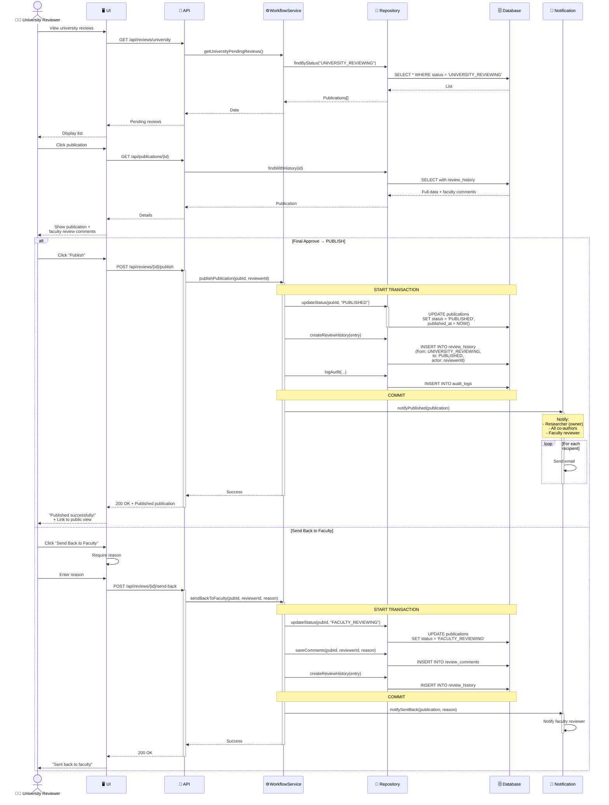

# Sequence Diagram: University Final Approval

> 📊 **Diagram ID**: SEQ-04  
> 🎯 **Use Case**: UC-D2-11 - University Final Approval  
> 👤 **Actor**: University Reviewer  
> ⚙️ **Result**: PUBLISHED or sent back to Faculty

---

## 📊 Sequence Diagram



---

## 📋 Two Actions

### 1. Final Approve → Publish ✅
**Effect**:
- Status: `UNIVERSITY_REVIEWING` → `PUBLISHED`
- `published_at` timestamp set
- Publication becomes **publicly visible**

**Notifications**:
1. Researcher (owner)
2. All co-authors
3. Faculty reviewer (FYI)

**Email Content**:
```
Subject: Your publication has been published!

Dear {researcher_name},

Congratulations! Your publication has been approved and published:

Title: {title}
Published: {timestamp}

View public page: {public_url}

Best regards,
UFPMS
```

---

### 2. Send Back to Faculty 🔄
**Effect**:
- Status: `UNIVERSITY_REVIEWING` → `FACULTY_REVIEWING`
- Faculty reviewer needs to re-review

**Use Cases**:
- University reviewer disagrees with faculty decision
- Found issues not caught by faculty
- Needs more information

**Reason required**: Why sending back

---

## 🗄️ Database Changes

### Publish
```sql
UPDATE publications 
SET status = 'PUBLISHED',
    published_at = NOW(),
    updated_at = NOW()
WHERE id = ? AND status = 'UNIVERSITY_REVIEWING';

INSERT INTO review_history (
    publication_id, from_status, to_status,
    actor_id, action, timestamp
) VALUES (
    ?, 'UNIVERSITY_REVIEWING', 'PUBLISHED',
    ?, 'FINAL_APPROVE', NOW()
);
```

### Send Back
```sql
UPDATE publications 
SET status = 'FACULTY_REVIEWING',
    updated_at = NOW()
WHERE id = ?;

INSERT INTO review_comments (
    publication_id, reviewer_id, 
    comment_type, comment_text, timestamp
) VALUES (
    ?, ?, 'SENT_BACK_REASON', ?, NOW()
);
```

---

## 🔒 Business Rules

1. **Only University Reviewers** can publish
2. After PUBLISHED:
   - Researcher **cannot edit** (only SuperAdmin)
   - Researcher **cannot delete** (only SuperAdmin)
   - Publication visible to **public**
3. Published publication counts toward:
   - Researcher statistics
   - Faculty/University reports
   - Public search results

---

## 📈 Post-Publication Effects

### Visibility
- Appears in public search
- Visible on researcher's profile
- Included in faculty/university reports

### Statistics Update
- Researcher publication count +1
- Faculty publication count +1
- University publication count +1

### Analytics (P2)
- Citation tracking enabled
- Download tracking enabled

---

**Related**: FR-APR-013, FR-APR-014, US-UNR-004, US-UNR-005  
**Created**: 10/02/2026
