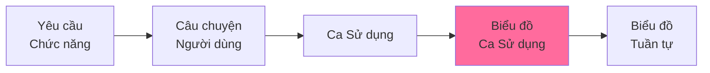

# Biểu đồ Ca Sử dụng - README

> 📁 **Thư mục**: `06_Diagrams/UseCase`  
> 📅 **Cập nhật**: 10/02/2026  
> 🎯 **Mục đích**: Minh họa tương tác giữa tác nhân và ca sử dụng hệ thống

---

## 📊 Tổng Quan

Biểu đồ Ca Sử dụng hiển thị:
- **Tác nhân**: 5 vai trò trong hệ thống
- **Ca Sử dụng**: Chức năng mà tác nhân có thể thực hiện
- **Mối quan hệ**: Include, Extend, Association

---

## 👥 Tác nhân (5 Vai trò)

| Tác nhân | Ký Hiệu | Mô Tả | Modules |
|-------|---------|-------|---------|
| **Nhà nghiên cứu** | RES | Giảng viên quản lý bài báo | 1, 2, 4 |
| **Người đánh giá Khoa** | FCR | Cán bộ Khoa xét duyệt | 2, 5 |
| **Người đánh giá Trường** | UNR | Cán bộ Trường phê duyệt cuối | 2, 5 |
| **Quản trị viên Cấp cao** | ADM | Quản trị hệ thống | 6, 1 |
| **Khách truy cập** | VIW | Khách truy cập công khai | 3, 4 |

---

## 📁 Biểu đồ Ca Sử dụng

### [Toàn bộ Hệ thống](./overall_system.md)
**Tổng quan toàn hệ thống**
- 5 tác nhân
- 6 ca sử dụng cấp cao (modules)
- Ranh giới hệ thống

### Biểu đồ Theo Module

#### [Module 1: Quản lý Ấn phẩm](./module_01_publication.md)
- **Tác nhân**: Nhà nghiên cứu, Quản trị viên Cấp cao
- **Ca Sử dụng**: 9 (Tạo, Sửa, Xóa, Tải lên PDF, Xem, v.v.)
- **Độ ưu tiên**: 12 P0, 2 P1, 1 P2

#### [Module 2: Quy trình Phê duyệt](./module_02_approval.md)
- **Tác nhân**: Nhà nghiên cứu, Người đánh giá Khoa, Người đánh giá Trường
- **Ca Sử dụng**: 15 (Gửi, Đánh giá, Phê duyệt, Từ chối, Theo dõi, v.v.)
- **Độ ưu tiên**: 18 P0, 2 P1
- **Đặc biệt**: Mối quan hệ Include/Extend

#### [Module 3: Tìm kiếm & Duyệt](./module_03_search.md)
- **Tác nhân**: Khách truy cập, Nhà nghiên cứu
- **Ca Sử dụng**: 7 (Tìm kiếm, Lọc, Duyệt, Xem Chi tiết, v.v.)
- **Độ ưu tiên**: 2 P0, 4 P1, 1 P2

#### [Module 4: Hồ sơ Nhà nghiên cứu](./module_04_profile.md)
- **Tác nhân**: Nhà nghiên cứu, Khách truy cập
- **Ca Sử dụng**: 6 (Xem Hồ sơ, Sửa Hồ sơ, Xem Thống kê, v.v.)
- **Độ ưu tiên**: 1 P0, 3 P1, 2 P2

#### [Module 5: Báo cáo & Phân tích](./module_05_reporting.md)
- **Tác nhân**: Người đánh giá Khoa, Người đánh giá Trường, Quản trị viên Cấp cao
- **Ca Sử dụng**: 7 (Tạo Báo cáo, Xem Phân tích, Xuất Dữ liệu, v.v.)
- **Độ ưu tiên**: 1 P0, 4 P1, 2 P2

#### [Module 6: Quản lý Quản trị](./module_06_admin.md)
- **Tác nhân**: Quản trị viên Cấp cao
- **Ca Sử dụng**: 10 (Quản lý Người dùng, Phân quyền, Cấu hình Hệ thống, v.v.)
- **Độ ưu tiên**: 8 P0, 2 P1

---

## 🎨 Mã màu

Biểu đồ sử dụng màu để phân biệt modules:

- 🟢 **Module 1** (Ấn phẩm): `#6bcf7f`
- 🩷 **Module 2** (Phê duyệt): `#ff6b9d`
- 🔵 **Module 3** (Tìm kiếm): `#4d96ff`
- 🟡 **Module 4** (Hồ sơ): `#ffd93d`
- 🟣 **Module 5** (Báo cáo): `#c8b6ff`
- 🟠 **Module 6** (Quản trị): `#ff9f43`

---

## 🔗 Truy xuất nguồn gốc

### Mối Quan Hệ với Tài liệu Khác

### Tham chiếu chéo

- **Yêu cầu**: [03_Requirements/Functional](../../03_Requirements/Functional/)
- **Câu chuyện Người dùng**: [04_User_Stories](../../04_User_Stories/)
- **Ca Sử dụng**: [05_Use_Cases](../../05_Use_Cases/)
- **Biểu đồ Tuần tự**: [../Sequence](../Sequence/)

---

## 📖 Hướng Dẫn Đọc

### Cho Các bên liên quan & Chủ sở hữu sản phẩm
1. Bắt đầu với [Toàn bộ Hệ thống](./overall_system.md)
2. Đọc biểu đồ theo modules quan tâm

### Cho Nhà phát triển
1. Xem toàn bộ hệ thống để hiểu bức tranh lớn
2. Chi tiết vào module đang triển khai
3. Kết hợp với [Biểu đồ Tuần tự](../Sequence/) để hiểu luồng hoạt động

### Cho Người kiểm thử
1. Sử dụng biểu đồ để xác định kịch bản kiểm thử
2. Ánh xạ tác nhân → vai trò kiểm thử
3. Ánh xạ ca sử dụng → ca kiểm thử

---

## ✅ Danh sách kiểm tra Xác thực

- [x] 5 tác nhân đã được định nghĩa rõ ràng
- [x] 6 modules đã có biểu đồ riêng
- [x] Mã màu nhất quán
- [x] Truy xuất nguồn gốc với Ca Sử dụng rõ ràng
- [x] Cú pháp Mermaid hợp lệ

---

**Tài liệu liên quan**:
- [Tài liệu Ca Sử dụng](../../05_Use_Cases/)
- [Yêu cầu](../../03_Requirements/)
- [Biểu đồ Tuần tự](../Sequence/)

---

*Hoàn thành: 10/02/2026*
