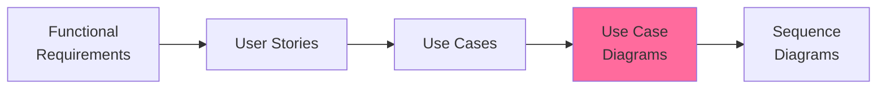

# Use Case Diagrams - README

> 📁 **Folder**: `06_Diagrams/UseCase`  
> 📅 **Cập nhật**: 10/02/2026  
> 🎯 **Mục đích**: Minh họa tương tác giữa actors và system use cases

---

## 📊 Tổng Quan

Use Case Diagrams hiển thị:
- **Actors**: 5 vai trò trong hệ thống
- **Use Cases**: Chức năng mà actors có thể thực hiện
- **Relationships**: Include, Extend, Association

---

## 👥 Actors (5 Roles)

| Actor | Ký Hiệu | Mô Tả | Modules |
|-------|---------|-------|---------|
| **Researcher** | RES | Giảng viên quản lý bài báo | 1, 2, 4 |
| **Faculty Reviewer** | FCR | Cán bộ Khoa xét duyệt | 2, 5 |
| **University Reviewer** | UNR | Cán bộ Trường phê duyệt cuối | 2, 5 |
| **SuperAdmin** | ADM | Quản trị hệ thống | 6, 1 |
| **Public Visitor** | VIW | Khách truy cập công khai | 3, 4 |

---

## 📁 Use Case Diagrams

### [Overall System](./overall_system.md)
**Tổng quan toàn hệ thống**
- 5 actors
- 6 high-level use cases (modules)
- System boundaries

### Module-Specific Diagrams

#### [Module 1: Publication Management](./module_01_publication.md)
- **Actors**: Researcher, SuperAdmin
- **Use Cases**: 9 (Create, Edit, Delete, Upload PDF, View, etc.)
- **Priority**: 12 P0, 2 P1, 1 P2

#### [Module 2: Approval Workflow](./module_02_approval.md)
- **Actors**: Researcher, Faculty Reviewer, University Reviewer
- **Use Cases**: 15 (Submit, Review, Approve, Reject, Track, etc.)
- **Priority**: 18 P0, 2 P1
- **Special**: Include/Extend relationships

#### [Module 3: Search & Browse](./module_03_search.md)
- **Actors**: Public Visitor, Researcher
- **Use Cases**: 7 (Search, Filter, Browse, View Details, etc.)
- **Priority**: 2 P0, 4 P1, 1 P2

#### [Module 4: Researcher Profile](./module_04_profile.md)
- **Actors**: Researcher, Public Visitor
- **Use Cases**: 6 (View Profile, Edit Profile, View Statistics, etc.)
- **Priority**: 1 P0, 3 P1, 2 P2

#### [Module 5: Reporting & Analytics](./module_05_reporting.md)
- **Actors**: Faculty Reviewer, University Reviewer, SuperAdmin
- **Use Cases**: 7 (Generate Reports, View Analytics, Export Data, etc.)
- **Priority**: 1 P0, 4 P1, 2 P2

#### [Module 6: Admin Management](./module_06_admin.md)
- **Actors**: SuperAdmin
- **Use Cases**: 10 (User Management, Role Assignment, System Config, etc.)
- **Priority**: 8 P0, 2 P1

---

## 🎨 Color Coding

Diagrams sử dụng màu để phân biệt modules:

- 🟢 **Module 1** (Publication): `#6bcf7f`
- 🩷 **Module 2** (Approval): `#ff6b9d`
- 🔵 **Module 3** (Search): `#4d96ff`
- 🟡 **Module 4** (Profile): `#ffd93d`
- 🟣 **Module 5** (Reporting): `#c8b6ff`
- 🟠 **Module 6** (Admin): `#ff9f43`

---

## 🔗 Traceability

### Mối Quan Hệ với Documentation Khác

### Cross-References

- **Requirements**: [03_Requirements/Functional](../../03_Requirements/Functional/)
- **User Stories**: [04_User_Stories](../../04_User_Stories/)
- **Use Cases**: [05_Use_Cases](../../05_Use_Cases/)
- **Sequence Diagrams**: [../Sequence](../Sequence/)

---

## 📖 Hướng Dẫn Đọc

### Cho Stakeholders & Product Owners
1. Bắt đầu với [Overall System](./overall_system.md)
2. Đọc diagrams theo modules quan tâm

### Cho Developers
1. Xem overall system để hiểu big picture
2. Chi tiết vào module đang implement
3. Kết hợp với [Sequence Diagrams](../Sequence/) để hiểu flows

### Cho Testers
1. Sử dụng diagrams để identify test scenarios
2. Map actors → test roles
3. Map use cases → test cases

---

## ✅ Validation Checklist

- [x] 5 actors đã được define rõ ràng
- [x] 6 modules đã có diagrams riêng
- [x] Color coding consistent
- [x] Traceability với Use Cases rõ ràng
- [x] Mermaid syntax hợp lệ

---

**Tài liệu liên quan**:
- [Use Cases Documentation](../../05_Use_Cases/)
- [Requirements](../../03_Requirements/)
- [Sequence Diagrams](../Sequence/)

---

*Hoàn thành: 10/02/2026*
