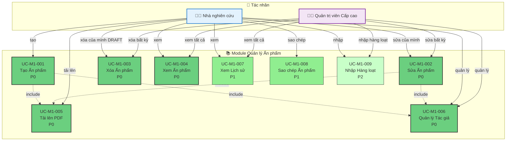

# Module 1: Quản lý Ấn phẩm - Biểu đồ Ca Sử dụng

> 📊 **ID Biểu đồ**: UCD-01  
> 📦 **Module**: Quản lý Ấn phẩm  
> 👥 **Tác nhân**: Nhà nghiên cứu, Quản trị viên Cấp cao  
> 📋 **Ca Sử dụng**: 9

---

## 🎯 Tổng quan Module

Module này xử lý tất cả các hoạt động CRUD cho ấn phẩm (bài báo khoa học).

**Tính năng Chính**:
- Tạo, Đọc, Cập nhật, Xóa ấn phẩm
- Tải lên tệp PDF
- Quản lý siêu dữ liệu (tác giả, từ khóa, v.v.)
- Xem lịch sử ấn phẩm

---

## 📊 Biểu đồ Ca Sử dụng

---

## 📋 Ca Sử dụng

### UC-M1-001: Tạo Ấn phẩm
**Độ ưu tiên**: P0  
**Tác nhân**: Nhà nghiên cứu  
**Mô tả**: Tạo mới một bài báo với metadata cơ bản  
**Điều kiện tiên quyết**: Người dùng đã đăng nhập  
**Điều kiện hậu**: Ấn phẩm được tạo với trạng thái = DRAFT

**Luồng chính**:
1. Nhà nghiên cứu nhấn "Tạo Ấn phẩm"
2. Hệ thống hiển thị biểu mẫu với các trường bắt buộc
3. Nhà nghiên cứu nhập metadata (tiêu đề, tạp chí, năm, DOI, v.v.)
4. Nhà nghiên cứu thêm tác giả (bao gồm mối quan hệ)
5. Nhà nghiên cứu tải lên PDF (bao gồm mối quan hệ)
6. Hệ thống xác thực dữ liệu
7. Hệ thống lưu ấn phẩm với trạng thái = DRAFT

**Liên quan**:
- FR-PUB-001, FR-PUB-002
- US-RES-001

---

### UC-M1-002: Sửa Ấn phẩm
**Độ ưu tiên**: P0  
**Tác nhân**: Nhà nghiên cứu, Quản trị viên Cấp cao  
**Mô tả**: Chỉnh sửa metadata của ấn phẩm  
**Điều kiện tiên quyết**: 
- Ấn phẩm tồn tại
- **Nhà nghiên cứu**: CHỈ sửa được ấn phẩm của chính mình ở trạng thái DRAFT
- **Quản trị viên Cấp cao**: Sửa được tất cả

**Quy tắc Nghiệp vụ**:
- Nhà nghiên cứu KHÔNG thể sửa nếu trạng thái khác DRAFT
- Đồng tác giả chỉ xem, không sửa được
- Mọi thay đổi được ghi vào lịch sử

**Liên quan**:
- FR-PUB-004
- US-RES-003

---

### UC-M1-003: Xóa Ấn phẩm
**Độ ưu tiên**: P0  
**Tác nhân**: Nhà nghiên cứu, Quản trị viên Cấp cao  
**Mô tả**: Xóa ấn phẩm  
**Điều kiện tiên quyết**: 
- **Nhà nghiên cứu**: CHỈ xóa được ấn phẩm của chính mình ở trạng thái DRAFT
- **Quản trị viên Cấp cao**: Xóa được tất cả (xóa mềm)

**Quy tắc Nghiệp vụ**:
- Xóa mềm (đặt dấu thời gian deleted_at)
- Không thể xóa nếu đã XUẤT BẢN (chỉ Quản trị viên Cấp cao mới xóa được)

**Liên quan**:
- FR-PUB-005
- US-RES-004

---

### UC-M1-004: Xem Ấn phẩm
**Độ ưu tiên**: P0  
**Tác nhân**: Nhà nghiên cứu, Quản trị viên Cấp cao  
**Mô tả**: Xem chi tiết ấn phẩm  
**Quy tắc Hiển thị**:
- **Nhà nghiên cứu**: Xem của chính mình + đồng tác giả + ĐÃ XUẤT BẢN
- **Quản trị viên Cấp cao**: Xem tất cả

**Liên quan**:
- FR-PUB-003
- US-RES-002

---

### UC-M1-005: Tải lên PDF
**Độ ưu tiên**: P0  
**Tác nhân**: Nhà nghiên cứu  
**Mô tả**: Tải lên tệp PDF của bài báo  
**Ràng buộc**:
- Kích thước tệp < 10MB
- Định dạng: Chỉ PDF
- Tự động trích xuất metadata nếu có (tính năng P2)

**Liên quan**:
- FR-PUB-006
- US-RES-005

---

### UC-M1-006: Quản lý Tác giả
**Độ ưu tiên**: P0  
**Tác nhân**: Nhà nghiên cứu  
**Mô tả**: Thêm/xóa/sắp xếp tác giả  
**Tính năng**:
- Thêm tác giả nội bộ (từ cơ sở dữ liệu người dùng)
- Thêm tác giả bên ngoài (nhập tay)
- Sắp xếp thứ tự (tác giả đầu tiên, tác giả liên hệ)
- Gán vai trò (tác giả, đồng tác giả, liên hệ)

**Quy tắc Nghiệp vụ**:
- Nhà nghiên cứu tự động được thêm làm tác giả
- Ít nhất 1 tác giả

**Liên quan**:
- FR-PUB-007, FR-PUB-008
- US-RES-006

---

### UC-M1-007: Xem Lịch sử
**Độ ưu tiên**: P1  
**Tác nhân**: Nhà nghiên cứu, Quản trị viên Cấp cao  
**Mô tả**: Xem lịch sử thay đổi của ấn phẩm  
**Thông tin**:
- Ai đã thay đổi cái gì, khi nào
- Chuyển đổi trạng thái
- Bình luận đánh giá

**Liên quan**:
- FR-PUB-009
- US-RES-007

---

### UC-M1-008: Sao chép Ấn phẩm
**Độ ưu tiên**: P1  
**Tác nhân**: Nhà nghiên cứu  
**Mô tả**: Sao chép một ấn phẩm để tạo mục mới  
**Ca sử dụng**: Tiện khi xuất bản cùng 1 chuỗi hội nghị

**Liên quan**:
- FR-PUB-010

---

### UC-M1-009: Nhập Hàng loạt
**Độ ưu tiên**: P2  
**Tác nhân**: Nhà nghiên cứu, Quản trị viên Cấp cao  
**Mô tả**: Nhập nhiều ấn phẩm từ Excel/CSV  
**Tính năng**:
- Tải lên mẫu Excel
- Xác thực định dạng
- Xem trước khi nhập
- Báo cáo lỗi

**Liên quan**:
- FR-PUB-015
- US-ADM-008

---

## 📊 Thống kê

| Độ ưu tiên | Ca Sử dụng | % |
|----------|-----------|---|
| P0 - Phải Có | 6 | 67% |
| P1 - Nên Có | 2 | 22% |
| P2 - Có Thì Tốt | 1 | 11% |

---

## 🔗 Truy xuất nguồn gốc

### Yêu cầu Chức năng

| Ca Sử dụng | YCCN | Mô tả |
|----------|-----|-------------|
| UC-M1-001 | FR-PUB-001, 002 | Tạo ấn phẩm |
| UC-M1-002 | FR-PUB-004 | Sửa metadata |
| UC-M1-003 | FR-PUB-005 | Xóa ấn phẩm |
| UC-M1-004 | FR-PUB-003 | Xem chi tiết |
| UC-M1-005 | FR-PUB-006 | Tải lên PDF |
| UC-M1-006 | FR-PUB-007, 008 | Quản lý tác giả |
| UC-M1-007 | FR-PUB-009 | Xem lịch sử |
| UC-M1-008 | FR-PUB-010 | Sao chép |
| UC-M1-009 | FR-PUB-015 | Nhập hàng loạt |

---

### Câu chuyện Người dùng

**Câu chuyện Nhà nghiên cứu**:
- US-RES-001: Tạo ấn phẩm
- US-RES-002: Xem ấn phẩm của mình
- US-RES-003: Sửa ấn phẩm
- US-RES-004: Xóa ấn phẩm
- US-RES-005: Tải lên PDF
- US-RES-006: Quản lý tác giả
- US-RES-007: Xem lịch sử

**Câu chuyện Quản trị viên**:
- US-ADM-006: Ghi đè dữ liệu ấn phẩm
- US-ADM-008: Nhập hàng loạt

---

## 📚 Tài liệu Liên quan

- **Ca Sử dụng**: [05_Use_Cases/Medium_Level/module_01_publication_management.md](../../05_Use_Cases/Medium_Level/module_01_publication_management.md)
- **Yêu cầu**: [03_Requirements/Functional/module_publication_management.md](../../03_Requirements/Functional/module_publication_management.md)
- **Biểu đồ Tuần tự**: [../Sequence/seq_create_publication.md](../Sequence/seq_create_publication.md)

---

**Ngày tạo**: 10/02/2026  
**Phiên bản**: 1.0
