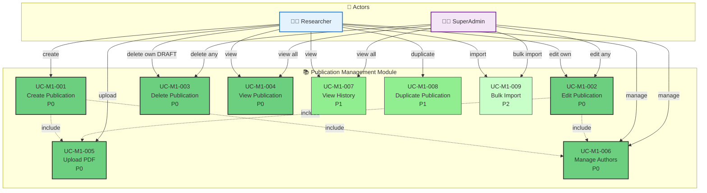

# Module 1: Publication Management - Use Case Diagram

> 📊 **Diagram ID**: UCD-01  
> 📦 **Module**: Publication Management  
> 👥 **Actors**: Researcher, SuperAdmin  
> 📋 **Use Cases**: 9

---

## 🎯 Module Overview

Module này handle tất cả CRUD operations cho publications (bài báo khoa học).

**Key Features**:
- Create, Read, Update, Delete publications
- Upload PDF files
- Manage metadata (authors, keywords, etc.)
- View publication history

---

## 📊 Use Case Diagram

---

## 📋 Use Cases

### UC-M1-001: Create Publication
**Priority**: P0  
**Actor**: Researcher  
**Description**: Tạo mới một bài báo với metadata cơ bản  
**Preconditions**: User đã đăng nhập  
**Postconditions**: Publication được tạo với status = DRAFT

**Main Flow**:
1. Researcher click "Create Publication"
2. System hiển thị form với các trường bắt buộc
3. Researcher nhập metadata (title, journal, year, DOI, etc.)
4. Researcher thêm authors (include relationship)
5. Researcher upload PDF (include relationship)
6. System validate dữ liệu
7. System lưu publication với status = DRAFT

**Related**:
- FR-PUB-001, FR-PUB-002
- US-RES-001

---

### UC-M1-002: Edit Publication
**Priority**: P0  
**Actor**: Researcher, SuperAdmin  
**Description**: Chỉnh sửa metadata của publication  
**Preconditions**: 
- Publication tồn tại
- **Researcher**: CHỈ edit được own publications ở status DRAFT
- **SuperAdmin**: Edit được tất cả

**Business Rules**:
- Researcher KHÔNG thể edit nếu status khác DRAFT
- Co-authors chỉ view, không edit được
- Mọi thay đổi được log vào history

**Related**:
- FR-PUB-004
- US-RES-003

---

### UC-M1-003: Delete Publication
**Priority**: P0  
**Actor**: Researcher, SuperAdmin  
**Description**: Xóa publication  
**Preconditions**: 
- **Researcher**: CHỈ xóa được own publications ở status DRAFT
- **SuperAdmin**: Xóa được tất cả (soft delete)

**Business Rules**:
- Soft delete (set deleted_at timestamp)
- Không thể xóa nếu đã PUBLISHED (chỉ SuperAdmin mới xóa được)

**Related**:
- FR-PUB-005
- US-RES-004

---

### UC-M1-004: View Publication
**Priority**: P0  
**Actor**: Researcher, SuperAdmin  
**Description**: Xem chi tiết publication  
**Visibility Rules**:
- **Researcher**: Xem own + co-authored + PUBLISHED
- **SuperAdmin**: Xem tất cả

**Related**:
- FR-PUB-003
- US-RES-002

---

### UC-M1-005: Upload PDF
**Priority**: P0  
**Actor**: Researcher  
**Description**: Upload file PDF của bài báo  
**Constraints**:
- File size < 10MB
- Format: PDF only
- Tự động extract metadata nếu có (P2 feature)

**Related**:
- FR-PUB-006
- US-RES-005

---

### UC-M1-006: Manage Authors
**Priority**: P0  
**Actor**: Researcher  
**Description**: Thêm/xóa/sắp xếp authors  
**Features**:
- Thêm internal authors (từ user database)
- Thêm external authors (nhập tay)
- Sắp xếp thứ tự (first author, corresponding author)
- Assign roles (author, co-author, corresponding)

**Business Rules**:
- Researcher tự động được add làm author
- Ít nhất 1 author

**Related**:
- FR-PUB-007, FR-PUB-008
- US-RES-006

---

### UC-M1-007: View History
**Priority**: P1  
**Actor**: Researcher, SuperAdmin  
**Description**: Xem lịch sử thay đổi của publication  
**Information**:
- Who changed what, when
- State transitions
- Review comments

**Related**:
- FR-PUB-009
- US-RES-007

---

### UC-M1-008: Duplicate Publication
**Priority**: P1  
**Actor**: Researcher  
**Description**: Copy một publication để tạo entry mới  
**Use Case**: Tiện khi publish cùng 1 conference series

**Related**:
- FR-PUB-010

---

### UC-M1-009: Bulk Import
**Priority**: P2  
**Actor**: Researcher, SuperAdmin  
**Description**: Import nhiều publications từ Excel/CSV  
**Features**:
- Upload Excel template
- Validate format
- Preview before import
- Error reporting

**Related**:
- FR-PUB-015
- US-ADM-008

---

## 📊 Statistics

| Priority | Use Cases | % |
|----------|-----------|---|
| P0 - Must Have | 6 | 67% |
| P1 - Should Have | 2 | 22% |
| P2 - Nice to Have | 1 | 11% |

---

## 🔗 Traceability

### Functional Requirements

| Use Case | FRs | Description |
|----------|-----|-------------|
| UC-M1-001 | FR-PUB-001, 002 | Create publication |
| UC-M1-002 | FR-PUB-004 | Edit metadata |
| UC-M1-003 | FR-PUB-005 | Delete publication |
| UC-M1-004 | FR-PUB-003 | View details |
| UC-M1-005 | FR-PUB-006 | Upload PDF |
| UC-M1-006 | FR-PUB-007, 008 | Manage authors |
| UC-M1-007 | FR-PUB-009 | View history |
| UC-M1-008 | FR-PUB-010 | Duplicate |
| UC-M1-009 | FR-PUB-015 | Bulk import |

---

### User Stories

**Researcher Stories**:
- US-RES-001: Create publication
- US-RES-002: View own publications
- US-RES-003: Edit publication
- US-RES-004: Delete publication
- US-RES-005: Upload PDF
- US-RES-006: Manage authors
- US-RES-007: View history

**Admin Stories**:
- US-ADM-006: Override publication data
- US-ADM-008: Bulk import

---

## 📚 Related Documentation

- **Use Cases**: [05_Use_Cases/Medium_Level/module_01_publication_management.md](../../05_Use_Cases/Medium_Level/module_01_publication_management.md)
- **Requirements**: [03_Requirements/Functional/module_publication_management.md](../../03_Requirements/Functional/module_publication_management.md)
- **Sequence Diagrams**: [../Sequence/seq_create_publication.md](../Sequence/seq_create_publication.md)

---

**Created**: 10/02/2026  
**Version**: 1.0
