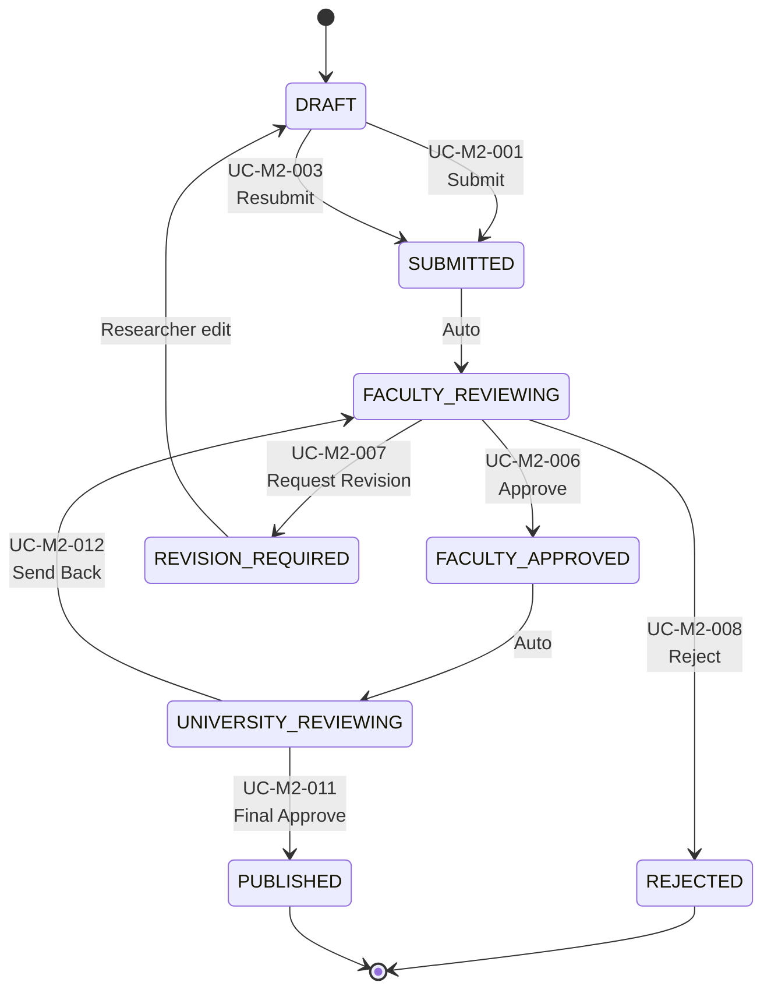

# Module 2: Approval Workflow - Use Case Diagram

> 📊 **Diagram ID**: UCD-02  
> 📦 **Module**: Approval Workflow  
> 👥 **Actors**: Researcher, Faculty Reviewer, University Reviewer  
> 📋 **Use Cases**: 15

---

## 🎯 Module Overview

Module này handle quy trình phê duyệt 2 cấp (Khoa → Trường) cho publications.

**Workflow States**:
```
DRAFT → SUBMITTED → FACULTY_REVIEWING → FACULTY_APPROVED → 
UNIVERSITY_REVIEWING → PUBLISHED

Alternative: REVISION_REQUIRED → DRAFT
Alternative: REJECTED (final)
```

---

## 📊 Use Case Diagram

```mermaid
graph TB
    subgraph Actors["👥 Actors"]
        RES[👨‍🔬 Researcher]
        FCR[👨‍💼 Faculty<br/>Reviewer]
        UNR[👨‍💼 University<br/>Reviewer]
    end
    
    subgraph APPROVAL["✅ Approval Workflow Module"]
        direction TB
        
        subgraph Submission["📤 Submission (Researcher)"]
            UC1[UC-M2-001<br/>Submit for Review<br/>P0]
            UC2[UC-M2-002<br/>Withdraw Submission<br/>P0]
            UC3[UC-M2-003<br/>Resubmit After Revision<br/>P0]
            UC4[UC-M2-004<br/>Track Approval Status<br/>P0]
        end
        
        subgraph FacultyReview["🏛️ Faculty Review"]
            UC5[UC-M2-005<br/>Review Submission<br/>P0]
            UC6[UC-M2-006<br/>Approve at Faculty<br/>P0]
            UC7[UC-M2-007<br/>Request Revision<br/>P0]
            UC8[UC-M2-008<br/>Reject Submission<br/>P0]
            UC9[UC-M2-009<br/>Assign Reviewer<br/>P1]
        end
        
        subgraph UniversityReview["🎓 University Review"]
            UC10[UC-M2-010<br/>Review at University<br/>P0]
            UC11[UC-M2-011<br/>Final Approval<br/>P0]
            UC12[UC-M2-012<br/>Send Back to Faculty<br/>P0]
        end
        
        subgraph Common["🔔 Common"]
            UC13[UC-M2-013<br/>View Review History<br/>P0]
            UC14[UC-M2-014<br/>Receive Notifications<br/>P0]
            UC15[UC-M2-015<br/>Add Review Comments<br/>P1]
        end
        
        %% Include relationships
        UC5 -.->|include| UC15
        UC10 -.->|include| UC15
        UC6 -.->|include| UC14
        UC7 -.->|include| UC14
        UC8 -.->|include| UC14
        UC11 -.->|include| UC14
        
        %% Extend relationships
        UC5 -.->|extend| UC9
    end
    
    %% Researcher connections
    RES -->|submit| UC1
    RES -->|withdraw| UC2
    RES -->|resubmit| UC3
    RES -->|track| UC4
    RES -->|view| UC13
    RES -->|receive| UC14
    
    %% Faculty Reviewer connections
    FCR -->|review| UC5
    FCR -->|approve| UC6
    FCR -->|request revision| UC7
    FCR -->|reject| UC8
    FCR -->|assign| UC9
    FCR -->|view| UC13
    FCR -->|add| UC15
    
    %% University Reviewer connections
    UNR -->|review| UC10
    UNR -->|final approve| UC11
    UNR -->|send back| UC12
    UNR -->|view| UC13  
    UNR -->|add| UC15
    
    %% Styling
    style UC1 fill:#ff6b9d,stroke:#333,stroke-width:2px
    style UC2 fill:#ff6b9d,stroke:#333,stroke-width:2px
    style UC3 fill:#ff6b9d,stroke:#333,stroke-width:2px
    style UC4 fill:#ff6b9d,stroke:#333,stroke-width:2px
    style UC5 fill:#ff6b9d,stroke:#333,stroke-width:2px
    style UC6 fill:#ff6b9d,stroke:#333,stroke-width:2px
    style UC7 fill:#ff6b9d,stroke:#333,stroke-width:2px
    style UC8 fill:#ff6b9d,stroke:#333,stroke-width:2px
    style UC9 fill:#ffb3d1,stroke:#333,stroke-width:1px
    style UC10 fill:#ff6b9d,stroke:#333,stroke-width:2px
    style UC11 fill:#ff6b9d,stroke:#333,stroke-width:2px
    style UC12 fill:#ff6b9d,stroke:#333,stroke-width:2px
    style UC13 fill:#ff6b9d,stroke:#333,stroke-width:2px
    style UC14 fill:#ff6b9d,stroke:#333,stroke-width:2px
    style UC15 fill:#ffb3d1,stroke:#333,stroke-width:1px
    
    style RES fill:#e3f2fd,stroke:#1976d2,stroke-width:2px
    style FCR fill:#fff3e0,stroke:#f57c00,stroke-width:2px
    style UNR fill:#fce4ec,stroke:#c2185b,stroke-width:2px
```



---

## 📋 Use Cases - Submission Group

### UC-M2-001: Submit for Review
**Priority**: P0  
**Actor**: Researcher  
**Description**: Submit publication từ DRAFT sang SUBMITTED  

**Preconditions**:
- Publication ở status DRAFT
- Tất cả required fields đã điền
- PDF đã upload

**Main Flow**:
1. Researcher view DRAFT publication
2. Click "Submit for Review"
3. System validate completion
4. System change status: DRAFT → SUBMITTED
5. System tự động chuyển sang FACULTY_REVIEWING
6. System send email notification to Faculty Reviewers
7. System log action vào review_history

**Business Rules**:
- Sau khi submit, researcher KHÔNG thể edit
- CHỈ có thể withdraw nếu chưa có reviewer claim

**Related**: FR-APR-001, US-RES-010

---

### UC-M2-002: Withdraw Submission
**Priority**: P0  
**Actor**: Researcher  
**Description**: Rút lại submission (SUBMITTED → DRAFT)

**Preconditions**:
- Status = SUBMITTED hoặc FACULTY_REVIEWING
- Chưa có reviewer bắt đầu review (hoặc được reviewer approve withdraw)

**Related**: FR-APR-002, US-RES-011

---

### UC-M2-003: Resubmit After Revision
**Priority**: P0  
**Actor**: Researcher  
**Description**: Submit lại sau khi fix theo yêu cầu revision

**Preconditions**:
- Status = REVISION_REQUIRED (sau khi Faculty/University request revision)
- Researcher đã edit xong

**Flow**:
- REVISION_REQUIRED → DRAFT (researcher edit)
- DRAFT → SUBMITTED (resubmit)
- SUBMITTED → FACULTY_REVIEWING (back to review)

**Related**: FR-APR-003, US-RES-012

---

### UC-M2-004: Track Approval Status
**Priority**: P0  
**Actor**: Researcher  
**Description**: Xem real-time status của publication trong workflow

**Information Displayed**:
- Current state
- Timeline (submitted date, reviewed date, etc.)
- Reviewer names (if disclosed)
- Comments (if any)

**Related**: FR-APR-004, US-RES-013

---

## 📋 Use Cases - Faculty Review Group

### UC-M2-005: Review Submission
**Priority**: P0  
**Actor**: Faculty Reviewer  
**Description**: Xét duyệt publication ở cấp Khoa

**Preconditions**:
- Status = FACULTY_REVIEWING
- Reviewer thuộc Faculty tương ứng

**Main Flow**:
1. Faculty Reviewer view danh sách submissions cần review
2. Click vào publication
3. System hiển thị full details + PDF
4. Reviewer đọc và đánh giá
5. Reviewer thêm comments (UC-M2-015 include)
6. Reviewer choose action: Approve / Request Revision / Reject

**Related**: FR-APR-005, FR-APR-006, US-FCR-002

---

### UC-M2-006: Approve at Faculty
**Priority**: P0  
**Actor**: Faculty Reviewer  
**Description**: Phê duyệt ở cấp Khoa

**Postconditions**:
- Status: FACULTY_REVIEWING → FACULTY_APPROVED
- System tự động chuyển sang UNIVERSITY_REVIEWING
- Email notification to University Reviewers

**Related**: FR-APR-007, US-FCR-003

---

### UC-M2-007: Request Revision
**Priority**: P0  
**Actor**: Faculty Reviewer  
**Description**: Yêu cầu researcher sửa lại

**Postconditions**:
- Status: FACULTY_REVIEWING → REVISION_REQUIRED
- Researcher received notification with comments
- Researcher có thể edit lại

**Related**: FR-APR-008, US-FCR-004

---

### UC-M2-008: Reject Submission
**Priority**: P0  
**Actor**: Faculty Reviewer  
**Description**: Từ chối publication (final rejection)

**Preconditions**:
- Lý do rejection phải được ghi rõ

**Postconditions**:
- Status: FACULTY_REVIEWING → REJECTED
- KHÔNG thể resubmit (chỉ SuperAdmin mới unlock được)

**Related**: FR-APR-009, US-FCR-005

---

### UC-M2-009: Assign Reviewer
**Priority**: P1  
**Actor**: Faculty Reviewer (Lead/Admin)  
**Description**: Assign submission cho specific reviewer

**Use Case**: Phân công reviewer khi có nhiều CB Khoa

**Related**: FR-APR-010

---

## 📋 Use Cases - University Review Group

### UC-M2-010: Review at University
**Priority**: P0  
**Actor**: University Reviewer  
**Description**: Xét duyệt cấp Trường (final review)

**Preconditions**:
- Status = UNIVERSITY_REVIEWING
- Publication đã được Faculty approve

**Actions**:
- Final Approve → PUBLISHED
- Send back to Faculty → FACULTY_REVIEWING

**Related**: FR-APR-011, FR-APR-012, US-UNR-003

---

### UC-M2-011: Final Approval
**Priority**: P0  
**Actor**: University Reviewer  
**Description**: Phê duyệt cuối cùng và publish

**Postconditions**:
- Status: UNIVERSITY_REVIEWING → PUBLISHED
- Publication visible publicly
- Researcher notified
- Audit log created

**Business Rule**: Sau khi PUBLISHED, CHỈ SuperAdmin mới edit/delete được

**Related**: FR-APR-013, US-UNR-004

---

### UC-M2-012: Send Back to Faculty
**Priority**: P0  
**Actor**: University Reviewer  
**Description**: Gửi lại cho Faculty để xem xét thêm

**Postconditions**:
- Status: UNIVERSITY_REVIEWING → FACULTY_REVIEWING
- Faculty reviewer notified

**Related**: FR-APR-014, US-UNR-005

---

## 📋 Use Cases - Common Group

### UC-M2-013: View Review History
**Priority**: P0  
**Actor**: Researcher, Faculty Reviewer, University Reviewer  
**Description**: Xem complete history của approval process

**Information**:
- All state transitions với timestamps
- Who did what
- Comments từ reviewers
- Email notifications sent

**Related**: FR-APR-015, US-RES-014, US-FCR-006, US-UNR-006

---

### UC-M2-014: Receive Notifications
**Priority**: P0  
**Actor**: All  
**Description**: Nhận email notifications về workflow events

**Events Trigger Notifications**:
- Submission submitted → Faculty Reviewers
- Approved at Faculty → University Reviewers, Researcher
- Revision requested → Researcher
- Rejected → Researcher
- Published → Researcher, all co-authors

**Related**: FR-APR-016, FR-APR-017

---

### UC-M2-015: Add Review Comments
**Priority**: P1  
**Actor**: Faculty Reviewer, University Reviewer  
**Description**: Thêm comments khi review

**Features**:
- Rich text comments
- Attach files (optional - P2)
- Tag specific sections of PDF (P2)

**Related**: FR-APR-018

---

## 📊 Statistics

| Priority | Use Cases | % |
|----------|-----------|---|
| P0 - Must Have | 13 | 87% |
| P1 - Should Have | 2 | 13% |

---

## 🔄 State Transitions



---

## 🔗 Traceability

### Functional Requirements
- FR-APR-001 to FR-APR-020 (tất cả 20 FRs)

### User Stories
**Researcher**: US-RES-010 to US-RES-014  
**Faculty Reviewer**: US-FCR-002 to US-FCR-006  
**University Reviewer**: US-UNR-003 to US-UNR-006

---

## 📚 Related Documentation

- **Use Cases**: [05_Use_Cases/Medium_Level/module_02_approval_workflow.md](../../05_Use_Cases/Medium_Level/module_02_approval_workflow.md)
- **Requirements**: [03_Requirements/Functional/module_approval_workflow.md](../../03_Requirements/Functional/module_approval_workflow.md)
- **Sequence Diagrams**: 
  - [seq_submit_for_review.md](../Sequence/seq_submit_for_review.md)
  - [seq_faculty_review.md](../Sequence/seq_faculty_review.md)
  - [seq_university_approval.md](../Sequence/seq_university_approval.md)
- **Activity Diagrams**: [act_approval_workflow.md](../Activity/act_approval_workflow.md)

---

**Created**: 10/02/2026  
**Version**: 1.0
