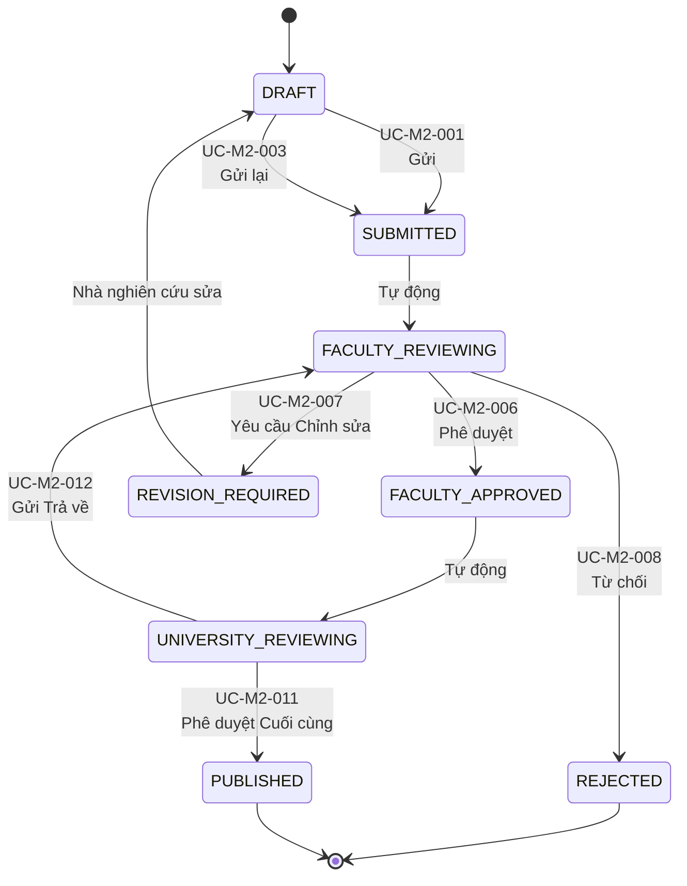

# Module 2: Quy trình Phê duyệt - Biểu đồ Ca Sử dụng

> 📊 **ID Biểu đồ**: UCD-02  
> 📦 **Module**: Quy trình Phê duyệt  
> 👥 **Tác nhân**: Nhà nghiên cứu, Người đánh giá Khoa, Người đánh giá Trường  
> 📋 **Ca Sử dụng**: 15

---

## 🎯 Tổng quan Module

Module này xử lý quy trình phê duyệt 2 cấp (Khoa → Trường) cho ấn phẩm.

**Trạng thái Quy trình**:
```
DRAFT (Nháp) → SUBMITTED (Đã gửi) → FACULTY_REVIEWING (Khoa đang duyệt) → FACULTY_APPROVED (Khoa đã duyệt) → 
UNIVERSITY_REVIEWING (Trường đang duyệt) → PUBLISHED (Đã xuất bản)

Thay thế: REVISION_REQUIRED (Yêu cầu chỉnh sửa) → DRAFT (Nháp)
Thay thế: REJECTED (Bị từ chối) (cuối cùng)
```

---

## 📊 Biểu đồ Ca Sử dụng

```mermaid
graph TB
    subgraph Actors["👥 Tác nhân"]
        RES[👨‍🔬 Nhà nghiên cứu]
        FCR[👨‍💼 Người đánh giá<br/>Khoa]
        UNR[👨‍💼 Người đánh giá<br/>Trường]
    end
    
    subgraph APPROVAL["✅ Module Quy trình Phê duyệt"]
        direction TB
        
        subgraph Submission["📤 Gửi bài (Nhà nghiên cứu)"]
            UC1[UC-M2-001<br/>Gửi để Đánh giá<br/>P0]
            UC2[UC-M2-002<br/>Rút lại Bài gửi<br/>P0]
            UC3[UC-M2-003<br/>Gửi lại Sau chỉnh sửa<br/>P0]
            UC4[UC-M2-004<br/>Theo dõi Trạng thái<br/>P0]
        end
        
        subgraph FacultyReview["🏛️ Đánh giá Khoa"]
            UC5[UC-M2-005<br/>Đánh giá Bài gửi<br/>P0]
            UC6[UC-M2-006<br/>Phê duyệt tại Khoa<br/>P0]
            UC7[UC-M2-007<br/>Yêu cầu Chỉnh sửa<br/>P0]
            UC8[UC-M2-008<br/>Từ chối Bài gửi<br/>P0]
            UC9[UC-M2-009<br/>Phân công Người đánh giá<br/>P1]
        end
        
        subgraph UniversityReview["🎓 Đánh giá Trường"]
            UC10[UC-M2-010<br/>Đánh giá tại Trường<br/>P0]
            UC11[UC-M2-011<br/>Phê duyệt Cuối cùng<br/>P0]
            UC12[UC-M2-012<br/>Gửi Trả về Khoa<br/>P0]
        end
        
        subgraph Common["🔔 Chung"]
            UC13[UC-M2-013<br/>Xem Lịch sử Đánh giá<br/>P0]
            UC14[UC-M2-014<br/>Nhận Thông báo<br/>P0]
            UC15[UC-M2-015<br/>Thêm Bình luận<br/>P1]
        end
        
        %% Include relationships
        UC5 -.->|include| UC15
        UC10 -.->|include| UC15
        UC6 -.->|include| UC14
        UC7 -.->|include| UC14
        UC8 -.->|include| UC14
        UC11 -.->|include| UC14
        
        %% Extend relationships
        UC5 -.->|extend| UC9
    end
    
    %% Researcher connections
    RES -->|gửi| UC1
    RES -->|rút lại| UC2
    RES -->|gửi lại| UC3
    RES -->|theo dõi| UC4
    RES -->|xem| UC13
    RES -->|nhận| UC14
    
    %% Faculty Reviewer connections
    FCR -->|đánh giá| UC5
    FCR -->|phê duyệt| UC6
    FCR -->|yêu cầu chỉnh sửa| UC7
    FCR -->|từ chối| UC8
    FCR -->|phân công| UC9
    FCR -->|xem| UC13
    FCR -->|thêm| UC15
    
    %% University Reviewer connections
    UNR -->|đánh giá| UC10
    UNR -->|phê duyệt cuối| UC11
    UNR -->|gửi trả về| UC12
    UNR -->|xem| UC13  
    UNR -->|thêm| UC15
    
    %% Styling
    style UC1 fill:#ff6b9d,stroke:#333,stroke-width:2px
    style UC2 fill:#ff6b9d,stroke:#333,stroke-width:2px
    style UC3 fill:#ff6b9d,stroke:#333,stroke-width:2px
    style UC4 fill:#ff6b9d,stroke:#333,stroke-width:2px
    style UC5 fill:#ff6b9d,stroke:#333,stroke-width:2px
    style UC6 fill:#ff6b9d,stroke:#333,stroke-width:2px
    style UC7 fill:#ff6b9d,stroke:#333,stroke-width:2px
    style UC8 fill:#ff6b9d,stroke:#333,stroke-width:2px
    style UC9 fill:#ffb3d1,stroke:#333,stroke-width:1px
    style UC10 fill:#ff6b9d,stroke:#333,stroke-width:2px
    style UC11 fill:#ff6b9d,stroke:#333,stroke-width:2px
    style UC12 fill:#ff6b9d,stroke:#333,stroke-width:2px
    style UC13 fill:#ff6b9d,stroke:#333,stroke-width:2px
    style UC14 fill:#ff6b9d,stroke:#333,stroke-width:2px
    style UC15 fill:#ffb3d1,stroke:#333,stroke-width:1px
    
    style RES fill:#e3f2fd,stroke:#1976d2,stroke-width:2px
    style FCR fill:#fff3e0,stroke:#f57c00,stroke-width:2px
    style UNR fill:#fce4ec,stroke:#c2185b,stroke-width:2px
```



---

## 📋 Ca Sử dụng - Nhóm Gửi bài

### UC-M2-001: Gửi để Đánh giá
**Độ ưu tiên**: P0  
**Tác nhân**: Nhà nghiên cứu  
**Mô tả**: Gửi ấn phẩm từ DRAFT sang SUBMITTED  

**Điều kiện tiên quyết**:
- Ấn phẩm ở trạng thái DRAFT
- Tất cả các trường bắt buộc đã điền
- PDF đã tải lên

**Luồng chính**:
1. Nhà nghiên cứu xem ấn phẩm DRAFT
2. Nhấn "Gửi để Đánh giá"
3. Hệ thống xác thực hoàn thành
4. Hệ thống đổi trạng thái: DRAFT → SUBMITTED
5. Hệ thống tự động chuyển sang FACULTY_REVIEWING
6. Hệ thống gửi email thông báo cho Người đánh giá Khoa
7. Hệ thống ghi nhật ký hành động vào review_history

**Quy tắc Nghiệp vụ**:
- Sau khi gửi, nhà nghiên cứu KHÔNG thể chỉnh sửa
- CHỈ có thể rút lại nếu chưa có người đánh giá nhận xử lý

**Liên quan**: FR-APR-001, US-RES-010

---

### UC-M2-002: Rút lại Bài gửi
**Độ ưu tiên**: P0  
**Tác nhân**: Nhà nghiên cứu  
**Mô tả**: Rút lại bài gửi (SUBMITTED → DRAFT)

**Điều kiện tiên quyết**:
- Trạng thái = SUBMITTED hoặc FACULTY_REVIEWING
- Chưa có người đánh giá bắt đầu đánh giá (hoặc được người đánh giá chấp thuận rút lại)

**Liên quan**: FR-APR-002, US-RES-011

---

### UC-M2-003: Gửi lại Sau chỉnh sửa
**Độ ưu tiên**: P0  
**Tác nhân**: Nhà nghiên cứu  
**Mô tả**: Gửi lại sau khi sửa theo yêu cầu chỉnh sửa

**Điều kiện tiên quyết**:
- Trạng thái = REVISION_REQUIRED (sau khi Khoa/Trường yêu cầu chỉnh sửa)
- Nhà nghiên cứu đã sửa xong

**Luồng**:
- REVISION_REQUIRED → DRAFT (nhà nghiên cứu sửa)
- DRAFT → SUBMITTED (gửi lại)
- SUBMITTED → FACULTY_REVIEWING (quay lại đánh giá)

**Liên quan**: FR-APR-003, US-RES-012

---

### UC-M2-004: Theo dõi Trạng thái
**Độ ưu tiên**: P0  
**Tác nhân**: Nhà nghiên cứu  
**Mô tả**: Xem trạng thái thời gian thực của ấn phẩm trong quy trình

**Thông tin hiển thị**:
- Trạng thái hiện tại
- Dòng thời gian (ngày gửi, ngày đánh giá, v.v.)
- Tên người đánh giá (nếu được công khai)
- Bình luận (nếu có)

**Liên quan**: FR-APR-004, US-RES-013

---

## 📋 Ca Sử dụng - Nhóm Đánh giá Khoa

### UC-M2-005: Đánh giá Bài gửi
**Độ ưu tiên**: P0  
**Tác nhân**: Người đánh giá Khoa  
**Mô tả**: Xét duyệt ấn phẩm ở cấp Khoa

**Điều kiện tiên quyết**:
- Trạng thái = FACULTY_REVIEWING
- Người đánh giá thuộc Khoa tương ứng

**Luồng chính**:
1. Người đánh giá Khoa xem danh sách bài gửi cần đánh giá
2. Nhấn vào ấn phẩm
3. Hệ thống hiển thị chi tiết đầy đủ + PDF
4. Người đánh giá đọc và đánh giá
5. Người đánh giá thêm bình luận (UC-M2-015 include)
6. Người đánh giá chọn hành động: Phê duyệt / Yêu cầu Chỉnh sửa / Từ chối

**Liên quan**: FR-APR-005, FR-APR-006, US-FCR-002

---

### UC-M2-006: Phê duyệt tại Khoa
**Độ ưu tiên**: P0  
**Tác nhân**: Người đánh giá Khoa  
**Mô tả**: Phê duyệt ở cấp Khoa

**Điều kiện hậu**:
- Trạng thái: FACULTY_REVIEWING → FACULTY_APPROVED
- Hệ thống tự động chuyển sang UNIVERSITY_REVIEWING
- Thông báo email cho Người đánh giá Trường

**Liên quan**: FR-APR-007, US-FCR-003

---

### UC-M2-007: Yêu cầu Chỉnh sửa
**Độ ưu tiên**: P0  
**Tác nhân**: Người đánh giá Khoa  
**Mô tả**: Yêu cầu nhà nghiên cứu sửa lại

**Điều kiện hậu**:
- Trạng thái: FACULTY_REVIEWING → REVISION_REQUIRED
- Nhà nghiên cứu nhận thông báo kèm bình luận
- Nhà nghiên cứu có thể sửa lại

**Liên quan**: FR-APR-008, US-FCR-004

---

### UC-M2-008: Từ chối Bài gửi
**Độ ưu tiên**: P0  
**Tác nhân**: Người đánh giá Khoa  
**Mô tả**: Từ chối ấn phẩm (từ chối cuối cùng)

**Điều kiện tiên quyết**:
- Lý do từ chối phải được ghi rõ

**Điều kiện hậu**:
- Trạng thái: FACULTY_REVIEWING → REJECTED
- KHÔNG thể gửi lại (chỉ Quản trị viên Cấp cao mới mở khóa được)

**Liên quan**: FR-APR-009, US-FCR-005

---

### UC-M2-009: Phân công Người đánh giá
**Độ ưu tiên**: P1  
**Tác nhân**: Người đánh giá Khoa (Trưởng nhóm/Quản trị)  
**Mô tả**: Phân công bài gửi cho người đánh giá cụ thể

**Ca sử dụng**: Phân công người đánh giá khi có nhiều Cán bộ Khoa

**Liên quan**: FR-APR-010

---

## 📋 Ca Sử dụng - Nhóm Đánh giá Trường

### UC-M2-010: Đánh giá tại Trường
**Độ ưu tiên**: P0  
**Tác nhân**: Người đánh giá Trường  
**Mô tả**: Xét duyệt cấp Trường (đánh giá cuối cùng)

**Điều kiện tiên quyết**:
- Trạng thái = UNIVERSITY_REVIEWING
- Ấn phẩm đã được Khoa phê duyệt

**Hành động**:
- Phê duyệt Cuối cùng → PUBLISHED
- Gửi Trả về Khoa → FACULTY_REVIEWING

**Liên quan**: FR-APR-011, FR-APR-012, US-UNR-003

---

### UC-M2-011: Phê duyệt Cuối cùng
**Độ ưu tiên**: P0  
**Tác nhân**: Người đánh giá Trường  
**Mô tả**: Phê duyệt cuối cùng và xuất bản

**Điều kiện hậu**:
- Trạng thái: UNIVERSITY_REVIEWING → PUBLISHED
- Ấn phẩm hiển thị công khai
- Nhà nghiên cứu được thông báo
- Nhật ký kiểm toán được tạo

**Quy tắc Nghiệp vụ**: Sau khi PUBLISHED, CHỈ Quản trị viên Cấp cao mới sửa/xóa được

**Liên quan**: FR-APR-013, US-UNR-004

---

### UC-M2-012: Gửi Trả về Khoa
**Độ ưu tiên**: P0  
**Tác nhân**: Người đánh giá Trường  
**Mô tả**: Gửi lại cho Khoa để xem xét thêm

**Điều kiện hậu**:
- Trạng thái: UNIVERSITY_REVIEWING → FACULTY_REVIEWING
- Người đánh giá Khoa được thông báo

**Liên quan**: FR-APR-014, US-UNR-005

---

## 📋 Ca Sử dụng - Nhóm Chung

### UC-M2-013: Xem Lịch sử Đánh giá
**Độ ưu tiên**: P0  
**Tác nhân**: Nhà nghiên cứu, Người đánh giá Khoa, Người đánh giá Trường  
**Mô tả**: Xem lịch sử đầy đủ của quy trình phê duyệt

**Thông tin**:
- Tất cả chuyển đổi trạng thái với dấu thời gian
- Ai đã làm gì
- Bình luận từ người đánh giá
- Thông báo email đã gửi

**Liên quan**: FR-APR-015, US-RES-014, US-FCR-006, US-UNR-006

---

### UC-M2-014: Nhận Thông báo
**Độ ưu tiên**: P0  
**Tác nhân**: Tất cả  
**Mô tả**: Nhận email thông báo về sự kiện quy trình

**Sự kiện Kích hoạt Thông báo**:
- Bài gửi đã nộp → Người đánh giá Khoa
- Đã phê duyệt tại Khoa → Người đánh giá Trường, Nhà nghiên cứu
- Yêu cầu chỉnh sửa → Nhà nghiên cứu
- Bị từ chối → Nhà nghiên cứu
- Đã xuất bản → Nhà nghiên cứu, tất cả đồng tác giả

**Liên quan**: FR-APR-016, FR-APR-017

---

### UC-M2-015: Thêm Bình luận
**Độ ưu tiên**: P1  
**Tác nhân**: Người đánh giá Khoa, Người đánh giá Trường  
**Mô tả**: Thêm bình luận khi đánh giá

**Tính năng**:
- Bình luận văn bản phong phú
- Đính kèm tệp (tùy chọn - P2)
- Gắn thẻ các phần cụ thể của PDF (P2)

**Liên quan**: FR-APR-018

---

## 📊 Thống kê

| Độ ưu tiên | Ca Sử dụng | % |
|----------|-----------|---|
| P0 - Phải Có | 13 | 87% |
| P1 - Nên Có | 2 | 13% |

---

## 🔄 Chuyển đổi Trạng thái



---

## 🔗 Truy xuất nguồn gốc

### Yêu cầu Chức năng
- FR-APR-001 đến FR-APR-020 (tất cả 20 FRs)

### Câu chuyện Người dùng
**Nhà nghiên cứu**: US-RES-010 đến US-RES-014  
**Người đánh giá Khoa**: US-FCR-002 đến US-FCR-006  
**Người đánh giá Trường**: US-UNR-003 đến US-UNR-006

---

## 📚 Tài liệu Liên quan

- **Ca Sử dụng**: [05_Use_Cases/Medium_Level/module_02_approval_workflow.md](../../05_Use_Cases/Medium_Level/module_02_approval_workflow.md)
- **Yêu cầu**: [03_Requirements/Functional/module_approval_workflow.md](../../03_Requirements/Functional/module_approval_workflow.md)
- **Biểu đồ Tuần tự**: 
  - [seq_submit_for_review.md](../Sequence/seq_submit_for_review.md)
  - [seq_faculty_review.md](../Sequence/seq_faculty_review.md)
  - [seq_university_approval.md](../Sequence/seq_university_approval.md)
- **Biểu đồ Hoạt động**: [act_approval_workflow.md](../Activity/act_approval_workflow.md)

---

**Ngày tạo**: 10/02/2026  
**Phiên bản**: 1.0
