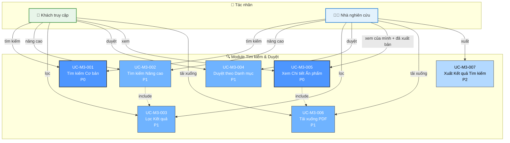

# Module 3: Tìm kiếm & Duyệt - Biểu đồ Ca Sử dụng

> 📊 **ID Biểu đồ**: UCD-03  
> 📦 **Module**: Tìm kiếm & Duyệt  
> 👥 **Tác nhân**: Khách truy cập, Nhà nghiên cứu  
> 📋 **Ca Sử dụng**: 7

---

## 🎯 Tổng quan Module

Module này cung cấp quyền truy cập công khai để tìm kiếm và duyệt các ấn phẩm ĐÃ XUẤT BẢN.

**Tính năng Chính**: Chế độ hiển thị kép
- **Khách truy cập**: CHỈ xem ấn phẩm ĐÃ XUẤT BẢN
- **Nhà nghiên cứu**: Xem ĐÃ XUẤT BẢN + ấn phẩm của chính mình (mọi trạng thái)

---

## 📊 Biểu đồ Ca Sử dụng

---

## 📋 Ca Sử dụng

### UC-M3-001: Tìm kiếm Cơ bản
**Độ ưu tiên**: P0  
**Tác nhân**: Khách truy cập, Nhà nghiên cứu  
**Mô tả**: Tìm kiếm đơn giản bằng từ khóa

**Phạm vi Tìm kiếm**:
- Tiêu đề, Tóm tắt, Từ khóa
- Tên tác giả
- Tên Tạp chí/Hội nghị
- Năm

**Khả năng hiển thị**:
- **Khách truy cập**: CHỈ ấn phẩm ĐÃ XUẤT BẢN
- **Nhà nghiên cứu**: ĐÃ XUẤT BẢN + của chính mình (mọi trạng thái)

**Tính năng**:
- Tìm kiếm văn bản tự do
- Xếp hạng theo mức độ liên quan
- Phân trang

**Liên quan**: FR-SRC-001, US-VIW-001, US-RES-015

---

### UC-M3-002: Tìm kiếm Nâng cao
**Độ ưu tiên**: P1  
**Tác nhân**: Khách truy cập, Nhà nghiên cứu  
**Mô tả**: Tìm kiếm với nhiều tiêu chí

**Trường Tìm kiếm**:
- Loại ấn phẩm (Tạp chí, Hội nghị, v.v.)
- Khoảng năm
- DOI, ISSN
- Khoa/Bộ môn
- Tác giả (khớp chính xác)

**Toán tử**: AND, OR, NOT

**Liên quan**: FR-SRC-002, US-VIW-002

---

### UC-M3-003: Lọc Kết quả
**Độ ưu tiên**: P1  
**Tác nhân**: Khách truy cập, Nhà nghiên cứu  
**Mô tả**: Lọc kết quả tìm kiếm

**Bộ lọc**:
- Năm
- Loại ấn phẩm
- Khoa
- Hạng (Q1, Q2, Q3, Q4)
- Có PDF
- Truy cập Mở

**Giao diện**: Thanh bên với các hộp kiểm

**Liên quan**: FR-SRC-003, US-VIW-003

---

### UC-M3-004: Duyệt theo Danh mục
**Độ ưu tiên**: P1  
**Tác nhân**: Khách truy cập, Nhà nghiên cứu  
**Mô tả**: Duyệt ấn phẩm theo danh mục

**Danh mục**:
- Theo Khoa
- Theo Năm
- Theo Loại ấn phẩm
- Theo Tác giả
- Ấn phẩm hàng đầu (được trích dẫn nhiều nhất - P2)

**Liên quan**: FR-SRC-004, US-VIW-004

---

### UC-M3-005: Xem Chi tiết Ấn phẩm
**Độ ưu tiên**: P0  
**Tác nhân**: Khách truy cập, Nhà nghiên cứu  
**Mô tả**: Xem chi tiết 1 ấn phẩm

**Thông tin Hiển thị**:
- Siêu dữ liệu đầy đủ
- Danh sách tác giả (kèm liên kết đến hồ sơ)
- Tóm tắt
- Liên kết tải xuống PDF (nếu có)
- Liên kết DOI (bên ngoài)
- Số lượt trích dẫn (P2)
- Ấn phẩm liên quan (P2)

**Quy tắc Hiển thị**:
- Công khai: CHỈ ĐÃ XUẤT BẢN
- Nhà nghiên cứu: ĐÃ XUẤT BẢN + của chính mình

**Liên quan**: FR-SRC-005, US-VIW-005

---

### UC-M3-006: Tải xuống PDF
**Độ ưu tiên**: P1  
**Tác nhân**: Khách truy cập, Nhà nghiên cứu  
**Mô tả**: Tải xuống tệp PDF

**Kiểm soát Truy cập**:
- Ấn phẩm công khai: Bất kỳ ai cũng có thể tải xuống
- Riêng tư/Cấm vận (P2): Yêu cầu mật khẩu

**Theo dõi**: Ghi nhận số lượt tải xuống (phân tích)

**Liên quan**: FR-SRC-006, US-VIW-006

---

### UC-M3-007: Xuất Kết quả Tìm kiếm
**Độ ưu tiên**: P2  
**Tác nhân**: Nhà nghiên cứu  
**Mô tả**: Xuất kết quả tìm kiếm

**Định dạng**:
- CSV
- Excel
- BibTeX
- RIS (cho trình quản lý tài liệu tham khảo)

**Ca sử dụng**: Nhà nghiên cứu muốn xuất để tạo thư mục tham khảo

**Liên quan**: FR-SRC-007

---

## 📊 Thống kê

| Độ ưu tiên | Ca Sử dụng | % |
|----------|-----------|---|
| P0 - Phải Có | 2 | 29% |
| P1 - Nên Có | 4 | 57% |
| P2 - Có Thì Tốt | 1 | 14% |

---

## 🔒 Ma trận Hiển thị

| Loại Người dùng | Có thể Xem | Không thể Xem |
|-----------|---------|------------|
| **Khách truy cập** | Chỉ ĐÃ XUẤT BẢN | NHÁP, ĐÃ GỬI, ĐANG DUYỆT, BỊ TỪ CHỐI |
| **Nhà nghiên cứu (đã đăng nhập)** | ĐÃ XUẤT BẢN + của chính mình (mọi trạng thái) | Chưa xuất bản của nhà nghiên cứu khác |
| **Người đánh giá Khoa** | ĐÃ XUẤT BẢN + bài gửi của khoa mình | Chưa xuất bản của khoa khác |
| **Người đánh giá Trường** | Tất cả | - |
| **Quản trị viên Cấp cao** | Tất cả | - |

---

## 🔗 Truy xuất nguồn gốc

### Yêu cầu Chức năng
- FR-SRC-001 đến FR-SRC-007 (7 FRs)

### Câu chuyện Người dùng
**Khách truy cập**: US-VIW-001 đến US-VIW-006  
**Nhà nghiên cứu**: US-RES-015, US-RES-016

---

## 📚 Tài liệu Liên quan

- **Ca Sử dụng**: [05_Use_Cases/Medium_Level/module_03_search_browse.md](../../05_Use_Cases/Medium_Level/module_03_search_browse.md)
- **Yêu cầu**: [03_Requirements/Functional/module_search.md](../../03_Requirements/Functional/module_search.md)
- **Biểu đồ Tuần tự**: [seq_search_publications.md](../Sequence/seq_search_publications.md)
- **Biểu đồ Hoạt động**: [act_search_filter.md](../Activity/act_search_filter.md)

---

**Ngày tạo**: 10/02/2026  
**Phiên bản**: 1.0
