# Module 3: Search & Browse - Use Case Diagram

> 📊 **Diagram ID**: UCD-03  
> 📦 **Module**: Search & Browse  
> 👥 **Actors**: Public Visitor, Researcher  
> 📋 **Use Cases**: 7

---

## 🎯 Module Overview

Module này provide public access để search và browse PUBLISHED publications.

**Key Feature**: Dual-mode visibility
- **Public Visitor**: CHỈ xem PUBLISHED publications
- **Researcher**: Xem PUBLISHED + own publications (all states)

---

## 📊 Use Case Diagram

```mermaid
graph TB
    subgraph Actors["👥 Actors"]
        VIW[👤 Public Visitor]
        RES[👨‍🔬 Researcher]
    end
    
    subgraph SEARCH["🔍 Search & Browse Module"]
        direction TB
        
        UC1[UC-M3-001<br/>Basic Search<br/>P0]
        UC2[UC-M3-002<br/>Advanced Search<br/>P1]
        UC3[UC-M3-003<br/>Filter Results<br/>P1]
        UC4[UC-M3-004<br/>Browse by Category<br/>P1]
        UC5[UC-M3-005<br/>View Publication Details<br/>P0]
        UC6[UC-M3-006<br/>Download PDF<br/>P1]
        UC7[UC-M3-007<br/>Export Search Results<br/>P2]
        
        %% Include relationships
        UC2 -.->|include| UC3
        UC5 -.->|include| UC6
    end
    
    %% Public Visitor connections
    VIW -->|search| UC1
    VIW -->|advanced| UC2
    VIW -->|filter| UC3
    VIW -->|browse| UC4
    VIW -->|view| UC5
    VIW -->|download| UC6
    
    %% Researcher connections (can do everything + more visibility)
    RES -->|search| UC1
    RES -->|advanced| UC2
    RES -->|filter| UC3
    RES -->|browse| UC4
    RES -->|view own + published| UC5
    RES -->|download| UC6
    RES -->|export| UC7
    
    %% Styling
    style UC1 fill:#4d96ff,stroke:#333,stroke-width:2px,color:#fff
    style UC2 fill:#6fb3ff,stroke:#333,stroke-width:1px,color:#fff
    style UC3 fill:#6fb3ff,stroke:#333,stroke-width:1px,color:#fff
    style UC4 fill:#6fb3ff,stroke:#333,stroke-width:1px,color:#fff
    style UC5 fill:#4d96ff,stroke:#333,stroke-width:2px,color:#fff
    style UC6 fill:#6fb3ff,stroke:#333,stroke-width:1px,color:#fff
    style UC7 fill:#b3d9ff,stroke:#333,stroke-width:1px,color:#000
    
    style VIW fill:#e8f5e9,stroke:#388e3c,stroke-width:2px
    style RES fill:#e3f2fd,stroke:#1976d2,stroke-width:2px
```

---

## 📋 Use Cases

### UC-M3-001: Basic Search
**Priority**: P0  
**Actor**: Public Visitor, Researcher  
**Description**: Tìm kiếm đơn giản bằng keywords

**Search Scope**:
- Title, Abstract, Keywords
- Author names
- Journal/Conference name
- Year

**Visibility**:
- **Public Visitor**: CHỈ PUBLISHED publications
- **Researcher**: PUBLISHED + own (all states)

**Features**:
- Free text search
- Ranking by relevance
- Pagination

**Related**: FR-SRC-001, US-VIW-001, US-RES-015

---

### UC-M3-002: Advanced Search
**Priority**: P1  
**Actor**: Public Visitor, Researcher  
**Description**: Tìm kiếm với nhiều criteria

**Search Fields**:
- Publication type (Journal, Conference, etc.)
- Year range
- DOI, ISSN
- Faculty/Department
- Author (exact match)

**Operators**: AND, OR, NOT

**Related**: FR-SRC-002, US-VIW-002

---

### UC-M3-003: Filter Results
**Priority**: P1  
**Actor**: Public Visitor, Researcher  
**Description**: Lọc kết quả search

**Filters**:
- Year
- Publication type
- Faculty
- Quartile (Q1, Q2, Q3, Q4)
- Has PDF
- Open Access

**UI**: Sidebar với checkboxes

**Related**: FR-SRC-003, US-VIW-003

---

### UC-M3-004: Browse by Category
**Priority**: P1  
**Actor**: Public Visitor, Researcher  
**Description**: Duyệt publications theo categories

**Categories**:
- By Faculty
- By Year
- By Publication Type
- By Author
- Top publications (most cited - P2)

**Related**: FR-SRC-004, US-VIW-004

---

### UC-M3-005: View Publication Details
**Priority**: P0  
**Actor**: Public Visitor, Researcher  
**Description**: Xem chi tiết 1 publication

**Information Displayed**:
- Full metadata
- Authors list (with links to profiles)
- Abstract
- PDF download link (if available)
- DOI link (external)
- Citation count (P2)
- Related publications (P2)

**Visibility Rules**:
- Public: CHỈ PUBLISHED
- Researcher: PUBLISHED + own

**Related**: FR-SRC-005, US-VIW-005

---

### UC-M3-006: Download PDF
**Priority**: P1  
**Actor**: Public Visitor, Researcher  
**Description**: Download PDF file

**Access Control**:
- Public publications: Anyone can download
- Private/Embargoed (P2): Require password

**Tracking**: Log download count (analytics)

**Related**: FR-SRC-006, US-VIW-006

---

### UC-M3-007: Export Search Results
**Priority**: P2  
**Actor**: Researcher  
**Description**: Export search results

**Formats**:
- CSV
- Excel
- BibTeX
- RIS (for reference managers)

**Use Case**: Researcher muốn export để tạo bibliography

**Related**: FR-SRC-007

---

## 📊 Statistics

| Priority | Use Cases | % |
|----------|-----------|---|
| P0 - Must Have | 2 | 29% |
| P1 - Should Have | 4 | 57% |
| P2 - Nice to Have | 1 | 14% |

---

## 🔒 Visibility Matrix

| User Type | Can See | Cannot See |
|-----------|---------|------------|
| **Public Visitor** | PUBLISHED only | DRAFT, SUBMITTED, REVIEWING, REJECTED |
| **Researcher (logged in)** | PUBLISHED + own (all states) | Other researchers' non-published |
| **Faculty Reviewer** | PUBLISHED + own faculty's submissions | Other faculty's non-published |
| **University Reviewer** | All | - |
| **SuperAdmin** | All | - |

---

## 🔗 Traceability

### Functional Requirements
- FR-SRC-001 to FR-SRC-007 (7 FRs)

### User Stories
**Public Visitor**: US-VIW-001 to US-VIW-006  
**Researcher**: US-RES-015, US-RES-016

---

## 📚 Related Documentation

- **Use Cases**: [05_Use_Cases/Medium_Level/module_03_search_browse.md](../../05_Use_Cases/Medium_Level/module_03_search_browse.md)
- **Requirements**: [03_Requirements/Functional/module_search.md](../../03_Requirements/Functional/module_search.md)
- **Sequence Diagrams**: [seq_search_publications.md](../Sequence/seq_search_publications.md)
- **Activity Diagrams**: [act_search_filter.md](../Activity/act_search_filter.md)

---

**Created**: 10/02/2026  
**Version**: 1.0
