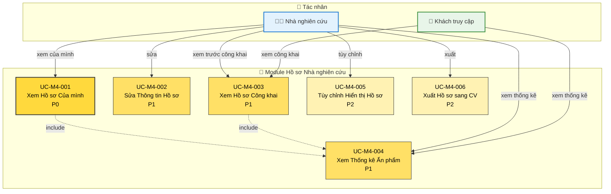

# Module 4: Hồ sơ Nhà nghiên cứu - Biểu đồ Ca Sử dụng

> 📊 **ID Biểu đồ**: UCD-04  
> 📦 **Module**: Hồ sơ Nhà nghiên cứu  
> 👥 **Tác nhân**: Nhà nghiên cứu, Khách truy cập  
> 📋 **Ca Sử dụng**: 6

---

## 🎯 Tổng quan Module

Module này cung cấp danh mục/hồ sơ công khai cho nhà nghiên cứu.

**Mục đích**: Trưng bày các ấn phẩm và thành tựu của nhà nghiên cứu một cách công khai

---

## 📊 Biểu đồ Ca Sử dụng

---

## 📋 Ca Sử dụng

### UC-M4-001: Xem Hồ sơ Của mình
**Độ ưu tiên**: P0  
**Tác nhân**: Nhà nghiên cứu  
**Mô tả**: Nhà nghiên cứu xem hồ sơ của mình

**Thông tin Hiển thị**:
- Thông tin cơ bản (tên, chức danh, bộ môn, khoa)
- Thông tin liên hệ
- Lĩnh vực nghiên cứu
- Danh sách ấn phẩm (mọi trạng thái)
- Thống kê (tổng ấn phẩm, trích dẫn, chỉ số h - P2)
- Ảnh (P1)
- Tiểu sử (P1)

**Quy tắc Nghiệp vụ**: Tự động tạo từ dữ liệu người dùng + ấn phẩm

**Liên quan**: FR-PRO-001, US-RES-020

---

### UC-M4-002: Sửa Thông tin Hồ sơ
**Độ ưu tiên**: P1  
**Tác nhân**: Nhà nghiên cứu  
**Mô tả**: Chỉnh sửa thông tin hồ sơ

**Trường có thể Sửa**:
- Ảnh
- Tiểu sử/Lĩnh vực nghiên cứu
- Thông tin liên hệ (email, điện thoại)
- Liên kết bên ngoài (ORCID, Google Scholar, trang web cá nhân)
- Mạng xã hội (tùy chọn)

**Không thể Sửa** (đồng bộ từ hệ thống nhân sự):
- Tên
- Bộ môn/Khoa
- Chức danh chính thức

**Liên quan**: FR-PRO-002, US-RES-021

---

### UC-M4-003: Xem Hồ sơ Công khai
**Độ ưu tiên**: P1  
**Tác nhân**: Khách truy cập, Nhà nghiên cứu  
**Mô tả**: Xem hồ sơ công khai của nhà nghiên cứu

**URL**: `/profile/{username}` hoặc `/profile/{orcid}`

**Khả năng hiển thị**:
- Thông tin cơ bản
- CHỈ ấn phẩm ĐÃ XUẤT BẢN
- Thống kê công khai
- Liên kết bên ngoài

**Riêng tư**: Nhà nghiên cứu kiểm soát cài đặt hiển thị (UC-M4-005)

**Liên quan**: FR-PRO-003, US-VIW-007

---

### UC-M4-004: Xem Thống kê Ấn phẩm
**Độ ưu tiên**: P1  
**Tác nhân**: Nhà nghiên cứu, Khách truy cập  
**Mô tả**: Xem thống kê ấn phẩm

**Chỉ số** (P0):
- Tổng ấn phẩm ĐÃ XUẤT BẢN
- Theo năm (biểu đồ)
- Theo loại ấn phẩm (biểu đồ tròn)

**Chỉ số** (P1):
- Theo hạng (Q1, Q2, Q3, Q4)
- Theo xếp hạng khoa/bộ môn

**Chỉ số** (P2):
- Số lượt trích dẫn
- Chỉ số h
- Chỉ số i10
- Mạng lưới cộng tác

**Liên quan**: FR-PRO-004, US-RES-022

---

### UC-M4-005: Tùy chỉnh Hiển thị Hồ sơ
**Độ ưu tiên**: P2  
**Tác nhân**: Nhà nghiên cứu  
**Mô tả**: Kiểm soát những gì hiển thị công khai

**Cài đặt Hiển thị**:
- Hiện/ẩn thông tin liên hệ
- Hiện/ẩn tiểu sử
- Hiện/ẩn ấn phẩm cụ thể (ngay cả khi ĐÃ XUẤT BẢN)
- Hiện/ẩn thống kê

**Mặc định**: Tất cả thông tin công khai hiển thị

**Liên quan**: FR-PRO-005

---

### UC-M4-006: Xuất Hồ sơ sang CV
**Độ ưu tiên**: P2  
**Tác nhân**: Nhà nghiên cứu  
**Mô tả**: Xuất dữ liệu hồ sơ sang định dạng CV

**Định dạng**:
- PDF (CV định dạng sẵn)
- Word (có thể chỉnh sửa)
- LaTeX

**Ca sử dụng**: Nộp hồ sơ, xin tài trợ, v.v.

**Liên quan**: FR-PRO-006

---

## 📊 Thống kê

| Độ ưu tiên | Ca Sử dụng | % |
|----------|-----------|---|
| P0 - Phải Có | 1 | 17% |
| P1 - Nên Có | 3 | 50% |
| P2 - Có Thì Tốt | 2 | 33% |

---

## 🔒 Cấp độ Riêng tư

| Thông tin | Khách truy cập | Nhà nghiên cứu (Của mình) | Nhà nghiên cứu (Người khác) |
|-------------|---------------|------------------|---------------------|
| Tên, Chức danh | ✅ | ✅ | ✅ |
| Bộ môn | ✅ | ✅ | ✅ |
| Ấn phẩm ĐÃ XUẤT BẢN | ✅ | ✅ | ✅ |
| Thông tin liên hệ | ✅ (nếu cho phép) | ✅ | ✅ (nếu cho phép) |
| Tiểu sử | ✅ | ✅ | ✅ |
| Ấn phẩm NHÁP/ĐÃ GỬI | ❌ | ✅ | ❌ |
| Thống kê | ✅ | ✅ (chi tiết) | ✅ |

---

## 🔗 Truy xuất nguồn gốc

### Yêu cầu Chức năng
- FR-PRO-001 đến FR-PRO-006 (6 FRs)

### Câu chuyện Người dùng
**Nhà nghiên cứu**: US-RES-020, US-RES-021, US-RES-022  
**Khách truy cập**: US-VIW-007, US-VIW-008

---

## 📚 Tài liệu Liên quan

- **Ca Sử dụng**: [05_Use_Cases/Medium_Level/module_04_researcher_profile.md](../../05_Use_Cases/Medium_Level/module_04_researcher_profile.md)
- **Yêu cầu**: [03_Requirements/Functional/module_profile.md](../../03_Requirements/Functional/module_profile.md)

---

**Ngày tạo**: 10/02/2026  
**Phiên bản**: 1.0
