# Module 4: Researcher Profile - Use Case Diagram

> 📊 **Diagram ID**: UCD-04  
> 📦 **Module**: Researcher Profile  
> 👥 **Actors**: Researcher, Public Visitor  
> 📋 **Use Cases**: 6

---

## 🎯 Module Overview

Module này provide public portfolio/profile cho researchers.

**Purpose**: Showcase researcher's publications và achievements publicly

---

## 📊 Use Case Diagram

```mermaid
graph TB
    subgraph Actors["👥 Actors"]
        RES[👨‍🔬 Researcher]
        VIW[👤 Public Visitor]
    end
    
    subgraph PROFILE["👤 Researcher Profile Module"]
        direction TB
        
        UC1[UC-M4-001<br/>View Own Profile<br/>P0]
        UC2[UC-M4-002<br/>Edit Profile Info<br/>P1]
        UC3[UC-M4-003<br/>View Public Profile<br/>P1]
        UC4[UC-M4-004<br/>View Publication Statistics<br/>P1]
        UC5[UC-M4-005<br/>Customize Profile Visibility<br/>P2]
        UC6[UC-M4-006<br/>Export Profile to CV<br/>P2]
        
        %% Include relationships
        UC1 -.->|include| UC4
        UC3 -.->|include| UC4
    end
    
    %% Researcher connections
    RES -->|view own| UC1
    RES -->|edit| UC2
    RES -->|preview public| UC3
    RES -->|view stats| UC4
    RES -->|customize| UC5
    RES -->|export| UC6
    
    %% Public Visitor connections
    VIW -->|view public| UC3
    VIW -->|view stats| UC4
    
    %% Styling
    style UC1 fill:#ffd93d,stroke:#333,stroke-width:2px,color:#000
    style UC2 fill:#ffe066,stroke:#333,stroke-width:1px,color:#000
    style UC3 fill:#ffe066,stroke:#333,stroke-width:1px,color:#000
    style UC4 fill:#ffe066,stroke:#333,stroke-width:1px,color:#000
    style UC5 fill:#fff2b3,stroke:#333,stroke-width:1px,color:#000
    style UC6 fill:#fff2b3,stroke:#333,stroke-width:1px,color:#000
    
    style RES fill:#e3f2fd,stroke:#1976d2,stroke-width:2px
    style VIW fill:#e8f5e9,stroke:#388e3c,stroke-width:2px
```

---

## 📋 Use Cases

### UC-M4-001: View Own Profile
**Priority**: P0  
**Actor**: Researcher  
**Description**: Researcher xem profile của mình

**Information Displayed**:
- Basic info (name, title, department, faculty)
- Contact info
- Research interests
- Publications list (all states)
- Statistics (total pubs, citations, h-index - P2)
- Photo (P1)
- Bio (P1)

**Business Rule**: Auto-generated từ user data + publications

**Related**: FR-PRO-001, US-RES-020

---

### UC-M4-002: Edit Profile Info
**Priority**: P1  
**Actor**: Researcher  
**Description**: Chỉnh sửa profile information

**Editable Fields**:
- Photo
- Bio/Research interests
- Contact info (email, phone)
- External links (ORCID, Google Scholar, personal website)
- Social media (optional)

**Not Editable** (synced từ HR system):
- Name
- Department/Faculty
- Official title

**Related**: FR-PRO-002, US-RES-021

---

### UC-M4-003: View Public Profile
**Priority**: P1  
**Actor**: Public Visitor, Researcher  
**Description**: Xem public profile của researcher

**URL**: `/profile/{username}` hoặc `/profile/{orcid}`

**Visibility**:
- Basic info
- PUBLISHED publications only
- Public statistics
- External links

**Privacy**: Researcher control visibility settings (UC-M4-005)

**Related**: FR-PRO-003, US-VIW-007

---

### UC-M4-004: View Publication Statistics
**Priority**: P1  
**Actor**: Researcher, Public Visitor  
**Description**: Xem thống kê publications

**Metrics** (P0):
- Total PUBLISHED publications
- By year (chart)
- By publication type (pie chart)

**Metrics** (P1):
- By quartile (Q1, Q2, Q3, Q4)
- By faculty/department ranking

**Metrics** (P2):
- Citation count
- h-index
- i10-index
- Collaboration network

**Related**: FR-PRO-004, US-RES-022

---

### UC-M4-005: Customize Profile Visibility
**Priority**: P2  
**Actor**: Researcher  
**Description**: Control những gì hiển thị publicly

**Visibility Settings**:
- Show/hide contact info
- Show/hide bio
- Show/hide specific publications (even if PUBLISHED)
- Show/hide statistics

**Default**: All public info visible

**Related**: FR-PRO-005

---

### UC-M4-006: Export Profile to CV
**Priority**: P2  
**Actor**: Researcher  
**Description**: Export profile data sang CV format

**Formats**:
- PDF (formatted CV)
- Word (editable)
- LaTeX

**Use Case**: Nộp hồ sơ, apply funding, etc.

**Related**: FR-PRO-006

---

## 📊 Statistics

| Priority | Use Cases | % |
|----------|-----------|---|
| P0 - Must Have | 1 | 17% |
| P1 - Should Have | 3 | 50% |
| P2 - Nice to Have | 2 | 33% |

---

## 🔒 Privacy Levels

| Information | Public Visitor | Researcher (Own) | Researcher (Others) |
|-------------|---------------|------------------|---------------------|
| Name, Title | ✅ | ✅ | ✅ |
| Department | ✅ | ✅ | ✅ |
| PUBLISHED pubs | ✅ | ✅ | ✅ |
| Contact info | ✅ (if allowed) | ✅ | ✅ (if allowed) |
| Bio | ✅ | ✅ | ✅ |
| DRAFT/SUBMITTED pubs | ❌ | ✅ | ❌ |
| Statistics | ✅ | ✅ (detailed) | ✅ |

---

## 🔗 Traceability

### Functional Requirements
- FR-PRO-001 to FR-PRO-006 (6 FRs)

### User Stories
**Researcher**: US-RES-020, US-RES-021, US-RES-022  
**Public Visitor**: US-VIW-007, US-VIW-008

---

## 📚 Related Documentation

- **Use Cases**: [05_Use_Cases/Medium_Level/module_04_researcher_profile.md](../../05_Use_Cases/Medium_Level/module_04_researcher_profile.md)
- **Requirements**: [03_Requirements/Functional/module_profile.md](../../03_Requirements/Functional/module_profile.md)

---

**Created**: 10/02/2026  
**Version**: 1.0
