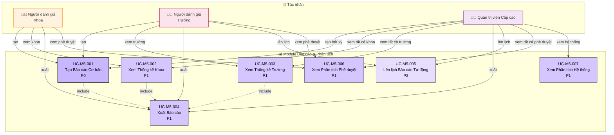

# Module 5: Báo cáo & Phân tích - Biểu đồ Ca Sử dụng

> 📊 **ID Biểu đồ**: UCD-05  
> 📦 **Module**: Báo cáo & Phân tích  
> 👥 **Tác nhân**: Người đánh giá Khoa, Người đánh giá Trường, Quản trị viên Cấp cao  
> 📋 **Ca Sử dụng**: 7

---

## 🎯 Tổng quan Module

Module này cung cấp các khả năng báo cáo và phân tích theo phân cấp và quyền hạn.

**Cấp độ Truy cập**:
- **Người đánh giá Khoa**: Báo cáo cấp Khoa
- **Người đánh giá Trường**: Báo cáo toàn trường
- **Quản trị viên Cấp cao**: Tất cả báo cáo + phân tích hệ thống

---

## 📊 Biểu đồ Ca Sử dụng

---

## 📋 Ca Sử dụng

### UC-M5-001: Tạo Báo cáo Cơ bản
**Độ ưu tiên**: P0  
**Tác nhân**: Người đánh giá Khoa, Người đánh giá Trường, Quản trị viên Cấp cao  
**Mô tả**: Tạo báo cáo ấn phẩm theo tham số

**Loại Báo cáo**:
- Ấn phẩm theo năm
- Ấn phẩm theo nhà nghiên cứu
- Ấn phẩm theo bộ môn/khoa
- Ấn phẩm theo trạng thái

**Tham số**:
- Khoảng thời gian
- Bộ lọc Khoa/Bộ môn
- Bộ lọc loại ấn phẩm
- Bộ lọc trạng thái

**Kiểm soát Truy cập**:
- Người đánh giá Khoa: Chỉ khoa của mình
- Người đánh giá Trường: Tất cả các khoa
- Quản trị viên Cấp cao: Tất cả + toàn hệ thống

**Đầu ra**: Chế độ xem HTML + Tùy chọn xuất

**Liên quan**: FR-REP-001, US-FCR-007, US-UNR-007

---

### UC-M5-002: Xem Thống kê Khoa
**Độ ưu tiên**: P1  
**Tác nhân**: Người đánh giá Khoa, Quản trị viên Cấp cao  
**Mô tả**: Thống kê cấp Khoa

**Chỉ số**:
- Tổng ấn phẩm (theo trạng thái)
- Xu hướng ấn phẩm mỗi năm
- Nhà nghiên cứu hàng đầu (theo số lượng ấn phẩm)
- Thống kê quy trình phê duyệt
  - Thời gian phê duyệt trung bình
  - Tỷ lệ từ chối
  - Tỷ lệ yêu cầu chỉnh sửa

**Trực quan hóa**: Biểu đồ và đồ thị

**Liên quan**: FR-REP-002, US-FCR-008

---

### UC-M5-003: Xem Thống kê Trường
**Độ ưu tiên**: P1  
**Tác nhân**: Người đánh giá Trường, Quản trị viên Cấp cao  
**Mô tả**: Thống kê toàn trường

**Chỉ số**:
- Tổng ấn phẩm toàn trường
- So sánh theo khoa
- Tăng trưởng theo năm
- Chỉ số chất lượng ấn phẩm (Phân bố theo hạng - Quartile)
- Hiệu quả quy trình phê duyệt

**Trực quan hóa**:
- Biểu đồ cột (so sánh khoa)
- Biểu đồ đường (xu hướng)
- Biểu đồ tròn (phân bố)

**Liên quan**: FR-REP-003, US-UNR-008

---

### UC-M5-004: Xuất Báo cáo
**Độ ưu tiên**: P1  
**Tác nhân**: Tất cả tác nhân  
**Mô tả**: Xuất dữ liệu báo cáo

**Định dạng**:
- PDF (báo cáo định dạng sẵn)
- Excel (.xlsx)
- CSV

**Ca sử dụng**:
- Gửi cho lãnh đạo
- Báo cáo thường niên
- Kiểm toán bên ngoài

**Liên quan**: FR-REP-004, US-FCR-009, US-UNR-009

---

### UC-M5-005: Lên lịch Báo cáo Tự động
**Độ ưu tiên**: P2  
**Tác nhân**: Người đánh giá Trường, Quản trị viên Cấp cao  
**Mô tả**: Lên lịch báo cáo định kỳ

**Tùy chọn Lịch biểu**:
- Hàng tuần
- Hàng tháng
- Hàng quý
- Tùy chỉnh

**Giao hàng**:
- Email cho người nhận
- Lưu vào thư mục chia sẻ

**Liên quan**: FR-REP-005

---

### UC-M5-006: Xem Phân tích Phê duyệt
**Độ ưu tiên**: P1  
**Tác nhân**: Người đánh giá Khoa, Người đánh giá Trường, Quản trị viên Cấp cao  
**Mô tả**: Phân tích về quy trình phê duyệt

**Chỉ số**:
- Thời gian trung bình ở mỗi giai đoạn
- Xác định điểm nghẽn
- Phân bố khối lượng công việc của người đánh giá
- Tỷ lệ phê duyệt/từ chối
- Mẫu yêu cầu chỉnh sửa

**Giá trị**: Thông tin chi tiết để cải tiến quy trình

**Liên quan**: FR-REP-006

---

### UC-M5-007: Xem Phân tích Hệ thống
**Độ ưu tiên**: P1  
**Tác nhân**: Quản trị viên Cấp cao  
**Mô tả**: Phân tích cấp hệ thống

**Chỉ số**:
- Hoạt động người dùng (đăng nhập, hành động)
- Sử dụng dung lượng lưu trữ
- Chỉ số hiệu suất
- Nhật ký lỗi
- Dấu vết kiểm toán

**Mục đích**: Giám sát và bảo trì hệ thống

**Liên quan**: FR-REP-007, US-ADM-010

---

## 📊 Thống kê

| Độ ưu tiên | Ca Sử dụng | % |
|----------|-----------|---|
| P0 - Phải Có | 1 | 14% |
| P1 - Nên Có | 5 | 71% |
| P2 - Có Thì Tốt | 1 | 14% |

---

## 🔒 Ma trận Truy cập

| Loại Báo cáo | Người đánh giá Khoa | Người đánh giá Trường | Quản trị viên Cấp cao |
|-------------|------------------|---------------------|------------|
| Thống kê khoa của mình | ✅ | ✅ | ✅ |
| Thống kê khoa khác | ❌ | ✅ | ✅ |
| Toàn trường | ❌ | ✅ | ✅ |
| Phân tích phê duyệt | ✅ (của mình) | ✅ (tất cả) | ✅ (tất cả) |
| Phân tích hệ thống | ❌ | ❌ | ✅ |

---

## 📈 Báo cáo Mẫu

### Báo cáo 1: Báo cáo Ấn phẩm Thường niên của Khoa
**Mục đích**: Tóm tắt cuối năm  
**Đối tượng**: Trưởng khoa  
**Chỉ số**:
- Tổng ấn phẩm ĐÃ XUẤT BẢN năm nay
- Phân loại theo loại
- Top 10 nhà nghiên cứu
- So sánh với năm trước

---

### Báo cáo 2: Hiệu quả Quy trình Phê duyệt
**Mục đích**: Cải tiến quy trình  
**Đối tượng**: Lãnh đạo trường  
**Chỉ số**:
- Thời gian trung bình: Gửi → Xuất bản
- Điểm nghẽn (giai đoạn tốn nhiều thời gian nhất)
- Hiệu suất người đánh giá
- Khuyến nghị

---

### Báo cáo 3: Đầu ra Nghiên cứu của Trường
**Mục đích**: Báo cáo bên ngoài (Bộ GD&ĐT, AUN-QA)  
**Đối tượng**: Cơ quan chính phủ  
**Chỉ số**:
- Tổng ấn phẩm Scopus/ISI
- Hợp tác quốc tế
- Ấn phẩm có tầm ảnh hưởng cao (Q1/Q2)
- Xu hướng

---

## 🔗 Truy xuất nguồn gốc

### Yêu cầu Chức năng
- FR-REP-001 đến FR-REP-007 (7 FRs)

### Câu chuyện Người dùng
**Người đánh giá Khoa**: US-FCR-007, US-FCR-008, US-FCR-009  
**Người đánh giá Trường**: US-UNR-007, US-UNR-008, US-UNR-009  
**Quản trị viên Cấp cao**: US-ADM-009, US-ADM-010

---

## 📚 Tài liệu Liên quan

- **Ca Sử dụng**: [05_Use_Cases/Medium_Level/module_05_reporting_analytics.md](../../05_Use_Cases/Medium_Level/module_05_reporting_analytics.md)
- **Yêu cầu**: [03_Requirements/Functional/module_reporting.md](../../03_Requirements/Functional/module_reporting.md)
- **Biểu đồ Hoạt động**: [act_report_generation.md](../Activity/act_report_generation.md)

---

**Ngày tạo**: 10/02/2026  
**Phiên bản**: 1.0
