# Module 5: Reporting & Analytics - Use Case Diagram

> 📊 **Diagram ID**: UCD-05  
> 📦 **Module**: Reporting & Analytics  
> 👥 **Actors**: Faculty Reviewer, University Reviewer, SuperAdmin  
> 📋 **Use Cases**: 7

---

## 🎯 Module Overview

Module này provide reporting và analytics capabilities theo hierarchy và permissions.

**Access Levels**:
- **Faculty Reviewer**: Faculty-level reports
- **University Reviewer**: University-wide reports
- **SuperAdmin**: All reports + system analytics

---

## 📊 Use Case Diagram

```mermaid
graph TB
    subgraph Actors["👥 Actors"]
        FCR[👨‍💼 Faculty<br/>Reviewer]
        UNR[👨‍💼 University<br/>Reviewer]
        ADM[👨‍💻 SuperAdmin]
    end
    
    subgraph REPORT["📊 Reporting & Analytics Module"]
        direction TB
        
        UC1[UC-M5-001<br/>Generate Basic Report<br/>P0]
        UC2[UC-M5-002<br/>View Faculty Statistics<br/>P1]
        UC3[UC-M5-003<br/>View University Statistics<br/>P1]
        UC4[UC-M5-004<br/>Export Report<br/>P1]
        UC5[UC-M5-005<br/>Schedule Automated Report<br/>P2]
        UC6[UC-M5-006<br/>View Approval Analytics<br/>P1]
        UC7[UC-M5-007<br/>View System Analytics<br/>P1]
        
        %% Include relationships
        UC1 -.->|include| UC4
        UC2 -.->|include| UC4
        UC3 -.->|include| UC4
    end
    
    %% Faculty Reviewer connections
    FCR -->|generate| UC1
    FCR -->|view faculty| UC2
    FCR -->|export| UC4
    FCR -->|view approval| UC6
    
    %% University Reviewer connections
    UNR -->|generate| UC1
    UNR -->|view university| UC3
    UNR -->|export| UC4
    UNR -->|schedule| UC5
    UNR -->|view approval| UC6
    
    %% SuperAdmin connections
    ADM -->|generate any| UC1
    ADM -->|view all faculty| UC2
    ADM -->|view all university| UC3
    ADM -->|export| UC4
    ADM -->|schedule| UC5
    ADM -->|view all approval| UC6
    ADM -->|view system| UC7
    
    %% Styling
    style UC1 fill:#c8b6ff,stroke:#333,stroke-width:2px,color:#000
    style UC2 fill:#d5c6ff,stroke:#333,stroke-width:1px,color:#000
    style UC3 fill:#d5c6ff,stroke:#333,stroke-width:1px,color:#000
    style UC4 fill:#d5c6ff,stroke:#333,stroke-width:1px,color:#000
    style UC5 fill:#e6ddff,stroke:#333,stroke-width:1px,color:#000
    style UC6 fill:#d5c6ff,stroke:#333,stroke-width:1px,color:#000
    style UC7 fill:#d5c6ff,stroke:#333,stroke-width:1px,color:#000
    
    style FCR fill:#fff3e0,stroke:#f57c00,stroke-width:2px
    style UNR fill:#fce4ec,stroke:#c2185b,stroke-width:2px
    style ADM fill:#f3e5f5,stroke:#7b1fa2,stroke-width:2px
```

---

## 📋 Use Cases

### UC-M5-001: Generate Basic Report
**Priority**: P0  
**Actor**: Faculty Reviewer, University Reviewer, SuperAdmin  
**Description**: Tạo báo cáo publications theo parameters

**Report Types**:
- Publications by year
- Publications by researcher
- Publications by department/faculty
- Publications by status

**Parameters**:
- Date range
- Faculty/Department filter
- Publication type filter
- Status filter

**Access Control**:
- Faculty Reviewer: Own faculty only
- University Reviewer: All faculties
- SuperAdmin: All + system-wide

**Output**: HTML view + Export option

**Related**: FR-REP-001, US-FCR-007, US-UNR-007

---

### UC-M5-002: View Faculty Statistics
**Priority**: P1  
**Actor**: Faculty Reviewer, SuperAdmin  
**Description**: Thống kê cấp Faculty

**Metrics**:
- Total publications (by status)
- Publications per year trend
- Top researchers (by publication count)
- Approval workflow stats
  - Average approval time
  - Rejection rate
  - Revision request rate

**Visualization**: Charts and graphs

**Related**: FR-REP-002, US-FCR-008

---

### UC-M5-003: View University Statistics
**Priority**: P1  
**Actor**: University Reviewer, SuperAdmin  
**Description**: Thống kê toàn trường

**Metrics**:
- Total publications university-wide
- By faculty comparison
- Year-over-year growth
- Publication quality metrics (Quartile distribution)
- Approval workflow efficiency

**Visualization**:
- Bar charts (faculty comparison)
- Line charts (trends)
- Pie charts (distribution)

**Related**: FR-REP-003, US-UNR-008

---

### UC-M5-004: Export Report
**Priority**: P1  
**Actor**: All actors  
**Description**: Export report data

**Formats**:
- PDF (formatted report)
- Excel (.xlsx)
- CSV

**Use Cases**:
- Submit to leadership
- Annual reports
- External audits

**Related**: FR-REP-004, US-FCR-009, US-UNR-009

---

### UC-M5-005: Schedule Automated Report
**Priority**: P2  
**Actor**: University Reviewer, SuperAdmin  
**Description**: Schedule recurring reports

**Schedule Options**:
- Weekly
- Monthly
- Quarterly
- Custom

**Delivery**:
- Email to recipients
- Save to shared folder

**Related**: FR-REP-005

---

### UC-M5-006: View Approval Analytics
**Priority**: P1  
**Actor**: Faculty Reviewer, University Reviewer, SuperAdmin  
**Description**: Analytics về approval workflow

**Metrics**:
- Average time at each stage
- Bottlenecks identification
- Reviewer workload distribution
- Approval/rejection rates
- Revision request patterns

**Value**: Process improvement insights

**Related**: FR-REP-006

---

### UC-M5-007: View System Analytics
**Priority**: P1  
**Actor**: SuperAdmin  
**Description**: System-level analytics

**Metrics**:
- User activity (logins, actions)
- Storage usage
- Performance metrics
- Error logs
- Audit trail

**Purpose**: System monitoring và maintenance

**Related**: FR-REP-007, US-ADM-010

---

## 📊 Statistics

| Priority | Use Cases | % |
|----------|-----------|---|
| P0 - Must Have | 1 | 14% |
| P1 - Should Have | 5 | 71% |
| P2 - Nice to Have | 1 | 14% |

---

## 🔒 Access Matrix

| Report Type | Faculty Reviewer | University Reviewer | SuperAdmin |
|-------------|------------------|---------------------|------------|
| Own faculty statistics | ✅ | ✅ | ✅ |
| Other faculty statistics | ❌ | ✅ | ✅ |
| University-wide | ❌ | ✅ | ✅ |
| Approval analytics | ✅ (own) | ✅ (all) | ✅ (all) |
| System analytics | ❌ | ❌ | ✅ |

---

## 📈 Sample Reports

### Report 1: Faculty Annual Publication Report
**Purpose**: Year-end summary  
**Audience**: Faculty Dean  
**Metrics**:
- Total publications PUBLISHED this year
- Breakdown by type
- Top 10 researchers
- Comparison với previous year

---

### Report 2: Approval Workflow Efficiency
**Purpose**: Process improvement  
**Audience**: University leadership  
**Metrics**:
- Average time: Submit → Published
- Bottlenecks (stages taking longest)
- Reviewer performance
- Recommendations

---

### Report 3: University Research Output
**Purpose**: External reporting (Bộ GD&ĐT, AUN-QA)  
**Audience**: Government agencies  
**Metrics**:
- Total scopus/ISI publications
- International collaborations
- High-impact publications (Q1/Q2)
- Trends

---

## 🔗 Traceability

### Functional Requirements
- FR-REP-001 to FR-REP-007 (7 FRs)

### User Stories
**Faculty Reviewer**: US-FCR-007, US-FCR-008, US-FCR-009  
**University Reviewer**: US-UNR-007, US-UNR-008, US-UNR-009  
**SuperAdmin**: US-ADM-009, US-ADM-010

---

## 📚 Related Documentation

- **Use Cases**: [05_Use_Cases/Medium_Level/module_05_reporting_analytics.md](../../05_Use_Cases/Medium_Level/module_05_reporting_analytics.md)
- **Requirements**: [03_Requirements/Functional/module_reporting.md](../../03_Requirements/Functional/module_reporting.md)
- **Activity Diagrams**: [act_report_generation.md](../Activity/act_report_generation.md)

---

**Created**: 10/02/2026  
**Version**: 1.0
