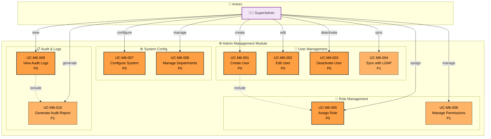

# Module 6: Admin Management - Use Case Diagram

> 📊 **Diagram ID**: UCD-06  
> 📦 **Module**: Admin & User Management  
> 👥 **Actors**: SuperAdmin  
> 📋 **Use Cases**: 10

---

## 🎯 Module Overview

Module này handle all administrative functions cho hệ thống UFPMS.

**Scope**:
- User management
- Role and permission management  
- System configuration
- Audit logs

---

## 📊 Use Case Diagram



---

## 📋 Use Cases - User Management

### UC-M6-001: Create User
**Priority**: P0  
**Actor**: SuperAdmin  
**Description**: Tạo user account mới

**Methods**:
1. **Manual**: Nhập thông tin tay
2. **LDAP Sync**: Import từ LDAP/AD (UC-M6-004)
3. **Bulk Import**: Upload Excel (P1)

**Required Fields**:
- Username (unique)
- Full name
- Email
- Department/Faculty
- Initial role (include UC-M6-005)

**Postconditions**:
- User account created
- Credentials sent via email
- Default role assigned

**Related**: FR-ADM-001, US-ADM-001

---

### UC-M6-002: Edit User
**Priority**: P0  
**Actor**: SuperAdmin  
**Description**: Chỉnh sửa user information

**Editable Fields**:
- Name, email
- Department/Faculty
- Role assignment
- Active/Inactive status

**Business Rules**:
- Cannot edit username (primary key)
- Cannot delete users, only deactivate (UC-M6-003)

**Related**: FR-ADM-002, US-ADM-002

---

### UC-M6-003: Deactivate User
**Priority**: P0  
**Actor**: SuperAdmin  
**Description**: Deactivate user account

**Use Cases**:
- Giảng viên nghỉ việc
- Temporary suspension

**Effects**:
- User cannot login
- User's publications remain visible (if PUBLISHED)
- Audit trail preserved

**Related**: FR-ADM-003, US-ADM-003

---

### UC-M6-004: Sync with LDAP
**Priority**: P1  
**Actor**: SuperAdmin  
**Description**: Đồng bộ users từ LDAP/AD

**Features**:
- One-time sync (all users)
- Incremental sync (new users only)
- Manual trigger hoặc scheduled (nightly)

**Mapping**:
- LDAP username → UFPMS username
- LDAP OU → Department/Faculty
- LDAP groups → Roles (P2)

**Related**: FR-ADM-004, US-ADM-004

---

## 📋 Use Cases - Role Management

### UC-M6-005: Assign Role
**Priority**: P0  
**Actor**: SuperAdmin  
**Description**: Gán role cho user

**Available Roles**:
1. **Researcher** (default)
2. **Faculty Reviewer**
3. **University Reviewer**
4. **SuperAdmin**

**Business Rules**:
- 1 user có thể có multiple roles
- Ví dụ: Researcher + Faculty Reviewer
- Ít nhất 1 active SuperAdmin

**Related**: FR-ADM-005, US-ADM-005

---

### UC-M6-006: Manage Permissions
**Priority**: P1  
**Actor**: SuperAdmin  
**Description**: Fine-grained permission management

**Permission Groups**:
- Publications: Create, Read, Update, Delete
- Approval: Review, Approve, Reject
- Reports: View, Generate, Export
- Admin: User management, System config

**Use Case**: Custom roles ngoài 4 roles mặc định (P2 feature)

**Related**: FR-ADM-006

---

## 📋 Use Cases - System Configuration

### UC-M6-007: Configure System
**Priority**: P0  
**Actor**: SuperAdmin  
**Description**: Configure system settings

**Settings Categories**:

**1. Email Configuration**
- SMTP server, port
- Sender email
- Notification templates

**2. LDAP/AD Configuration**
- Server URL
- Base DN
- Bind credentials

**3. Workflow Configuration**
- Approval SLA targets
- Auto-assignment rules (P2)

**4. File Storage**
- Max file size
- Allowed file types
- Storage path

**Related**: FR-ADM-007, US-ADM-007

---

### UC-M6-008: Manage Departments
**Priority**: P0  
**Actor**: SuperAdmin  
**Description**: Quản lý departments và faculties

**Features**:
- Create/Edit/Delete departments
- Assign department to faculty
- Assign faculty dean (Faculty Reviewer)

**Hierarchy**:
```
University
  ├─ Faculty 1
  │   ├─ Department A
  │   └─ Department B
  └─ Faculty 2
      └─ Department C
```

**Related**: FR-ADM-008

---

## 📋 Use Cases - Audit & Logs

### UC-M6-009: View Audit Logs
**Priority**: P0  
**Actor**: SuperAdmin  
**Description**: Xem system audit trail

**Logged Events**:
- User login/logout
- Publication CRUD operations
- State transitions (approval workflow)
- User management actions
- System config changes

**Log Details**:
- Timestamp
- User (who)
- Action (what)
- Entity (which publication/user)
- Old value → New value (for edits)
- IP address

**Filters**:
- Date range
- User
- Action type
- Entity type

**Related**: FR-ADM-009, US-ADM-009

---

### UC-M6-010: Generate Audit Report
**Priority**: P1  
**Actor**: SuperAdmin  
**Description**: Tạo audit report

**Use Cases**:
- Security audit
- Compliance reporting
- Investigation

**Report Types**:
- User activity report
- Publication change history
- System access log

**Export**: PDF, Excel

**Related**: FR-ADM-010, US-ADM-010

---

## 📊 Statistics

| Priority | Use Cases | % |
|----------|-----------|---|
| P0 - Must Have | 8 | 80% |
| P1 - Should Have | 2 | 20% |

---

## 🔐 Default Roles & Permissions

### Role: Researcher
**Permissions**:
- Publications: CRUD (own only, DRAFT state only)
- Approval: Submit, Track status
- Reports: View own statistics
- Profile: Edit own

---

### Role: Faculty Reviewer
**Inherits**: Researcher permissions  
**Additional**:
- Approval: Review, Approve, Reject, Request Revision (own faculty)
- Reports: View faculty statistics

---

### Role: University Reviewer
**Inherits**: Researcher permissions  
**Additional**:
- Approval: Final approval (university-wide)
- Reports: View university statistics

---

### Role: SuperAdmin
**Permissions**: ALL
- User management
- System configuration
- Audit logs
- Override any publication
- Delete any data

---

## 🔗 Traceability

### Functional Requirements
- FR-ADM-001 to FR-ADM-010 (10 FRs)

### User Stories
**SuperAdmin**: US-ADM-001 to US-ADM-010

---

## 📚 Related Documentation

- **Use Cases**: [05_Use_Cases/Medium_Level/module_06_admin_management.md](../../05_Use_Cases/Medium_Level/module_06_admin_management.md)
- **Requirements**: [03_Requirements/Functional/module_admin.md](../../03_Requirements/Functional/module_admin.md)
- **System Spec**: [01_System_Specification/stakeholders.md](../../01_System_Specification/stakeholders.md#roles)

---

**Created**: 10/02/2026  
**Version**: 1.0
