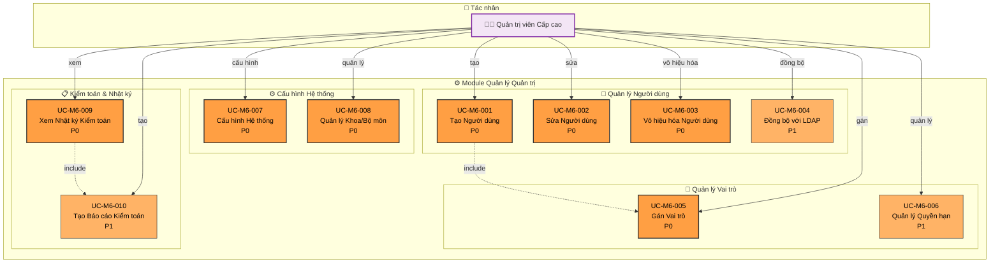

# Module 6: Quản lý Quản trị - Biểu đồ Ca Sử dụng

> 📊 **ID Biểu đồ**: UCD-06  
> 📦 **Module**: Quản lý Quản trị & Người dùng  
> 👥 **Tác nhân**: Quản trị viên Cấp cao  
> 📋 **Ca Sử dụng**: 10

---

## 🎯 Tổng quan Module

Module này xử lý tất cả các chức năng quản trị cho hệ thống UFPMS.

**Phạm vi**:
- Quản lý người dùng
- Quản lý vai trò và quyền hạn
- Cấu hình hệ thống
- Nhật ký kiểm toán

---

## 📊 Biểu đồ Ca Sử dụng



---

## 📋 Ca Sử dụng - Quản lý Người dùng

### UC-M6-001: Tạo Người dùng
**Độ ưu tiên**: P0  
**Tác nhân**: Quản trị viên Cấp cao  
**Mô tả**: Tạo tài khoản người dùng mới

**Phương thức**:
1. **Thủ công**: Nhập thông tin tay
2. **Đồng bộ LDAP**: Import từ LDAP/AD (UC-M6-004)
3. **Import Hàng loạt**: Upload Excel (P1)

**Trường Bắt buộc**:
- Tên đăng nhập (duy nhất)
- Họ và tên
- Email
- Khoa/Bộ môn
- Vai trò ban đầu (bao gồm UC-M6-005)

**Hậu điều kiện**:
- Tài khoản người dùng được tạo
- Thông tin đăng nhập gửi qua email
- Vai trò mặc định được gán

**Liên quan**: FR-ADM-001, US-ADM-001

---

### UC-M6-002: Sửa Người dùng
**Độ ưu tiên**: P0  
**Tác nhân**: Quản trị viên Cấp cao  
**Mô tả**: Chỉnh sửa thông tin người dùng

**Trường có thể Sửa**:
- Tên, email
- Khoa/Bộ môn
- Gán vai trò
- Trạng thái Hoạt động/Không hoạt động

**Quy tắc Nghiệp vụ**:
- Không thể sửa tên đăng nhập (khóa chính)
- Không thể xóa người dùng, chỉ vô hiệu hóa (UC-M6-003)

**Liên quan**: FR-ADM-002, US-ADM-002

---

### UC-M6-003: Vô hiệu hóa Người dùng
**Độ ưu tiên**: P0  
**Tác nhân**: Quản trị viên Cấp cao  
**Mô tả**: Vô hiệu hóa tài khoản người dùng

**Ca sử dụng**:
- Giảng viên nghỉ việc
- Tạm ngưng hoạt động

**Tác động**:
- Người dùng không thể đăng nhập
- Ấn phẩm của người dùng vẫn hiển thị (nếu ĐÃ XUẤT BẢN)
- Dấu vết kiểm toán được bảo lưu

**Liên quan**: FR-ADM-003, US-ADM-003

---

### UC-M6-004: Đồng bộ với LDAP
**Độ ưu tiên**: P1  
**Tác nhân**: Quản trị viên Cấp cao  
**Mô tả**: Đồng bộ người dùng từ LDAP/AD

**Tính năng**:
- Đồng bộ một lần (tất cả người dùng)
- Đồng bộ gia tăng (chỉ người dùng mới)
- Kích hoạt thủ công hoặc theo lịch (hàng đêm)

**Ánh xạ**:
- Tên đăng nhập LDAP → Tên đăng nhập UFPMS
- LDAP OU → Khoa/Bộ môn
- Nhóm LDAP → Vai trò (P2)

**Liên quan**: FR-ADM-004, US-ADM-004

---

## 📋 Ca Sử dụng - Quản lý Vai trò

### UC-M6-005: Gán Vai trò
**Độ ưu tiên**: P0  
**Tác nhân**: Quản trị viên Cấp cao  
**Mô tả**: Gán vai trò cho người dùng

**Vai trò Có sẵn**:
1. **Nhà nghiên cứu** (mặc định)
2. **Người đánh giá Khoa**
3. **Người đánh giá Trường**
4. **Quản trị viên Cấp cao**

**Quy tắc Nghiệp vụ**:
- 1 người dùng có thể có nhiều vai trò
- Ví dụ: Nhà nghiên cứu + Người đánh giá Khoa
- Ít nhất 1 Quản trị viên Cấp cao đang hoạt động

**Liên quan**: FR-ADM-005, US-ADM-005

---

### UC-M6-006: Quản lý Quyền hạn
**Độ ưu tiên**: P1  
**Tác nhân**: Quản trị viên Cấp cao  
**Mô tả**: Quản lý quyền hạn chi tiết

**Nhóm Quyền**:
- Ấn phẩm: Thêm, Xem, Sửa, Xóa
- Phê duyệt: Xem xét, Phê duyệt, Từ chối
- Báo cáo: Xem, Tạo, Xuất
- Quản trị: Quản lý người dùng, Cấu hình hệ thống

**Ca sử dụng**: Vai trò tùy chỉnh ngoài 4 vai trò mặc định (tính năng P2)

**Liên quan**: FR-ADM-006

---

## 📋 Ca Sử dụng - Cấu hình Hệ thống

### UC-M6-007: Cấu hình Hệ thống
**Độ ưu tiên**: P0  
**Tác nhân**: Quản trị viên Cấp cao  
**Mô tả**: Cấu hình cài đặt hệ thống

**Danh mục Cài đặt**:

**1. Cấu hình Email**
- Máy chủ SMTP, cổng
- Email người gửi
- Mẫu thông báo

**2. Cấu hình LDAP/AD**
- URL máy chủ
- Base DN
- Thông tin xác thực Bind

**3. Cấu hình Quy trình**
- Mục tiêu SLA phê duyệt
- Quy tắc tự động gán (P2)

**4. Lưu trữ Tệp**
- Kích thước tệp tối đa
- Loại tệp cho phép
- Đường dẫn lưu trữ

**Liên quan**: FR-ADM-007, US-ADM-007

---

### UC-M6-008: Quản lý Khoa/Bộ môn
**Độ ưu tiên**: P0  
**Tác nhân**: Quản trị viên Cấp cao  
**Mô tả**: Quản lý các khoa và bộ môn

**Tính năng**:
- Thêm/Sửa/Xóa bộ môn
- Gán bộ môn vào khoa
- Gán trưởng khoa (Người đánh giá Khoa)

**Phân cấp**:
```
Trường Đại học
  ├─ Khoa 1
  │   ├─ Bộ môn A
  │   └─ Bộ môn B
  └─ Khoa 2
      └─ Bộ môn C
```

**Liên quan**: FR-ADM-008

---

## 📋 Ca Sử dụng - Kiểm toán & Nhật ký

### UC-M6-009: Xem Nhật ký Kiểm toán
**Độ ưu tiên**: P0  
**Tác nhân**: Quản trị viên Cấp cao  
**Mô tả**: Xem dấu vết kiểm toán hệ thống

**Sự kiện được Ghi lại**:
- Đăng nhập/đăng xuất người dùng
- Thao tác CRUD ấn phẩm
- Chuyển đổi trạng thái (quy trình phê duyệt)
- Hành động quản lý người dùng
- Thay đổi cấu hình hệ thống

**Chi tiết Nhật ký**:
- Thời gian
- Người dùng (ai)
- Hành động (làm gì)
- Đối tượng (ấn phẩm/người dùng nào)
- Giá trị cũ → Giá trị mới (đối với chỉnh sửa)
- Địa chỉ IP

**Bộ lọc**:
- Khoảng thời gian
- Người dùng
- Loại hành động
- Loại đối tượng

**Liên quan**: FR-ADM-009, US-ADM-009

---

### UC-M6-010: Tạo Báo cáo Kiểm toán
**Độ ưu tiên**: P1  
**Tác nhân**: Quản trị viên Cấp cao  
**Mô tả**: Tạo báo cáo kiểm toán

**Ca sử dụng**:
- Kiểm toán bảo mật
- Báo cáo tuân thủ
- Điều tra

**Loại Báo cáo**:
- Báo cáo hoạt động người dùng
- Lịch sử thay đổi ấn phẩm
- Nhật ký truy cập hệ thống

**Xuất**: PDF, Excel

**Liên quan**: FR-ADM-010, US-ADM-010

---

## 📊 Thống kê

| Độ ưu tiên | Ca Sử dụng | % |
|----------|-----------|---|
| P0 - Phải Có | 8 | 80% |
| P1 - Nên Có | 2 | 20% |

---

## 🔐 Vai trò Mặc định & Quyền hạn

### Vai trò: Nhà nghiên cứu
**Quyền hạn**:
- Ấn phẩm: CRUD (chỉ của mình, chỉ trạng thái NHÁP)
- Phê duyệt: Gửi, Theo dõi trạng thái
- Báo cáo: Xem thống kê của mình
- Hồ sơ: Sửa của mình

---

### Vai trò: Người đánh giá Khoa
**Kế thừa**: Quyền hạn Nhà nghiên cứu  
**Bổ sung**:
- Phê duyệt: Xem xét, Phê duyệt, Từ chối, Yêu cầu Chỉnh sửa (khoa của mình)
- Báo cáo: Xem thống kê khoa

---

### Vai trò: Người đánh giá Trường
**Kế thừa**: Quyền hạn Nhà nghiên cứu  
**Bổ sung**:
- Phê duyệt: Phê duyệt cuối cùng (toàn trường)
- Báo cáo: Xem thống kê toàn trường

---

### Vai trò: Quản trị viên Cấp cao
**Quyền hạn**: TẤT CẢ
- Quản lý người dùng
- Cấu hình hệ thống
- Nhật ký kiểm toán
- Ghi đè bất kỳ ấn phẩm nào
- Xóa bất kỳ dữ liệu nào

---

## 🔗 Truy xuất nguồn gốc

### Yêu cầu Chức năng
- FR-ADM-001 đến FR-ADM-010 (10 FRs)

### Câu chuyện Người dùng
**Quản trị viên Cấp cao**: US-ADM-001 đến US-ADM-010

---

## 📚 Tài liệu Liên quan

- **Ca Sử dụng**: [05_Use_Cases/Medium_Level/module_06_admin_management.md](../../05_Use_Cases/Medium_Level/module_06_admin_management.md)
- **Yêu cầu**: [03_Requirements/Functional/module_admin.md](../../03_Requirements/Functional/module_admin.md)
- **Đặc tả Hệ thống**: [01_System_Specification/stakeholders.md](../../01_System_Specification/stakeholders.md#roles)

---

**Ngày tạo**: 10/02/2026  
**Phiên bản**: 1.0
