# Overall System Use Case Diagram

> 📊 **Diagram ID**: UCD-00  
> 🎯 **Scope**: Toàn hệ thống UFPMS  
> 👥 **Actors**: 5 roles  
> 📦 **Modules**: 6 high-level use cases

---

## 🎯 Mục Đích

Diagram này hiển thị tổng quan toàn bộ hệ thống UFPMS với:
- 5 actors chính
- 6 modules (high-level use cases)
- Mối quan hệ giữa actors và modules

---

## 📊 Use Case Diagram

```mermaid
graph TB
    subgraph Actors["🎭 Actors"]
        RES[👨‍🔬 Researcher<br/>Giảng viên]
        FCR[👨‍💼 Faculty Reviewer<br/>CB Khoa]
        UNR[👨‍💼 University Reviewer<br/>CB Trường]
        ADM[👨‍💻 SuperAdmin<br/>Quản trị viên]
        VIW[👤 Public Visitor<br/>Khách truy cập]
    end
    
    subgraph UFPMS["🏛️ UFPMS System"]
        direction TB
        
        UC1[📚 UC-HL-001<br/>Manage Publications<br/>Quản lý bài báo]
        UC2[✅ UC-HL-002<br/>Approval Workflow<br/>Quy trình phê duyệt]
        UC3[🔍 UC-HL-003<br/>Search & Browse<br/>Tìm kiếm & duyệt]
        UC4[👤 UC-HL-004<br/>Researcher Profile<br/>Hồ sơ giảng viên]
        UC5[📊 UC-HL-005<br/>Reporting & Analytics<br/>Báo cáo & thống kê]
        UC6[⚙️ UC-HL-006<br/>Admin Management<br/>Quản trị hệ thống]
    end
    
    %% Researcher connections
    RES -->|Create, Edit, Delete| UC1
    RES -->|Submit for review| UC2
    RES -->|View own profile| UC4
    
    %% Faculty Reviewer connections
    FCR -->|Review submissions| UC2
    FCR -->|View reports| UC5
    
    %% University Reviewer connections
    UNR -->|Final approval| UC2
    UNR -->|View reports| UC5
    
    %% SuperAdmin connections
    ADM -->|Manage system| UC6
    ADM -->|Override publications| UC1
    ADM -->|View all reports| UC5
    
    %% Public Visitor connections
    VIW -->|Search & browse| UC3
    VIW -->|View public profiles| UC4
    
    %% Styling
    style UC1 fill:#6bcf7f,stroke:#333,stroke-width:2px,color:#000
    style UC2 fill:#ff6b9d,stroke:#333,stroke-width:2px,color:#000
    style UC3 fill:#4d96ff,stroke:#333,stroke-width:2px,color:#fff
    style UC4 fill:#ffd93d,stroke:#333,stroke-width:2px,color:#000
    style UC5 fill:#c8b6ff,stroke:#333,stroke-width:2px,color:#000
    style UC6 fill:#ff9f43,stroke:#333,stroke-width:2px,color:#000
    
    style RES fill:#e3f2fd,stroke:#1976d2,stroke-width:2px
    style FCR fill:#fff3e0,stroke:#f57c00,stroke-width:2px
    style UNR fill:#fce4ec,stroke:#c2185b,stroke-width:2px
    style ADM fill:#f3e5f5,stroke:#7b1fa2,stroke-width:2px
    style VIW fill:#e8f5e9,stroke:#388e3c,stroke-width:2px
```

---

## 👥 Actors

### 1. Researcher (Giảng viên)
**Role**: Primary user - Tạo và quản lý bài báo của mình

**Modules truy cập**:
- ✅ Module 1: Manage Publications (CRUD)
- ✅ Module 2: Approval Workflow (Submit, track status)
- ✅ Module 4: Researcher Profile (View, edit own)

**Số lượng**: 300-500 users

---

### 2. Faculty Reviewer (Cán bộ Khoa)
**Role**: Xét duyệt bài báo cấp Khoa

**Modules truy cập**:
- ✅ Module 2: Approval Workflow (Review, approve/reject at faculty level)
- ✅ Module 5: Reporting & Analytics (Faculty-level reports)

**Số lượng**: 10-20 users

---

### 3. University Reviewer (Cán bộ Trường)
**Role**: Phê duyệt cuối cùng cấp Trường

**Modules truy cập**:
- ✅ Module 2: Approval Workflow (Final approval, publish)
- ✅ Module 5: Reporting & Analytics (University-wide reports)

**Số lượng**: 2-5 users

---

### 4. SuperAdmin (Quản trị viên)
**Role**: Quản trị toàn bộ hệ thống

**Modules truy cập**:
- ✅ Module 6: Admin Management (User, role, system config)
- ✅ Module 1: Manage Publications (Override, delete any)
- ✅ Module 5: Reporting & Analytics (All reports)

**Số lượng**: 1-3 users

---

### 5. Public Visitor (Khách truy cập)
**Role**: Công chúng xem thông tin công khai

**Modules truy cập**:
- ✅ Module 3: Search & Browse (CHỈ xem PUBLISHED publications)
- ✅ Module 4: Researcher Profile (View public profiles)

**Số lượng**: Unlimited (không cần đăng nhập)

---

## 📦 High-Level Use Cases (Modules)

### UC-HL-001: Manage Publications
**Mô tả**: CRUD operations cho bài báo khoa học  
**Actors**: Researcher, SuperAdmin  
**Priority**: P0  
**Related FRs**: FR-PUB-001 to FR-PUB-015

---

### UC-HL-002: Approval Workflow
**Mô tả**: Quy trình phê duyệt 2 cấp (Khoa → Trường)  
**Actors**: Researcher, Faculty Reviewer, University Reviewer  
**Priority**: P0  
**Related FRs**: FR-APR-001 to FR-APR-020

**Special**: Use case phức tạp nhất với 9 states và nhiều transitions

---

### UC-HL-003: Search & Browse
**Mô tả**: Tìm kiếm và duyệt bài báo công khai  
**Actors**: Public Visitor, Researcher  
**Priority**: P1 (P0 cho basic search)  
**Related FRs**: FR-SRC-001 to FR-SRC-007

---

### UC-HL-004: Researcher Profile
**Mô tả**: Hồ sơ và portfolio giảng viên  
**Actors**: Researcher, Public Visitor  
**Priority**: P1 (P0 cho view)  
**Related FRs**: FR-PRO-001 to FR-PRO-006

---

### UC-HL-005: Reporting & Analytics
**Mô tả**: Báo cáo và thống kê theo quyền  
**Actors**: Faculty Reviewer, University Reviewer, SuperAdmin  
**Priority**: P1 (P0 cho basic reports)  
**Related FRs**: FR-REP-001 to FR-REP-007

---

### UC-HL-006: Admin Management
**Mô tả**: Quản trị người dùng, roles, system  
**Actors**: SuperAdmin  
**Priority**: P0  
**Related FRs**: FR-ADM-001 to FR-ADM-010

---

## 🔗 Traceability

### Với Requirements

| Use Case | Functional Requirements | Count |
|----------|------------------------|-------|
| UC-HL-001 | FR-PUB-001 to FR-PUB-015 | 15 |
| UC-HL-002 | FR-APR-001 to FR-APR-020 | 20 |
| UC-HL-003 | FR-SRC-001 to FR-SRC-007 | 7 |
| UC-HL-004 | FR-PRO-001 to FR-PRO-006 | 6 |
| UC-HL-005 | FR-REP-001 to FR-REP-007 | 7 |
| UC-HL-006 | FR-ADM-001 to FR-ADM-010 | 10 |

**Total**: 65 Functional Requirements

---

### Với User Stories

| Actor | User Stories | Related Modules |
|-------|--------------|-----------------|
| Researcher | US-RES-001 to US-RES-028 | UC-HL-001, 002, 004 |
| Faculty Reviewer | US-FCR-001 to US-FCR-009 | UC-HL-002, 005 |
| University Reviewer | US-UNR-001 to US-UNR-010 | UC-HL-002, 005 |
| SuperAdmin | US-ADM-001 to US-ADM-010 | UC-HL-006, 001, 005 |
| Public Visitor | US-VIW-001 to US-VIW-008 | UC-HL-003, 004 |

---

## 🚀 Implementation Priority

### Phase 1 (MVP - 3 months)
**P0 Use Cases**:
- ✅ UC-HL-001: Manage Publications (core features)
- ✅ UC-HL-002: Approval Workflow (complete 2-tier approval)
- ✅ UC-HL-006: Admin Management (user & role management)

---

### Phase 2 (6 months)
**P1 Use Cases**:
- 🟡 UC-HL-003: Search & Browse (advanced search)
- 🟡 UC-HL-004: Researcher Profile (full portfolio)
- 🟡 UC-HL-005: Reporting & Analytics (detailed reports)

---

### Phase 3 (Future)
**P2 Enhancements**:
- 🟢 Advanced analytics
- 🟢 External integrations (ORCID, DOI)
- 🟢 Mobile app

---

## 📚 Related Documentation

- **Detailed Diagrams**: [Module-specific diagrams](./README.md#module-specific-diagrams)
- **Use Cases**: [05_Use_Cases/High_Level/](../../05_Use_Cases/High_Level/)
- **Requirements**: [03_Requirements/Functional/](../../03_Requirements/Functional/)
- **User Stories**: [04_User_Stories/](../../04_User_Stories/)

---

**Diagram Type**: Use Case Diagram (Mermaid)  
**Created**: 10/02/2026  
**Version**: 1.0
