# Biểu đồ Ca Sử dụng Tổng quan Hệ thống

> 📊 **ID Biểu đồ**: UCD-00  
> 🎯 **Phạm vi**: Toàn hệ thống UFPMS  
> 👥 **Tác nhân**: 5 vai trò  
> 📦 **Modules**: 6 ca sử dụng cấp cao

---

## 🎯 Mục Đích

Biểu đồ này hiển thị tổng quan toàn bộ hệ thống UFPMS với:
- 5 tác nhân chính
- 6 modules (ca sử dụng cấp cao)
- Mối quan hệ giữa tác nhân và modules

---

## 📊 Biểu đồ Ca Sử dụng

```mermaid
graph TB
    subgraph Actors["🎭 Tác nhân"]
        RES[👨‍🔬 Nhà nghiên cứu<br/>Giảng viên]
        FCR[👨‍💼 Người đánh giá Khoa<br/>CB Khoa]
        UNR[👨‍💼 Người đánh giá Trường<br/>CB Trường]
        ADM[👨‍💻 Quản trị viên Cấp cao<br/>Quản trị viên]
        VIW[👤 Khách truy cập<br/>Công chúng]
    end
    
    subgraph UFPMS["🏛️ Hệ thống UFPMS"]
        direction TB
        
        UC1[📚 UC-HL-001<br/>Quản lý Bài báo<br/>Manage Publications]
        UC2[✅ UC-HL-002<br/>Quy trình Phê duyệt<br/>Approval Workflow]
        UC3[🔍 UC-HL-003<br/>Tìm kiếm & Duyệt<br/>Search & Browse]
        UC4[👤 UC-HL-004<br/>Hồ sơ Nhà nghiên cứu<br/>Researcher Profile]
        UC5[📊 UC-HL-005<br/>Báo cáo & Phân tích<br/>Reporting & Analytics]
        UC6[⚙️ UC-HL-006<br/>Quản lý Quản trị<br/>Admin Management]
    end
    
    %% Researcher connections
    RES -->|Tạo, Sửa, Xóa| UC1
    RES -->|Gửi để xem xét| UC2
    RES -->|Xem hồ sơ của mình| UC4
    
    %% Faculty Reviewer connections
    FCR -->|Xem xét bài gửi| UC2
    FCR -->|Xem báo cáo| UC5
    
    %% University Reviewer connections
    UNR -->|Phê duyệt cuối cùng| UC2
    UNR -->|Xem báo cáo| UC5
    
    %% SuperAdmin connections
    ADM -->|Quản lý hệ thống| UC6
    ADM -->|Ghi đè bài báo| UC1
    ADM -->|Xem tất cả báo cáo| UC5
    
    %% Public Visitor connections
    VIW -->|Tìm kiếm & duyệt| UC3
    VIW -->|Xem hồ sơ công khai| UC4
    
    %% Styling
    style UC1 fill:#6bcf7f,stroke:#333,stroke-width:2px,color:#000
    style UC2 fill:#ff6b9d,stroke:#333,stroke-width:2px,color:#000
    style UC3 fill:#4d96ff,stroke:#333,stroke-width:2px,color:#fff
    style UC4 fill:#ffd93d,stroke:#333,stroke-width:2px,color:#000
    style UC5 fill:#c8b6ff,stroke:#333,stroke-width:2px,color:#000
    style UC6 fill:#ff9f43,stroke:#333,stroke-width:2px,color:#000
    
    style RES fill:#e3f2fd,stroke:#1976d2,stroke-width:2px
    style FCR fill:#fff3e0,stroke:#f57c00,stroke-width:2px
    style UNR fill:#fce4ec,stroke:#c2185b,stroke-width:2px
    style ADM fill:#f3e5f5,stroke:#7b1fa2,stroke-width:2px
    style VIW fill:#e8f5e9,stroke:#388e3c,stroke-width:2px
```

---

## 👥 Tác nhân

### 1. Nhà nghiên cứu (Giảng viên)
**Vai trò**: Người dùng chính - Tạo và quản lý bài báo của mình

**Modules truy cập**:
- ✅ Module 1: Quản lý Bài báo (CRUD)
- ✅ Module 2: Quy trình Phê duyệt (Gửi, theo dõi trạng thái)
- ✅ Module 4: Hồ sơ Nhà nghiên cứu (Xem, sửa của mình)

**Số lượng**: 300-500 người dùng

---

### 2. Người đánh giá Khoa (Cán bộ Khoa)
**Vai trò**: Xem xét bài báo cấp Khoa

**Modules truy cập**:
- ✅ Module 2: Quy trình Phê duyệt (Xem xét, phê duyệt/từ chối cấp khoa)
- ✅ Module 5: Báo cáo & Phân tích (Báo cáo cấp Khoa)

**Số lượng**: 10-20 người dùng

---

### 3. Người đánh giá Trường (Cán bộ Trường)
**Vai trò**: Phê duyệt cuối cùng cấp Trường

**Modules truy cập**:
- ✅ Module 2: Quy trình Phê duyệt (Phê duyệt cuối cùng, xuất bản)
- ✅ Module 5: Báo cáo & Phân tích (Báo cáo toàn trường)

**Số lượng**: 2-5 người dùng

---

### 4. Quản trị viên Cấp cao (Quản trị viên)
**Vai trò**: Quản trị toàn bộ hệ thống

**Modules truy cập**:
- ✅ Module 6: Quản lý Quản trị (Người dùng, vai trò, cấu hình hệ thống)
- ✅ Module 1: Quản lý Bài báo (Ghi đè, xóa bất kỳ)
- ✅ Module 5: Báo cáo & Phân tích (Tất cả báo cáo)

**Số lượng**: 1-3 người dùng

---

### 5. Khách truy cập (Công chúng)
**Vai trò**: Công chúng xem thông tin công khai

**Modules truy cập**:
- ✅ Module 3: Tìm kiếm & Duyệt (CHỈ xem bài báo ĐÃ XUẤT BẢN)
- ✅ Module 4: Hồ sơ Nhà nghiên cứu (Xem hồ sơ công khai)

**Số lượng**: Không giới hạn (không cần đăng nhập)

---

## 📦 Ca Sử dụng Cấp cao (Modules)

### UC-HL-001: Quản lý Bài báo
**Mô tả**: Các thao tác CRUD cho bài báo khoa học  
**Tác nhân**: Nhà nghiên cứu, Quản trị viên Cấp cao  
**Độ ưu tiên**: P0  
**FRs Liên quan**: FR-PUB-001 đến FR-PUB-015

---

### UC-HL-002: Quy trình Phê duyệt
**Mô tả**: Quy trình phê duyệt 2 cấp (Khoa → Trường)  
**Tác nhân**: Nhà nghiên cứu, Người đánh giá Khoa, Người đánh giá Trường  
**Độ ưu tiên**: P0  
**FRs Liên quan**: FR-APR-001 đến FR-APR-020

**Đặc biệt**: Ca sử dụng phức tạp nhất với 9 trạng thái và nhiều chuyển đổi

---

### UC-HL-003: Tìm kiếm & Duyệt
**Mô tả**: Tìm kiếm và duyệt bài báo công khai  
**Tác nhân**: Khách truy cập, Nhà nghiên cứu  
**Độ ưu tiên**: P1 (P0 cho tìm kiếm cơ bản)  
**FRs Liên quan**: FR-SRC-001 đến FR-SRC-007

---

### UC-HL-004: Hồ sơ Nhà nghiên cứu
**Mô tả**: Hồ sơ và danh mục đầu tư giảng viên  
**Tác nhân**: Nhà nghiên cứu, Khách truy cập  
**Độ ưu tiên**: P1 (P0 cho xem)  
**FRs Liên quan**: FR-PRO-001 đến FR-PRO-006

---

### UC-HL-005: Báo cáo & Phân tích
**Mô tả**: Báo cáo và thống kê theo quyền  
**Tác nhân**: Người đánh giá Khoa, Người đánh giá Trường, Quản trị viên Cấp cao  
**Độ ưu tiên**: P1 (P0 cho báo cáo cơ bản)  
**FRs Liên quan**: FR-REP-001 đến FR-REP-007

---

### UC-HL-006: Quản lý Quản trị
**Mô tả**: Quản trị người dùng, vai trò, hệ thống  
**Tác nhân**: Quản trị viên Cấp cao  
**Độ ưu tiên**: P0  
**FRs Liên quan**: FR-ADM-001 đến FR-ADM-010

---

## 🔗 Truy xuất nguồn gốc

### Với Yêu cầu (Requirements)

| Ca Sử dụng | Yêu cầu Chức năng | Số lượng |
|----------|------------------------|-------|
| UC-HL-001 | FR-PUB-001 đến FR-PUB-015 | 15 |
| UC-HL-002 | FR-APR-001 đến FR-APR-020 | 20 |
| UC-HL-003 | FR-SRC-001 đến FR-SRC-007 | 7 |
| UC-HL-004 | FR-PRO-001 đến FR-PRO-006 | 6 |
| UC-HL-005 | FR-REP-001 đến FR-REP-007 | 7 |
| UC-HL-006 | FR-ADM-001 đến FR-ADM-010 | 10 |

**Tổng**: 65 Yêu cầu Chức năng

---

### Với Câu chuyện Người dùng (User Stories)

| Tác nhân | Câu chuyện Người dùng | Modules Liên quan |
|-------|--------------|-----------------|
| Nhà nghiên cứu | US-RES-001 đến US-RES-028 | UC-HL-001, 002, 004 |
| Người đánh giá Khoa | US-FCR-001 đến US-FCR-009 | UC-HL-002, 005 |
| Người đánh giá Trường | US-UNR-001 đến US-UNR-010 | UC-HL-002, 005 |
| Quản trị viên Cấp cao | US-ADM-001 đến US-ADM-010 | UC-HL-006, 001, 005 |
| Khách truy cập | US-VIW-001 đến US-VIW-008 | UC-HL-003, 004 |

---

## 🚀 Ưu tiên Triển khai

### Giai đoạn 1 (MVP - 3 tháng)
**Ca Sử dụng P0**:
- ✅ UC-HL-001: Quản lý Bài báo (tính năng cốt lõi)
- ✅ UC-HL-002: Quy trình Phê duyệt (hoàn thành phê duyệt 2 cấp)
- ✅ UC-HL-006: Quản lý Quản trị (quản lý người dùng & vai trò)

---

### Giai đoạn 2 (6 tháng)
**Ca Sử dụng P1**:
- 🟡 UC-HL-003: Tìm kiếm & Duyệt (tìm kiếm nâng cao)
- 🟡 UC-HL-004: Hồ sơ Nhà nghiên cứu (đầy đủ danh mục đầu tư)
- 🟡 UC-HL-005: Báo cáo & Phân tích (báo cáo chi tiết)

---

### Giai đoạn 3 (Tương lai)
**Nâng cấp P2**:
- 🟢 Phân tích nâng cao
- 🟢 Tích hợp bên ngoài (ORCID, DOI)
- 🟢 Ứng dụng di động

---

## 📚 Tài liệu Liên quan

- **Biểu đồ Chi tiết**: [Biểu đồ cụ thể theo Module](./README.md#module-specific-diagrams)
- **Ca Sử dụng**: [05_Use_Cases/High_Level/](../../05_Use_Cases/High_Level/)
- **Yêu cầu**: [03_Requirements/Functional/](../../03_Requirements/Functional/)
- **Câu chuyện Người dùng**: [04_User_Stories/](../../04_User_Stories/)

---

**Loại biểu đồ**: Biểu đồ Ca Sử dụng (Mermaid)  
**Ngày tạo**: 10/02/2026  
**Phiên bản**: 1.0
