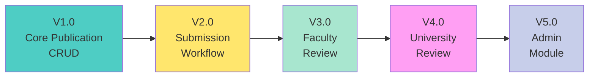

# Kế Hoạch Phát Triển Incremental - UFPMS

> 📅 **Ngày tạo**: 13/02/2026  
> 🎯 **Chiến lược**: Incremental Development - Chia nhỏ thành 5 phiên bản  
> ⏱️ **Timeline**: Linh hoạt, phát triển theo từng version

---

## 🎯 Triết Lý Incremental Development

**Nguyên tắc**: Thiết kế → Phát triển → Hoàn thiện từng phần nhỏ trước khi chuyển sang phần tiếp theo.

**Lợi ích**:
- ✅ Dễ quản lý và kiểm soát chất lượng
- ✅ Có thể demo và nhận feedback sớm
- ✅ Giảm rủi ro kỹ thuật
- ✅ Team làm việc focus hơn
- ✅ Có sản phẩm chạy được sau mỗi version

---

## 📦 5 Mini-Versions



---

## Version 1.0: Core Publication Management

### 🎯 Scope
**User Stories**: 9 stories  
- US-RES-001: Tạo bài báo mới
- US-RES-002: Upload file PDF
- US-RES-003: Sửa bài báo nháp
- US-RES-004: Xóa bài báo nháp
- US-RES-005: Xem danh sách bài báo
- US-RES-006: Thêm đồng tác giả
- US-RES-008: Xem chi tiết bài báo
- US-RES-009: Download file PDF
- US-RES-024: Xem dashboard giờ làm

**Mục tiêu**: Giảng viên có thể quản lý bài báo của mình (CRUD đầy đủ).

### 📐 Phase 1: Design

#### Lead Tasks
- Thiết kế database schema (Publications, Users, Departments, Faculties tables)
- Thiết kế API cho Publication module
- Setup Git repository + CI/CD cơ bản

#### Frontend Team (Figma Design)
**Screens** (6 màn hình):
1. Login page
2. Researcher Dashboard (overview + statistics)
3. Publication List (với filters)
4. Create Publication form
5. Edit Publication form
6. Publication Detail view

**Components**:
- Design system basics (colors, typography, spacing)
- Core components (Button, Input, Table, Card, Modal)

#### Backend Team (API Design Review)
- Review database schema
- Review API endpoints
- Prepare development environment

### 💻 Phase 2: Development

#### Backend
- Setup Spring Boot project
- Implement authentication (mock LDAP, JWT)
- Implement Publication CRUD APIs
- Implement file upload/download
- Implement co-author APIs
- Write unit tests

#### Frontend
- Setup React project (Vite + TypeScript + MUI)
- Implement login flow
- Implement Publication List page
- Implement Create/Edit forms
- Implement Detail view
- Implement file upload UI

### ✅ Phase 3: Verification

#### Testing
- Manual UAT cho 9 user stories
- Integration testing
- Bug fixes

#### Deliverables
✅ Giảng viên có thể login và quản lý bài báo đầy đủ (CRUD)  
✅ Dashboard hiển thị statistics  
✅ Working system có thể demo

---

## Version 2.0: Submission Workflow (Researcher)

### 🎯 Scope
**User Stories**: 3 stories  
- US-RES-010: Nộp xét duyệt
- US-RES-011: Xem trạng thái xét duyệt
- US-RES-012: Chỉnh sửa theo yêu cầu

**Mục tiêu**: Giảng viên có thể nộp bài báo để xét duyệt.

### 📐 Phase 1: Design

#### Lead
- Thiết kế state machine (publication status transitions)
- Thiết kế Review History table schema
- Design submission workflow APIs

#### Frontend (Figma)
**Screens** (3 màn hình):
1. Submission wizard
2. Review status tracking page
3. Revision request view

#### Backend
- Review state machine logic
- Review new database tables

### 💻 Phase 2: Development

#### Backend
- Implement state machine
- Implement submission APIs
- Implement review history tracking
- Write tests

#### Frontend
- Implement submission UI
- Implement status tracking
- Implement revision workflow

### ✅ Phase 3: Verification

✅ Researcher có thể submit publication (DRAFT → SUBMITTED)  
✅ Status tracking hoạt động  
✅ Revision workflow hoạt động

---

## Version 3.0: Faculty Review Workflow

### 🎯 Scope
**User Stories**: 5 stories  
- US-FCR-001: Xem dashboard chờ duyệt
- US-FCR-002: Phê duyệt bài báo
- US-FCR-003: Yêu cầu bổ sung
- US-FCR-004: Từ chối bài báo
- US-FCR-005: Xem lịch sử xét duyệt

**Mục tiêu**: Cán bộ Khoa có thể xét duyệt bài báo.

### 📐 Phase 1: Design

#### Lead
- Design Faculty Review APIs
- Design Review Comments table schema
- Design authorization rules

#### Frontend (Figma)
**Screens** (4 màn hình):
1. Faculty Reviewer Dashboard
2. Review Detail page (with PDF viewer)
3. Review action form (Approve/Request Changes/Reject)
4. Review history page

### 💻 Phase 2: Development

#### Backend
- Implement review APIs
- Implement comment system
- Implement role-based authorization
- Notification queue (mock email)

#### Frontend
- Implement Faculty Dashboard
- Implement Review UI
- Implement comment threads
- Implement history view

### ✅ Phase 3: Verification

✅ Faculty reviewer có thể review và approve/reject  
✅ Comments system hoạt động  
✅ Audit trail ghi nhận đầy đủ

---

## Version 4.0: University Review Workflow

### 🎯 Scope
**User Stories**: 5 stories  
- US-UNR-001: Xem dashboard chờ duyệt Trường
- US-UNR-002: Xem ý kiến cấp Khoa
- US-UNR-003: Phê duyệt và công bố
- US-UNR-004: Từ chối cấp Trường
- US-UNR-005: Xem Audit Trail

**Mục tiêu**: Hoàn tất quy trình 2 cấp, publish publications.

### 📐 Phase 1: Design

#### Frontend (Figma)
**Screens** (4 màn hình):
1. University Reviewer Dashboard
2. Review detail with Faculty comments
3. Final approval form
4. Full audit trail view

### 💻 Phase 2: Development

#### Backend
- Implement University review APIs
- Implement publish workflow
- Implement full audit trail APIs

#### Frontend
- Implement University Dashboard
- Implement review UI with Faculty comments
- Implement audit trail visualization

### ✅ Phase 3: Verification

✅ End-to-end workflow hoạt động (DRAFT → PUBLISHED)  
✅ 2-tier approval process hoàn chỉnh

---

## Version 5.0: Admin Module

### 🎯 Scope
**User Stories**: 3 stories  
- US-ADM-001: Quản lý người dùng (CRUD)
- US-ADM-002: Gán vai trò người dùng
- US-ADM-003: Quản lý Khoa/Đơn vị
- US-ADM-006: Xem Audit Logs

**Mục tiêu**: Admin có thể quản lý hệ thống.

### 📐 Phase 1: Design

#### Frontend (Figma)
**Screens** (5 màn hình):
1. User Management (CRUD table)
2. User Detail & Role Assignment
3. Department Management
4. Faculty Management
5. Audit Logs viewer

### 💻 Phase 2: Development

#### Backend
- User management APIs
- Role assignment APIs
- Department/Faculty APIs
- Audit log APIs

#### Frontend
- Implement all admin screens
- Implement bulk actions

### ✅ Phase 3: Verification

✅ Admin có thể quản lý users, roles, departments

---


## 📊 Version Summary

| Version | Deliverable |
|---------|-------------|
| **V1.0** | Core Publication CRUD |
| **V2.0** | + Submission workflow |
| **V3.0** | + Faculty Review |
| **V4.0** | + University Review |
| **V5.0** | + Admin module |

---

## 🔄 Quy Trình Mỗi Version

```
┌─────────────────────────────────────────┐
│  DESIGN PHASE                           │
│  - Figma mockups                        │
│  - API specification                    │
│  - Database changes                     │
│  ✅ Review checkpoint với team          │
└────────────┬────────────────────────────┘
             │
┌────────────▼────────────────────────────┐
│  DEVELOPMENT PHASE                      │
│  - Backend implementation               │
│  - Frontend implementation              │
│  - Daily standups                       │
│  ✅ Code review cho mọi PR              │
└────────────┬────────────────────────────┘
             │
┌────────────▼────────────────────────────┐
│  VERIFICATION PHASE                     │
│  - UAT testing                          │
│  - Bug fixes                            │
│  - Documentation update                 │
│  ✅ Version DONE, demo được             │
└─────────────────────────────────────────┘
```

---

## 👥 Team Workflow Mỗi Version

### Lead
- **Design Phase**: Thiết kế architecture, API, schema
- **Development**: Code review, technical guidance
- **Verification**: Final QA, deployment prep

### Frontend Team
- **Design Phase**: Tạo Figma mockups cho screens mới
- **Development**: Implement UI theo design
- **Verification**: Fix UI bugs, polish UX

### Backend Team
- **Design Phase**: Review APIs, prepare environment
- **Development**: Implement APIs và business logic
- **Verification**: Fix bugs, performance tuning

---

## 🎯 Definition of DONE cho mỗi Version

Mỗi version được coi là hoàn thành khi:

✅ **Functionality**
- [ ] Tất cả user stories trong scope đã implement
- [ ] Acceptance criteria đạt 100%
- [ ] Manual testing pass

✅ **Quality**
- [ ] Unit test coverage > 80%
- [ ] Integration tests pass
- [ ] No critical/high bugs

✅ **Design**
- [ ] UI match Figma design
- [ ] Responsive trên desktop/tablet
- [ ] Accessibility cơ bản (keyboard navigation)

✅ **Documentation**
- [ ] API docs updated (Swagger)
- [ ] Code comments đầy đủ
- [ ] User guide updated (nếu cần)

✅ **Deployment**
- [ ] Merged vào main branch
- [ ] Deployed lên staging
- [ ] Có thể demo cho stakeholders

---

## 🚀 Bắt Đầu với V1.0

### Phase 1: Design

**Lead Tasks**:
- [ ] Finalize database schema cho V1.0
- [ ] Design Publication APIs (OpenAPI spec)
- [ ] Setup Git repo với README đầy đủ
- [ ] Setup CI/CD pipeline cơ bản
- [ ] Kickoff meeting với team

**Frontend Tasks**:
- [ ] Setup Figma workspace
- [ ] Design system (colors, typography, components)
- [ ] Design 6 screens cho V1.0
- [ ] Create interactive prototype
- [ ] Design review meeting

**Backend Tasks**:
- [ ] Setup local dev environment
- [ ] Review API spec
- [ ] Setup Spring Boot project skeleton
- [ ] Setup database + migrations
- [ ] API design review meeting

**Checkpoint**:
✅ Design hoàn chỉnh, team ready to code

---

## 📋 Advantages of This Approach

**1. Risk Mitigation**
- Phát hiện vấn đề sớm trong V1.0
- Điều chỉnh approach cho các version sau

**2. Early Feedback**
- Demo V1.0 cho stakeholders sớm
- Nhận feedback và adjust

**3. Team Morale**
- Có deliverable sau mỗi 2-3 tuần
- Team thấy tiến độ rõ ràng

**4. Flexible Scope**
- Có thể skip/postpone versions nếu cần
- Ví dụ: V5.0 (Admin) có thể làm sau

**5. Better Quality**
- Focus vào scope nhỏ → quality cao hơn
- Refactor dễ dàng giữa các versions

---

## 🔗 Dependencies Giữa Các Versions

```
V1.0 (Core CRUD)
  ↓ mandatory
V2.0 (Submission) → cần V1.0 có publications
  ↓ mandatory
V3.0 (Faculty Review) → cần V2.0 có submissions
  ↓ mandatory
V4.0 (University Review) → cần V3.0 có faculty approvals
  ↓ independent (có thể làm song song với V4.0)
V5.0 (Admin) → không phụ thuộc vào workflow, có thể làm bất cứ lúc nào
```

**Note**: V5.0 (Admin) có thể phát triển song song với V2-V4 hoặc làm sau cùng.

---

**Prepared by**: Lead  
**Date**: 13/02/2026  
**Version**: 2.0 - Incremental Approach  
**Status**: Ready for Review
