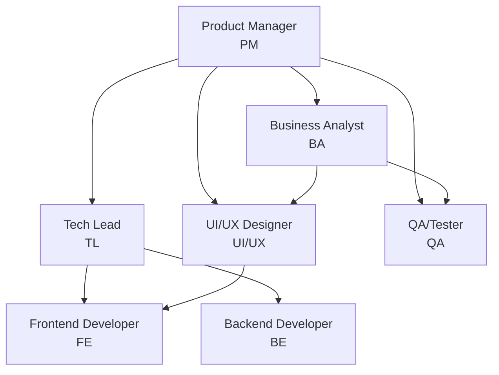
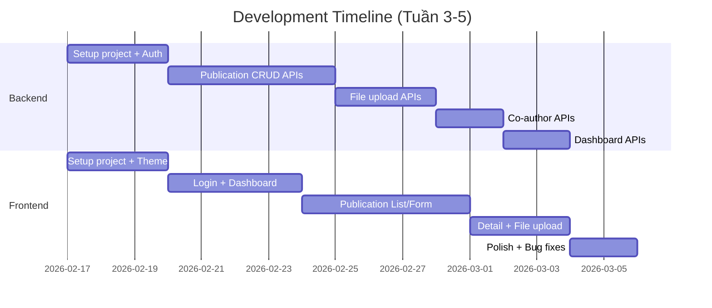

# Team Workflow - UFPMS Version 1.0

> 📅 **Ngày tạo**: 16/02/2026  
> 🎯 **Mục đích**: Mô tả flow làm việc của team để hoàn thành V1.0  
> 📚 **Dựa trên**: Incremental Development Plan + SOPs của 7 vai trò

---

## 🎯 Tổng Quan

Tài liệu này mô tả chi tiết quy trình làm việc của team phát triển **UFPMS Version 1.0** - Core Publication Management. Version 1.0 bao gồm **9 user stories** và được phát triển theo phương pháp **Incremental**, qua **3 phases**: Design → Development → Verification.

---

## 👥 Đội Ngũ Phát Triển



**7 vai trò chính**:
1. **Product Manager (PM)** - Lãnh đạo tổng thể, điều phối team
2. **Tech Lead (TL)** - Kiến trúc kỹ thuật, hướng dẫn dev team
3. **Business Analyst (BA)** - Phân tích yêu cầu, định nghĩa acceptance criteria
4. **UI/UX Designer (UI/UX)** - Thiết kế giao diện, tạo design system
5. **Frontend Developer (FE)** - Phát triển giao diện người dùng
6. **Backend Developer (BE)** - Phát triển APIs và database
7. **QA/Tester (QA)** - Kiểm thử, đảm bảo chất lượng

---

## 📋 V1.0 Scope

**9 User Stories** cần hoàn thành:
- US-RES-001: Tạo bài báo mới
- US-RES-002: Upload file PDF
- US-RES-003: Sửa bài báo nháp
- US-RES-004: Xóa bài báo nháp
- US-RES-005: Xem danh sách bài báo
- US-RES-006: Thêm đồng tác giả
- US-RES-008: Xem chi tiết bài báo
- US-RES-009: Download file PDF
- US-RES-024: Xem dashboard giờ làm

**Deliverable**: Giảng viên có thể quản lý bài báo của mình (CRUD đầy đủ)

---

## 🔄 Quy Trình 3 Phases

```
┌─────────────────────────────────────────┐
│  PHASE 1: DESIGN (Tuần 1-2)             │
│  - PM kickoff project                   │
│  - BA phân tích requirements            │
│  - UI/UX thiết kế screens               │
│  - TL thiết kế architecture             │
│  - QA chuẩn bị test cases               │
│  ✅ Checkpoint: Design Review           │
└────────────┬────────────────────────────┘
             │
┌────────────▼────────────────────────────┐
│  PHASE 2: DEVELOPMENT (Tuần 3-5)        │
│  - BE implement APIs                    │
│  - FE implement UI                      │
│  - PM daily standups                    │
│  - TL code review                       │
│  - QA API testing                       │
│  ✅ Checkpoint: Sprint Reviews          │
└────────────┬────────────────────────────┘
             │
┌────────────▼────────────────────────────┐
│  PHASE 3: VERIFICATION (Tuần 6)         │
│  - QA regression testing                │
│  - PM UAT coordination                  │
│  - Bug fixes by dev team                │
│  - Final polish                         │
│  ✅ Checkpoint: V1.0 DONE               │
└─────────────────────────────────────────┘
```

---

## 📐 PHASE 1: DESIGN

> **Timeline**: 1-2 tuần  
> **Mục tiêu**: Hoàn thiện design, architecture, và acceptance criteria

### 1.1 Khởi Động Project

**👤 Product Manager (PM) dẫn dắt:**

**Bước 1: Tổ chức Kickoff Meeting**
```
Thành viên: Toàn team (PM, TL, BA, UI/UX, FE, BE, QA)
Thời lượng: 60 phút

Agenda:
├─ Giới thiệu V1.0 scope (9 user stories) - 15 phút
├─ Review timeline & milestones - 10 phút
├─ Phân công roles & responsibilities - 10 phút
├─ Communication plan (standups, reviews) - 10 phút
└─ Q&A - 15 phút

Output:
- Meeting notes
- Project charter (PM tạo)
- Team hiểu rõ scope và vai trò
```

**Bước 2: PM tạo Project Charter**
```
Document sections:
├─ Project overview: V1.0 Core Publication Management
├─ Scope: 9 user stories (in-scope), các features khác (out-of-scope)
├─ Timeline: 6 tuần (Design 2 tuần, Dev 3 tuần, Verification 1 tuần)
├─ Team roster: Danh sách roles và members
├─ Success criteria: 9/9 stories hoàn thành, UAT passed, 0 critical bugs
└─ Risks & mitigations
```

---

### 1.2 Phân Tích Requirements

**👤 Business Analyst (BA) chủ trì:**

**Bước 1: Phân tích chi tiết 9 User Stories**

```
Cho mỗi user story, BA tạo document:
├─ Business value
├─ Detailed description
├─ Acceptance criteria (chi tiết)
├─ Business rules (BR-001, BR-002, ...)
├─ Edge cases
├─ Dependencies
└─ Test scenarios (để QA reference)

Ví dụ: US-RES-001 - Tạo bài báo mới
  Acceptance Criteria:
  ✓ Form có required fields: Title, Type, Year
  ✓ Validation errors hiển thị inline
  ✓ Save button tạo publication với status=DRAFT
  ✓ Redirect đến Publication Detail sau khi save
  
  Business Rules:
  BR-001: Title max 500 chars
  BR-002: Year range: 1900 - current year
  BR-003: Publication Type: JOURNAL, CONFERENCE, BOOK_CHAPTER, OTHER
  BR-004: DOI format validation
  BR-005: Default status = DRAFT
```

**Bước 2: Tạo Business Rules Document (BRD)**

```
Tổng hợp tất cả business rules:
├─ Publication rules (BR-001 đến BR-007)
├─ File upload rules (BR-008 đến BR-011)
├─ Co-author rules (BR-012 đến BR-015)
├─ Authorization rules (BR-016 đến BR-018)
├─ Dashboard rules (BR-019 đến BR-021)
└─ Validation rules (BR-022 đến BR-024)
```

**Bước 3: Vẽ Process Flow Diagrams**

BA tạo flowcharts cho:
- Create Publication workflow
- Upload PDF workflow
- Edit/Delete Publication workflow
- View List với filters workflow

---

### 1.3 Thiết Kế Architecture & API

**👤 Tech Lead (TL) chủ trì:**

**Bước 1: Thiết kế System Architecture**

```
3-tier architecture:
┌─────────────────────────────────┐
│ PRESENTATION LAYER              │
│ - React SPA (TypeScript + MUI)  │
│ - State: Zustand/Redux          │
└────────────┬────────────────────┘
             │ HTTPS/REST APIs
┌────────────▼────────────────────┐
│ APPLICATION LAYER               │
│ - Spring Boot REST API          │
│ - Auth: JWT                     │
│ - Services, Controllers         │
└────────────┬────────────────────┘
             │ JDBC
┌────────────▼────────────────────┐
│ DATA LAYER                      │
│ - MySQL Database                │
│ - Tables: users, publications   │
│ - File System: PDF storage      │
└─────────────────────────────────┘
```

**Bước 2: Quyết định Technology Stack**

```
Backend:
- Java 17 + Spring Boot 3.x
- Spring Data JPA (Hibernate)
- Spring Security + JWT
- MySQL 8.0
- Swagger/OpenAPI docs

Frontend:
- TypeScript + React 18
- Material-UI (MUI)
- Zustand (state management)
- React Router v6
- Axios (HTTP client)
- Vite (build tool)

Testing:
- Backend: JUnit 5, Mockito
- Frontend: Vitest, React Testing Library
```

**Bước 3: Review Database Schema**

```
Bảng chính:
├─ users (id, username, email, password, role, faculty_id, department_id)
├─ faculties (id, name, code)
├─ departments (id, name, code, faculty_id)
├─ publications (id, title, type, year, status, pdf_path, created_by, ...)
└─ publication_authors (id, publication_id, user_id, author_name, order, ...)

Indexes:
- publications(status, created_by, year)
- users(username, email)
```

**Bước 4: Design API Endpoints**

```
Authentication:
POST   /api/auth/login
GET    /api/auth/me

Publications:
POST   /api/publications
GET    /api/publications?status=&year=&page=&size=
GET    /api/publications/{id}
PUT    /api/publications/{id}
DELETE /api/publications/{id}

File:
POST   /api/publications/{id}/upload-pdf
GET    /api/publications/{id}/download-pdf

Authors:
POST   /api/publications/{id}/authors
DELETE /api/publications/{id}/authors/{authorId}

Dashboard:
GET    /api/dashboard/stats
```

**Bước 5: Định nghĩa Coding Standards**

TL tạo document:
- Naming conventions (Java, TypeScript)
- Package structure
- Git branch strategy (GitFlow lite)
- Code review checklist
- Commit message format

---

### 1.4 Thiết Kế UI/UX

**👤 UI/UX Designer chủ trì:**

**Bước 1: User Research (1-2 giờ)**

```
Interview stakeholders:
1. Bạn quản lý publications như thế nào hiện tại?
2. Khó khăn chính là gì?
3. Features quan trọng nhất?
4. Expectations về giao diện?

Competitive analysis (optional):
- Google Scholar UI
- ResearchGate UX
```

**Bước 2: Tạo Design System trong Figma**

```
├─ Colors:
│  - Primary: #1976D2 (Blue)
│  - Secondary: #FF9800 (Orange)
│  - Status colors: Success, Warning, Error, Info
│  - Neutral colors: Text, Background, Dividers
│
├─ Typography:
│  - Font: Roboto
│  - H1: 32px/700, H2: 24px/600, Body: 16px/400
│
├─ Spacing: Base unit = 8px
│
├─ Components:
│  - Button (Primary, Secondary, Text, Danger)
│  - Input (Standard, Filled, Outlined)
│  - Card, Table, Modal, Badge
│
└─ Grid System: 12 columns, 1200px max-width
```

**Bước 3: Design 6 Screens**

```
Screen 1: Login Page
- Logo, username/password inputs, login button

Screen 2: Dashboard
- Statistics cards (2x2 grid)
- Recent publications table
- Floating "Create New" button

Screen 3: Publication List
- Filter bar (status, year, search)
- Data table with pagination
- Empty state

Screen 4: Create Publication Form
- 2-column grid layout
- Sections: Basic Info, Details, Content, Authors, PDF Upload
- Save/Cancel buttons

Screen 5: Edit Publication Form
- Pre-filled form (tương tự Create)
- Delete button (chỉ cho DRAFT)

Screen 6: Publication Detail
- Left: PDF Viewer (60%)
- Right: Metadata Panel (40%)
- Actions: Edit, Download, Back
```

**Bước 4: Tạo Interactive Prototype**

```
Link screens để demo user flows:
- Login → Dashboard
- Dashboard → Create → Save → Detail
- List → Edit → Save → Detail
- Detail → View PDF, Download
```

---

### 1.5 Chuẩn Bị Test Plan

**👤 QA/Tester chủ trì:**

**Bước 1: Review Requirements với BA**

QA đọc kỹ:
- 9 user stories + acceptance criteria
- Business rules document
- Process flow diagrams

**Bước 2: Tạo Test Cases (~55 test cases)**

```
Coverage matrix:
├─ US-RES-001: Tạo bài báo (10 test cases)
│  TC-001: Happy path
│  TC-002: Missing title → Error
│  TC-003: Invalid year → Error
│  ...
│
├─ US-RES-002: Upload PDF (8 test cases)
│  TC-011: Upload valid PDF → Success
│  TC-012: File > 20MB → Error
│  TC-013: Upload .docx → Error
│  ...
│
└─ ... (tương tự cho 7 user stories còn lại)

Tổng: ~55 test cases covering happy paths + edge cases
```

**Bước 3: Chuẩn bị Test Data & Environment**

```
Test accounts:
- researcher1 / password123
- researcher2 / password123

Sample files:
- valid_5mb.pdf
- large_25mb.pdf
- corrupted.pdf
- sample.docx (để test error)

Tools:
- Postman (API testing)
- Chrome DevTools
- Bug tracking (Jira/Trello)
```

---

### 1.6 Design Review Meeting

**👤 PM tổ chức, toàn team tham gia:**

```
Thời lượng: 60-90 phút

Agenda:
├─ BA presents: Requirements recap (10 phút)
│  - 9 user stories
│  - Acceptance criteria
│  - Business rules
│
├─ UI/UX presents: Figma designs walkthrough (20 phút)
│  - Design system
│  - 6 screens demo
│  - Interactive prototype
│
├─ TL presents: Architecture overview (15 phút)
│  - Tech stack decisions
│  - Database schema
│  - API specification
│
├─ QA presents: Test plan overview (10 phút)
│  - Test coverage (55 test cases)
│  - Testing approach
│
├─ Feedback & Questions (15 phút)
│
└─ PM decision: Approve để chuyển sang Development? (5 phút)

Approval criteria:
✅ Designs match user stories
✅ Architecture feasible
✅ Team confident để implement

Output:
- Design sign-off
- Go ahead cho Phase 2: Development
```

**🎯 End of Phase 1 Checkpoint**

✅ **Deliverables**:
- Project Charter (PM)
- Detailed User Stories + BRD (BA)
- Architecture Design Doc (TL)
- Figma Designs + Prototype (UI/UX)
- Test Plan + Test Cases (QA)
- Coding Standards (TL)

✅ **Approval**: PM sign-off → Chuyển sang Phase 2

---

## 💻 PHASE 2: DEVELOPMENT

> **Timeline**: 3 tuần  
> **Mục tiêu**: Implement 6 screens + APIs + Testing

### 2.1 Sprint Setup (Nếu dùng Agile)

**👤 PM lập kế hoạch:**

```
Sprint duration: 1-2 tuần

Sprint 1 (Tuần 3-4):
Goal: "Complete authentication + basic CRUD"
Stories:
- US-RES-001: Tạo bài báo
- US-RES-003: Sửa bài báo
- US-RES-004: Xóa bài báo
- US-RES-005: Xem danh sách

Sprint 2 (Tuần 5):
Goal: "Complete file upload + co-authors + dashboard"
Stories:
- US-RES-002: Upload PDF
- US-RES-006: Thêm đồng tác giả
- US-RES-008: View detail
- US-RES-009: Download PDF
- US-RES-024: Dashboard
```

---

### 2.2 Development Workflow

**Parallel work by Backend & Frontend teams:**



---

### 2.2.1 Backend Development

**👤 Backend Developer:**

**Tuần 3: Foundation**

```
Day 1-2: Project Setup
├─ Create Spring Boot project (Spring Initializr)
├─ Setup dependencies: Web, JPA, Security, MySQL, Swagger
├─ Configure application.properties (database, JWT secret)
├─ Setup folder structure (controller, service, repository, model)
└─ Git repo initialized

Day 3-5: Authentication Module
├─ Implement User entity + UserRepository
├─ JWT utility class (generateToken, validateToken)
├─ Security config (disable CSRF, stateless session)
├─ AuthController: POST /api/auth/login, GET /api/auth/me
├─ Unit tests cho JWT + AuthController
└─ Postman collection tạo sẵn để test
```

**Tuần 4: Publication CRUD**

```
Day 1-3: Publications Module
├─ Implement Publication entity (title, type, year, status, ...)
├─ PublicationRepository (findByCreatedBy, findByFilters, ...)
├─ PublicationService (create, list, get, update, delete)
│  - Business logic: ownership check, status validation
│  - BR-006: Chỉ DRAFT có thể edit/delete
├─ PublicationController: POST, GET, PUT, DELETE endpoints
└─ Unit tests + Integration tests

Day 4-5: Co-Authors Module
├─ PublicationAuthor entity + repository
├─ PublicationAuthorService (add, remove, reorder)
├─ AuthorController: POST, DELETE endpoints
└─ Unit tests
```

**Tuần 5: File Upload + Dashboard**

```
Day 1-2: File Upload Module
├─ FileStorageService
│  - storePdfFile(file, publicationId): Validate, save to disk
│  - loadPdfFile(filepath): Load for download
│  - Validation: PDF only, max 20MB
├─ FileController: POST /upload-pdf, GET /download-pdf
└─ Integration tests (upload → download)

Day 3-4: Dashboard Module
├─ DashboardService.getStats()
│  - Query: totalPublications, publishedCount, draftCount
│  - Calculate totalWorkHours (JOURNAL=40h, CONFERENCE=20h, ...)
├─ DashboardController: GET /dashboard/stats
└─ Tests

Day 5: Swagger Documentation
├─ Add @Tag, @Operation annotations
├─ Test Swagger UI tại /swagger-ui.html
└─ Export Postman collection
```

**👤 Tech Lead: Code Review Throughout**

```
Daily routine:
├─ Morning: Review open Pull Requests (trong vòng 4 giờ)
├─ Standup: Listen cho technical blockers
├─ Afternoon: Availability cho team questions, pair programming
└─ Evening: Run SonarQube scan (weekly)

Code review checklist:
✓ Code follows style guide
✓ Tests included (coverage > 80%)
✓ No hardcoded values
✓ Error handling proper
✓ Performance OK (no N+1 queries)
✓ Security OK (no SQL injection, XSS)
```

---

### 2.2.2 Frontend Development

**👤 Frontend Developer:**

**Tuần 3: Foundation**

```
Day 1-2: Project Setup
├─ Create Vite project: npm create vite@latest
├─ Install dependencies: MUI, React Router, Axios, React Hook Form
├─ Setup folder structure (components, pages, services, hooks, store)
├─ Create MUI theme (colors, typography từ Figma)
└─ Setup Axios instance (baseURL, JWT interceptor)

Day 3-5: Login + Dashboard
├─ Implement Login page
│  - react-hook-form cho username/password
│  - Validate, call authService.login()
│  - Lưu JWT token vào localStorage
│  - Navigate đến Dashboard
├─ Implement Dashboard page
│  - Fetch dashboardService.getStats()
│  - Hiển thị 4 statistics cards (Grid 2x2)
│  - Recent publications table
│  - Floating "Create New" button
└─ Tests: Login flow, Dashboard render
```

**Tuần 4: Publication List + Form**

```
Day 1-3: Publication List
├─ Implement PublicationList page
│  - Fetch publicationService.list(filters, page)
│  - Filter bar: Status dropdown, Year input, Search box
│  - Data table: Title, Year, Status badge, Created Date, Actions
│  - Pagination controls
│  - Empty state: "No publications yet"
├─ Actions: View (navigate to detail), Edit, Delete (confirm dialog)
└─ Tests

Day 4-5: Create/Edit Publication Form
├─ PublicationForm component (reusable)
│  - react-hook-form + yup validation
│  - Grid 2 columns: Type, Title, Year, Journal, Volume, DOI, Abstract, Keywords
│  - Validation: required fields, year range, title max 500
├─ CreatePublication page: Empty form, onSubmit → create API
├─ EditPublication page: Pre-filled form, onSubmit → update API
│  - Delete button (chỉ cho DRAFT)
└─ Tests: Form validation, submission
```

**Tuần 5: Detail + File Upload + Polish**

```
Day 1-2: Publication Detail
├─ PublicationDetail page
│  - 2 columns: PDF Viewer (60%), Metadata Panel (40%)
│  - PDF viewer: iframe (src = /api/publications/{id}/download-pdf)
│  - Metadata: Type, Year, Journal, Authors, Abstract, Keywords, File info
│  - Actions: Edit (nếu DRAFT), Download PDF, Back
└─ Tests

Day 3: File Upload UI
├─ Upload PDF button trong Create/Edit form
├─ File picker: accept=".pdf", max 20MB validation
├─ Progress indicator
└─ Success/Error messages

Day 4-5: UI Polish + Bug Fixes
├─ Loading states: Spinners, skeletons
├─ Empty states: User-friendly messages
├─ Error handling: Toast notifications
├─ Responsive testing: Desktop + Tablet
├─ Accessibility: Keyboard navigation, focus indicators
└─ Fix bugs từ QA
```

**👤 UI/UX Designer: Design QA**

```
Weekly check-in với Frontend:
├─ Review implemented screens
├─ Compare với Figma designs
├─ Note differences:
│  "Button padding nhỏ, tăng từ 8px lên 12px"
│  "Card shadow quá đậm, giảm opacity"
└─ Log issues cho frontend to fix

Visual QA checklist:
✓ Colors match design system
✓ Typography (sizes, weights) correct
✓ Spacing consistent (8px grid)
✓ Components match Figma
✓ Hover/Focus states hoạt động
```

---

### 2.3 Daily Workflow

**👤 PM điều phối hàng ngày:**

**Daily Standup (9:00 AM, 15 phút)**

```
Format: Mỗi member trả lời 3 câu hỏi
1. Yesterday: Làm được gì?
2. Today: Hôm nay sẽ làm gì?
3. Blockers: Có vấn đề gì cần giúp?

PM's role:
├─ Listen actively
├─ Note blockers
├─ Follow up ngay sau standup để resolve
└─ Track progress towards sprint goal
```

**PM: Progress Tracking**

```
Tracking matrix (cập nhật hàng ngày):

User Story | Backend API | Frontend UI | Testing | Status
US-RES-001 | ✅ Done     | ✅ Done    | 🔄 In Progress | 80%
US-RES-002 | ✅ Done     | ⏳ Not Started | ⏳ Blocked | 30%
US-RES-003 | 🔄 In Progress | ⏳ Waiting | ⏳ Waiting | 20%
...

Legend:
✅ Done | 🔄 In Progress | ⏳ Waiting | ❌ Blocked
```

**QA: Daily API Testing**

```
Sau mỗi backend deploy:
├─ Run Postman collections
│  - Authentication tests
│  - Publications CRUD tests
│  - File upload tests
├─ Log test results
└─ Report failures thành bugs
```

**👤 BA: Support Team Clarifications**

```
Dev team sẽ có questions, BA trả lời:

Q: "Error message khi title > 500 chars nên là gì?"
A: "Title cannot exceed 500 characters"

Q: "Khi delete publication, có cần confirm dialog không?"
A: "Có, confirm: 'Are you sure you want to delete?'"

Response time: < 4 hours
Document câu trả lời để reference
```

---

### 2.4 Code Review Process

**👤 Tech Lead review mọi PR:**

```
PR workflow:
1. Dev tạo feature branch: feature/US-RES-001-create-publication
2. Implement feature + tests
3. Create PR to develop branch
4. TL review trong vòng 4 giờ
5. CI pipeline runs (build, tests, linting)
6. TL approve → Merge
7. Delete feature branch

Code review checklist (TL):
✓ Follows coding standards
✓ Tests included (unit + integration)
✓ No hardcoded values
✓ Error handling proper
✓ Performance OK
✓ Security OK
✓ Naming clear
```

---

### 2.5 Sprint Review (End of Sprint)

**👤 PM tổ chức, toàn team tham gia:**

```
Thời lượng: 60 phút
Frequency: End of each sprint (2 weeks)

Agenda:
├─ PM: Sprint goal recap (5 phút)
│
├─ Dev team: Demo completed stories (30 phút)
│  - Live demo cho từng user story
│  - Show running application
│
├─ BA: Review acceptance criteria (10 phút)
│  - Verify stories đạt criteria
│  - Note any gaps
│
├─ QA: Testing status (5 phút)
│  - Test cases run: X/Y passed
│  - Bugs found: Priority breakdown
│
├─ Feedback & Discussion (10 phút)
│
└─ PM: Next sprint planning preview (5 phút)

Output:
- Sprint completion metrics
- Issues to carry over to next sprint
```

---

### 2.6 Bug Management

**👤 QA log bugs, PM prioritize:**

```
Bug priority matrix:
P0 (Critical - Must fix):
- System crashes
- Data loss
- Login không hoạt động

P1 (High - Should fix):
- Major features không hoạt động
- Validation errors sai

P2 (Medium - Can defer to V1.1):
- UI minor issues
- Performance chưa tối ưu

P3 (Low - Backlog):
- Nice-to-have improvements

PM decision: V1.0 chỉ release khi P0/P1 bugs = 0
```

**Bug workflow:**

```
1. QA finds bug → Log trong Jira với reproduction steps
2. PM triages → Assign priority
3. PM assigns to Developer
4. Dev fixes → Create PR
5. TL reviews + approves
6. QA re-tests → Verify fix
7. QA marks "Verified" → Close bug
```

---

**🎯 End of Phase 2 Checkpoint**

✅ **Deliverables**:
- Backend APIs implemented + tested (BE)
- Frontend screens implemented (FE)
- API documentation (Swagger) (TL)
- Sprint review notes (PM)
- Bug reports (QA)

✅ **Metrics**:
- 9/9 user stories implemented
- Code coverage: Backend > 80%, Frontend > 70%
- CI/CD pipelines: All green

✅ **Ready for Phase 3**: Verification

---

## ✅ PHASE 3: VERIFICATION

> **Timeline**: 1 tuần  
> **Mục tiêu**: QA comprehensive testing, bug fixes, UAT, release preparation

### 3.1 Regression Testing

**👤 QA chạy toàn bộ test suite:**

**Bước 1: Execute ~55 Test Cases**

```
Testing matrix:
├─ Functional testing (all 9 user stories)
│  TC-001 đến TC-055
│
├─ API testing (Postman)
│  - Authentication
│  - CRUD endpoints
│  - File upload/download
│
├─ UI testing (Manual)
│  - All 6 screens
│  - Responsive (desktop + tablet)
│  - Browsers: Chrome (primary), Firefox (optional)
│
└─ Exploratory testing
   - "Phá" create form (SQL injection, XSS, emojis)
   - Navigation flows
   - Data integrity

Execution tracking:
- Pass: __ / 55
- Fail: __
- Blocked: __

Target: 100% pass rate
```

**Bước 2: Log Bugs**

```
Bug report format (QA):
BUG-001: Create publication fails khi title có emoji

Priority: P2 (Medium)
Steps to Reproduce:
1. Login với researcher1
2. Vào Create Publication
3. Nhập title: "Bài báo 😀"
4. Click Save
Expected: Publication created
Actual: Error 500
Screenshot: [attached]
Assigned To: Backend Developer
```

---

### 3.2 Bug Fixing

**👤 Dev teams fix bugs:**

```
Week 6 workflow:
├─ Day 1-2: QA runs regression tests
│  - Log all bugs
│
├─ Day 3-4: Dev teams fix P0/P1 bugs
│  - Backend: API bugs, validation bugs
│  - Frontend: UI bugs, UX issues
│  - TL reviews fixes
│
└─ Day 5: QA re-tests fixes
   - Verify all P0/P1 bugs fixed
   - Regression check (no new bugs?)
```

**PM tracking bug metrics:**

```
Daily bug burn-down chart:
Day 1: 20 bugs open
Day 2: 20 bugs open (QA still finding)
Day 3: 18 bugs (2 fixed)
Day 4: 10 bugs (8 fixed)
Day 5: 2 bugs (P2 defer to V1.1)

Release criteria:
✅ 0 P0 bugs
✅ 0 P1 bugs
⚠️  P2/P3 bugs documented as known issues
```

---

### 3.3 Definition of Done Review

**👤 PM verify DoD checklist:**

```
V1.0 đạt DoD khi:

Functionality:
✅ 9/9 user stories implemented
✅ All acceptance criteria đạt 100%
✅ Manual testing passed

Quality:
✅ Unit test coverage > 80% (Backend), > 70% (Frontend)
✅ Integration tests passed
✅ 0 critical/high bugs
✅ QA sign-off

Design:
✅ UI match Figma designs (UI/UX designer approval)
✅ Responsive trên desktop + tablet
✅ Accessibility baseline (keyboard nav, contrast, labels)

Documentation:
✅ API docs updated (Swagger)
✅ Code comments đầy đủ
✅ README updated

Deployment:
✅ Merged to main branch
✅ Deployed to staging successfully
✅ Có thể demo cho stakeholders
✅ PM final sign-off
```

---

### 3.4 User Acceptance Testing (UAT)

**👤 PM tổ chức UAT sessions:**

```
Thành viên: Stakeholders (faculty leadership) + Development team

UAT Session (2-3 giờ):
├─ Giới thiệu V1.0 (10 phút)
│  - Scope recap
│  - Timeline achieved
│
├─ Live Demo (30 phút)
│  PM demo 6 screens theo user journey:
│  a. Login
│  b. Dashboard overview
│  c. Create new publication
│  d. Upload PDF
│  e. Add co-authors
│  f. View publication list & detail
│
├─ Hands-on Testing (90 phút)
│  - Stakeholders login vào staging
│  - Thử tất cả 9 user stories
│  - PM observe và ghi chú feedback
│
└─ Feedback Collection (30 phút)
   - Q&A
   - Log feedback: Bugs? Change requests?

Acceptance criteria:
✅ Tất cả 9 user stories work as expected
✅ No critical bugs
✅ Stakeholders satisfied

Output:
- UAT sign-off HOẶC
- List of issues to fix
```

---

### 3.5 Final QA Reports

**👤 QA tạo Test Summary Report:**

```
BÁO CÁO TESTING V1.0

1. Tóm Tắt Thực Thi Test:
   - Total test cases: 55
   - Executed: 55
   - Passed: 52 (94.5%)
   - Failed: 3 (defer to V1.1)

2. Tóm Tắt Bugs:
   - Total bugs found: 20
   - P0/Critical: 0 ✅
   - P1/High: 0 ✅ (all fixed)
   - P2/Medium: 12 (10 fixed, 2 defer)
   - P3/Low: 8 (5 fixed, 3 defer)

3. Test Coverage:
   - Functional testing: 100% (9 user stories)
   - API testing: 100%
   - UI testing: 100%
   - Browsers: Chrome ✅, Firefox ⚠️ (minor issues deferred)
   - Responsive: Desktop + Tablet ✅

4. Known Issues/Limitations:
   - PDF viewer không hoạt động tốt trên Firefox (dùng download)
   - Dashboard work hours không filter custom date range (defer to V2.0)

5. Khuyến Nghị:
   ✅ Ready for release

6. Sign-Off:
   QA Lead: [Tên] [Ngày]
```

---

### 3.6 Demo Preparation & Stakeholder Demo

**👤 PM chuẩn bị demo:**

```
Demo meeting (60 phút):

Attendees:
- Stakeholders (faculty leadership)
- Development team
- PM (host/moderator)

Agenda:
├─ Project recap (5 phút)
│  - V1.0 scope
│  - Timeline: 6 tuần (on-time!)
│
├─ Live Demo (30 phút)
│  Demo theo user journey:
│  1. Login → Dashboard
│  2. Create publication (fill form, save)
│  3. Upload PDF
│  4. Add co-authors
│  5. View list (filters, sort)
│  6. View detail (PDF viewer, metadata)
│  7. Edit → Delete
│  8. Dashboard work hours
│
├─ Metrics & Achievements (10 phút)
│  - User stories completed: 9/9 ✅
│  - Test coverage: Backend 82%, Frontend 74%
│  - Bugs fixed: 18/20 (2 P3 deferred)
│  - Performance: API response < 500ms
│
├─ Next Steps (V2.0 preview) (5 phút)
│  - Submission workflow
│  - Researcher can submit for review
│
└─ Q&A (10 phút)

Output:
- Stakeholder approval ✅
- Feedback cho V2.0
- Change requests (backlog)
```

---

### 3.7 Release Sign-Off

**👤 PM final checklist:**

```
PM signs off khi:
✅ DoD 100% achieved
✅ UAT passed
✅ Stakeholder demo successful
✅ 0 P0/P1 bugs outstanding
✅ Deployment plan reviewed với Tech Lead
✅ Rollback plan documented
✅ Team ready for production support

Go / No-Go Decision:
✅ GO: Release to production
❌ NO-GO: Fix remaining issues, re-test
```

---

### 3.8 Production Deployment

**👤 Tech Lead dẫn đầu deployment:**

```
Deployment checklist:

Pre-Deployment:
├─ Merge develop → main
├─ Tag release: v1.0.0
├─ Backup production database (nếu cần)
└─ Review deployment guide

Deployment Steps:
├─ Deploy backend (Spring Boot JAR)
├─ Run database migrations (Flyway)
├─ Deploy frontend (build + upload to server/CDN)
├─ Update environment variables
└─ Restart services

Post-Deployment:
├─ Smoke test: Login, create publication, upload PDF
├─ Check application logs (no errors)
├─ Monitor for 1 hour
└─ Announce deployment to team

Rollback Plan (nếu deployment fails):
1. Revert code về previous version
2. Restore database backup
3. Notify team
4. Post-mortem: Analyze what went wrong
```

---

### 3.9 Post-Release Activities

**👤 Toàn team:**

**Day 1 sau release:**

```
PM:
├─ Send release notes to stakeholders
├─ Update project status: V1.0 DONE ✅
└─ Schedule retrospective meeting

TL:
├─ Monitor application logs
├─ Track error rates (< 1%)
├─ Check API response times
└─ Collect production metrics

QA:
├─ Sanity testing trên production
└─ Log any production issues

Team:
└─ On-call rotation for production support
```

**Retrospective Meeting (End of V1.0)**

```
Thời lượng: 90 phút
PM facilitates

Agenda:
├─ What went well? (30 phút)
│  - Good practices to continue
│  - Successes to celebrate
│
├─ What didn't go well? (30 phút)
│  - Pain points
│  - Blockers encountered
│  - Processes to improve
│
├─ Lessons Learned (20 phút)
│  - Technical learnings
│  - Process improvements
│
└─ Action Items for V2.0 (10 phút)
   - Specific changes to make next version

Output:
- Retrospective notes
- Action items documented
- Lessons learned cho V2.0
```

---

**🎯 End of Phase 3 - V1.0 DONE!**

✅ **Final Deliverables**:
- Working V1.0 application deployed to production
- API documentation (Swagger) (TL)
- Test reports (QA)
- Release notes (PM)
- Lessons learned document (PM)
- User guide (optional) (BA)

✅ **Metrics**:
- 9/9 user stories delivered
- On-time delivery: 6 tuần
- Quality: 0 P0/P1 bugs, test coverage > 75%
- Stakeholder satisfaction: UAT passed

✅ **Ready for V2.0**: Submission Workflow

---

## 📊 Key Success Metrics

### Team Performance

| Metric | Target | Actual (Example) |
|--------|--------|------------------|
| On-time delivery | 100% | ✅ 100% |
| User stories completed | 9/9 | ✅ 9/9 |
| Code coverage | Backend > 80%, Frontend > 70% | ✅ BE: 82%, FE: 74% |
| Critical bugs | 0 | ✅ 0 |
| Stakeholder satisfaction | UAT Passed | ✅ Passed |

### Individual Role Success

**✅ Product Manager**: V1.0 delivered on-time, team morale good, stakeholders satisfied  
**✅ Tech Lead**: Architecture solid, code quality high, PRs reviewed promptly  
**✅ Business Analyst**: Requirements rõ ràng, no blockers vì ambiguity  
**✅ UI/UX Designer**: Designs approved, implementation match > 95%  
**✅ Frontend Developer**: All screens implemented, responsive, no console errors  
**✅ Backend Developer**: All APIs working, tests passed, performance good  
**✅ QA/Tester**: Test coverage 100%, all bugs found và documented

---

## 🔑 Key Collaboration Points

### Critical Cross-Role Workflows

**1. BA ↔ UI/UX: Screen Requirements Alignment**
```
BA provides: Detailed screen specs, field requirements, validation rules
UI/UX reviews: Verify designs match requirements
Collaboration: Design review meeting
```

**2. UI/UX ↔ Frontend: Design Handoff**
```
UI/UX provides: Figma link, exported assets, style guide
Frontend implements: Pixel-perfect implementation
Collaboration: Weekly design QA check-ins
```

**3. Tech Lead ↔ Backend/Frontend: Architecture Guidance**
```
TL provides: API specs, coding standards, architecture docs
Developers implement: According to specs
Collaboration: Code reviews, daily availability for questions
```

**4. Backend ↔ Frontend: API Integration**
```
Backend provides: API endpoints, Swagger docs, Postman collection
Frontend integrates: API calls, error handling
Collaboration: API review meeting, shared Postman workspace
```

**5. BA ↔ QA: Test Scenarios Definition**
```
BA provides: Acceptance criteria, test scenarios, business rules
QA creates: Test cases covering all scenarios
Collaboration: Test plan review
```

**6. Dev Teams ↔ QA: Bug Cycle**
```
QA finds: Bugs với reproduction steps
Dev fixes: PRs with fixes
QA verifies: Re-test and close bugs
Collaboration: Daily standup updates, Jira workflow
```

**7. PM ↔ All: Daily Coordination**
```
PM coordinates: Daily standups, sprint reviews, UAT
Team provides: Status updates, blockers, deliverables
Collaboration: Daily standups (15 min), weekly check-ins
```

---

## 🚀 Tổng Kết

### Nguyên Tắc Làm Việc

**1. Communication is Key**
- Daily standups: 9:00 AM, 15 phút
- Slack/Teams for quick questions
- Document decisions (không chỉ nói miệng)

**2. Quality Over Speed**
- Đừng rush để meet deadline mà sacrifice quality
- Code review mandatory cho mọi PR
- Testing không thể bỏ qua

**3. Collaboration Over Silos**
- BA, UI/UX, TL phải sync sớm (Design phase)
- Backend, Frontend share APIs specs
- QA involved từ đầu (không phải cuối)

**4. Incremental Progress**
- 9 user stories chia nhỏ thành sprints
- Demo sau mỗi sprint
- Nhận feedback sớm, điều chỉnh kịp thời

**5. Documentation Matters**
- BA: Requirements + BRD
- TL: Architecture + API docs
- PM: Meeting notes, decisions
- QA: Test cases, bug reports

---

### Timeline Recap

```
Week 1-2: DESIGN
├─ Kickoff, requirements, architecture
├─ Figma designs, test plan
└─ Design review → Approval

Week 3-5: DEVELOPMENT
├─ Backend: APIs + Database
├─ Frontend: UI + Integration
├─ Daily standups, code reviews
└─ Sprint reviews

Week 6: VERIFICATION
├─ QA regression testing
├─ Bug fixes
├─ UAT → Stakeholder approval
├─ Production deployment
└─ V1.0 DONE! 🎉
```

---

**Prepared by**: Team Lead  
**Date**: 16/02/2026  
**Version**: 1.0  
**Status**: Ready for Team Review
