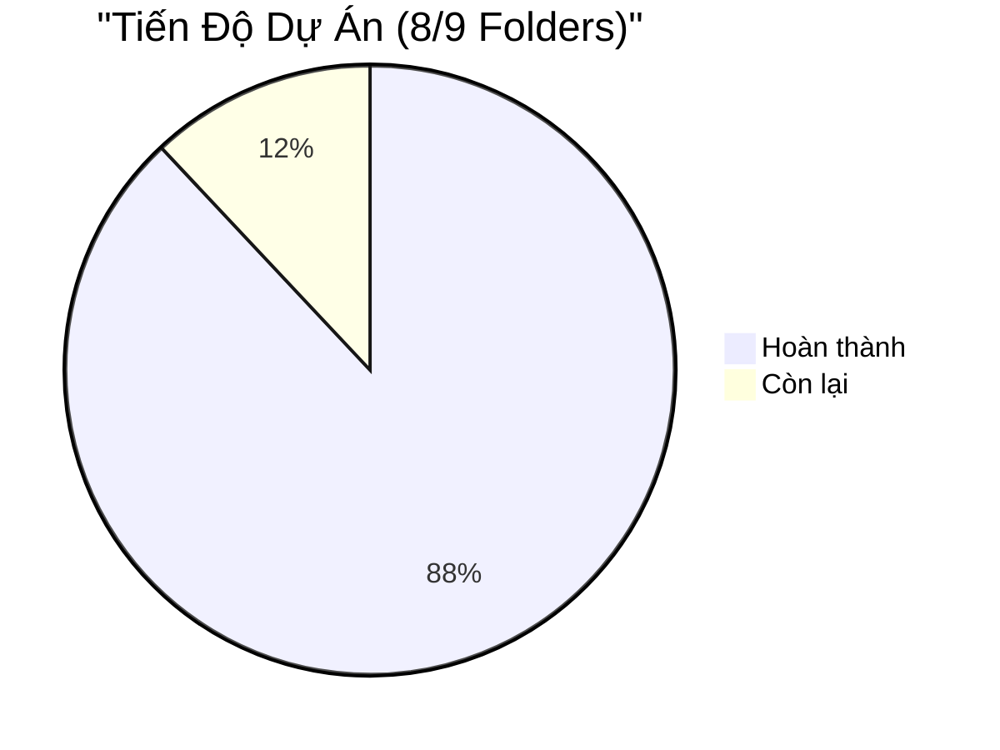
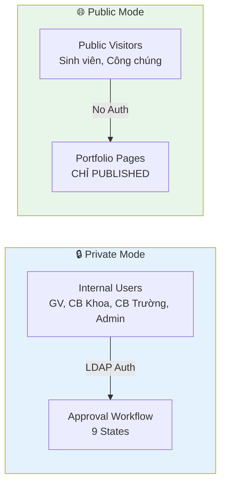
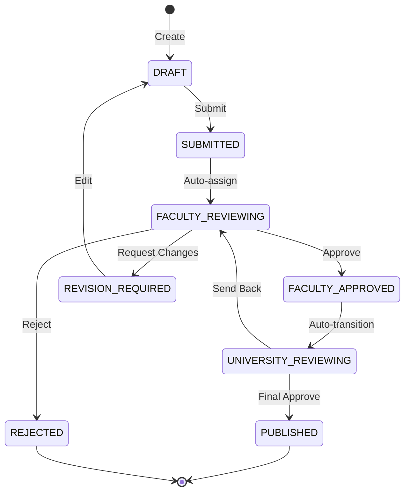

# Executive Summary - UFPMS Documentation Phase

> 📊 **Báo Cáo Tiến Độ**: Đặc Tả & Thiết Kế Hệ Thống  
> 📅 **Ngày báo cáo**: 11/02/2026  
> 👤 **Người thực hiện**: [Tên của bạn]  
> 🎯 **Giai đoạn**: Documentation & Design (88% Hoàn Thành)

---

## 📈 Tổng Quan Tiến Độ

### Tình Trạng Chung



| Giai đoạn | Trạng thái | Hoàn thành |
|-----------|-----------|-----------|
| **Documentation & Design Phase** | 🟢 Gần hoàn tất | **88%** |
| **Implementation Phase** | ⚪ Chưa bắt đầu | 0% |
| **Testing Phase** | ⚪ Chưa bắt đầu | 0% |

---

## ✅ Thành Quả Đã Đạt Được

### 1️⃣ Problem Context & System Specification (100%)

**Hoàn thành**:
- ✅ **Big Picture**: 7 nhóm công trình NCKH (phạm vi MVP: Bài báo khoa học)
- ✅ **Khung pháp lý**: Thông tư 04/2016, chuẩn quốc tế ISO/IEEE 29148
- ✅ **System Scope**: 6 modules, quy trình phê duyệt 2 cấp
- ✅ **Tech Stack**: Spring Boot 3.x + MySQL 8.0 + React 18

**Deliverables**: 8 documents

---

### 2️⃣ System Clarification (100%)

**Hoàn thành**:
- ✅ **Problem Statement**: Định nghĩa vấn đề, pain points, ROI analysis
- ✅ **As-Is Process**: Phân tích quy trình hiện tại (phân tán, thủ công, 2-3 ngày/báo cáo)
- ✅ **To-Be Process**: Thiết kế quy trình mới (tập trung, tự động, < 5 phút/báo cáo)
- ✅ **User Analysis**: 5 nhóm người dùng (300-500 Researchers, 10-20 Faculty Reviewers, 2-5 University Reviewers, 2-5 SuperAdmins, ∞ Public Viewers)

**Key Metrics**:
- Giảm thời gian báo cáo: **2-3 ngày → < 5 phút** (99% improvement)
- Giảm trùng lặp: **15-20% → 0%**
- Tăng adoption rate: **60% → 80%+**

**Deliverables**: 9 documents

---

### 3️⃣ Requirements (100%)

**Hoàn thành**:
- ✅ **65 Functional Requirements** (6 modules)
  - Module 1: Publication Management (15 FRs)
  - Module 2: Approval Workflow (20 FRs)
  - Module 3: Search & Browse (10 FRs)
  - Module 4: Researcher Profile (7 FRs)
  - Module 5: Reporting & Analytics (10 FRs)
  - Module 6: Admin & User Management (8 FRs)

- ✅ **25 Non-Functional Requirements**
  - Performance (5 NFRs): < 2s response time, < 5s search
  - Security (7 NFRs): OWASP Top 10, LDAP auth, role-based access
  - Usability (5 NFRs): 80% tasks < 5 phút
  - Scalability (4 NFRs): 500 concurrent users, 10K publications
  - Compatibility (4 NFRs): Chrome/Firefox/Edge, mobile responsive

- ✅ **Prioritization**: P0 (25 FRs), P1 (25 FRs), P2 (15 FRs)

**Deliverables**: 8 documents

---

### 4️⃣ User Stories (100%)

**Hoàn thành**:
- ✅ **65 User Stories** mapped từ 65 FRs
- ✅ **By Role**:
  - Researcher: 28 stories
  - Faculty Reviewer: 11 stories
  - University Reviewer: 8 stories
  - SuperAdmin: 13 stories
  - Public Visitor: 5 stories

- ✅ **By Priority**:
  - P0 (Critical): 25 stories
  - P1 (Important): 25 stories
  - P2 (Nice-to-have): 15 stories

**Deliverables**: 9 documents

---

### 5️⃣ Use Cases (100%)

**Hoàn thành**:
- ✅ **80 Use Cases** với 3 levels of detail
  - **High-Level**: 6 use cases (1 per module)
  - **Medium-Level**: 54 use cases (detailed workflows)
  - **Detailed-Level**: 20 use cases (P0 critical flows)

**Key Use Cases** (P0):
- UC-D1-01: Create Publication
- UC-D2-01: Submit for Review
- UC-D2-05: Faculty Review (Approve/Reject/Revision)
- UC-D2-11: University Final Approval
- UC-D3-01: Search Publications

**Deliverables**: 80+ documents

---

### 6️⃣ Diagrams (100%)

**Hoàn thành**: **25 diagrams** với Mermaid format

#### Use Case Diagrams (7)
- Overall system + 6 module diagrams
- Actors: 5 roles với relationships

#### Sequence Diagrams (7)
- Create Publication
- Submit for Review
- Faculty Review Process
- University Approval
- Revision Request Flow
- Search Publications
- User Authentication

#### Activity Diagrams (4)
- Complete Approval Workflow (9 states)
- Publication Creation Workflow
- Search & Filter Workflow
- Report Generation Workflow

#### ER Diagrams (2)
- Complete ERD (10 tables: users, publications, reviews, comments, etc.)
- Entity Specifications (detailed column definitions, indexes, constraints)

#### Context Diagrams (2)
- System Context (UFPMS boundaries)
- External Integrations (5 systems: LDAP, Email, HR, DOI, ORCID)

#### Data Flow Diagrams (3)
- Level 0: UFPMS as single process
- Level 1: 6 modules decomposition
- Level 2: Approval workflow detail (7 sub-processes)

**Deliverables**: 25 diagram files + 7 READMEs

---

## 🎯 Highlights & Key Decisions

### 1. Dual-Mode System Architecture



**Lợi ích**:
- ✅ Kiểm soát chất lượng internal (approval workflow)
- ✅ Tăng visibility external (public profiles)
- ✅ Security: CHỈ công trình PUBLISHED được public

---

### 2. Quy Trình Phê Duyệt 2 Cấp



**9 trạng thái** với audit trail đầy đủ

---

### 3. Database Design (10 Tables)

#### Core Entities
1. **users** - 300-500 giảng viên + reviewers
2. **publications** - Bài báo khoa học (core entity)
3. **publication_authors** - N:M relationship
4. **review_history** - Audit log (immutable)
5. **review_comments** - Reviewer feedback

#### Lookup/Config Tables
6. **faculties** - Các Khoa
7. **departments** - Các Bộ môn
8. **publication_types** - Journal, Conference, Book Chapter
9. **roles** - RESEARCHER, FACULTY_REVIEWER, UNIVERSITY_REVIEWER, SUPERADMIN
10. **user_roles** - User-Role assignment

**Normalization**: 3NF  
**Indexes**: Optimized cho search và reporting

---

## 📦 Deliverables Summary

| Folder | Documents | Status |
|--------|-----------|--------|
| 00_Problem_Context | 8 files | ✅ 100% |
| 01_System_Specification | 6 files | ✅ 100% |
| 02_System_Clarification | 9 files | ✅ 100% |
| 03_Requirements | 8 files | ✅ 100% |
| 04_User_Stories | 9 files | ✅ 100% |
| 05_Use_Cases | 80+ files | ✅ 100% |
| 06_Diagrams | 32 files (25 diagrams + 7 READMEs) | ✅ 100% |
| **Tổng** | **~160 files** | **88%** |

---

## 🔄 Traceability Matrix

Đảm bảo traceability từ Problem → Requirements → User Stories → Use Cases → Diagrams:

```
Problem Statement
    ↓
Pain Point #1: Dữ liệu phân tán
    ↓
FR-PUB-001: Centralized publication database
    ↓
US-RES-001: "As a Researcher, I want to create publications..."
    ↓
UC-D1-01: Create Publication
    ↓
Sequence Diagram: seq_create_publication.md
```

**Coverage**: 100% từ P0 requirements đến diagrams

---

## 🚧 Công Việc Còn Lại (12%)

### 7️⃣ Review & Approval (0%)

**Cần làm**:
- [ ] Stakeholder feedback sessions
- [ ] Developer team review
- [ ] QA team review
- [ ] Revision tracking
- [ ] Approval records

**Timeline**: 1 tuần

---

### 8️⃣ Final Documents (0%)

**Cần làm**:
- [ ] Software Requirements Specification (SRS) document
- [ ] Use Case Specification document
- [ ] Traceability Matrix (Excel/CSV)
- [ ] Final presentation deck

**Timeline**: 1 tuần

---

## 💡 Recommendations

### 1. Ưu Tiên Implementation

**Phase 1 (MVP - 3 tháng)**:
- ✅ Module 1: Publication Management (P0)
- ✅ Module 2: Approval Workflow (P0)
- ✅ Module 3: Search & Browse (P0 - public only)
- ⏳ Module 4: Basic Profile (P1)

**Phase 2 (3-6 tháng)**:
- Module 5: Reporting & Analytics
- Module 6: Advanced Admin features
- Enhanced search với filters

---

### 2. Technical Preparation

**Cần chuẩn bị**:
- ✅ Development environment (Docker)
- ✅ Database schema (từ ERD)
- ⏳ LDAP/AD connection setup
- ⏳ Email server configuration
- ⏳ CI/CD pipeline

---

### 3. Risk Mitigation

| Risk | Impact | Mitigation |
|------|--------|------------|
| **LDAP integration delay** | High | Fallback: Basic auth trong MVP |
| **Scope creep** | Medium | Strict P0/P1/P2 enforcement |
| **User adoption** | High | Training sessions + User guide |
| **Data migration** | Medium | Scripts để import từ Excel |

---

## 📊 Success Metrics (Post-Implementation)

### Quantitative Metrics

| Metric | Baseline | Target (6 tháng) |
|--------|----------|------------------|
| Thời gian tạo báo cáo | 2-3 ngày | < 5 phút |
| Tỉ lệ GV sử dụng | ~60% | > 80% |
| Tỉ lệ trùng lặp | 15-20% | ~0% |
| Page load time | N/A | < 2s |

### Qualitative Metrics

- [ ] Độ hài lòng người dùng > 85% (NPS survey)
- [ ] 100% công trình được xác thực (qua workflow)
- [ ] Public profiles tăng website traffic 30%

---

## 🎯 Next Steps

### Tuần Tới (Tuần 1)

1. **Review Session**
   - [ ] Presentation với Project Owner
   - [ ] Stakeholder feedback collection
   - [ ] Priority refinement

2. **Documentation Finalization**
   - [ ] Tạo SRS document
   - [ ] Tạo Traceability Matrix
   - [ ] Approval sign-offs

### Tuần 2-3

3. **Implementation Kick-off**
   - [ ] Development environment setup
   - [ ] Sprint planning (2-week sprints)
   - [ ] Team training trên documentation

---

## 📚 Appendix

### A. Document Navigation

**Root**: [README.md](./README.md)

**Key Documents**:
- Problem Context: [docs/00_Problem_Context/README.md](./docs/00_Problem_Context/README.md)
- Requirements: [docs/03_Requirements/README.md](./docs/03_Requirements/README.md)
- Use Cases: [docs/05_Use_Cases/README.md](./docs/05_Use_Cases/README.md)
- Diagrams: [docs/06_Diagrams/README.md](./docs/06_Diagrams/README.md)

### B. Glossary

- **UFPMS**: University Faculty Publication Management System
- **FR**: Functional Requirement
- **NFR**: Non-Functional Requirement
- **UC**: Use Case
- **P0/P1/P2**: Priority levels (Critical/Important/Nice-to-have)
- **MVP**: Minimum Viable Product

### C. Contact & Questions

**Project Owner**: [Tên Project Owner]  
**Technical Lead**: [Tên của bạn]  
**Email**: [Email của bạn]

---

## ✅ Sign-off

**Người thực hiện**: _________________  
**Ngày**: 11/02/2026

**Project Owner Review**: _________________  
**Ngày**: ___/___/2026

---

*Document Version: 1.0*  
*Last Updated: 11/02/2026 00:30*  
*Status: Ready for Review*
