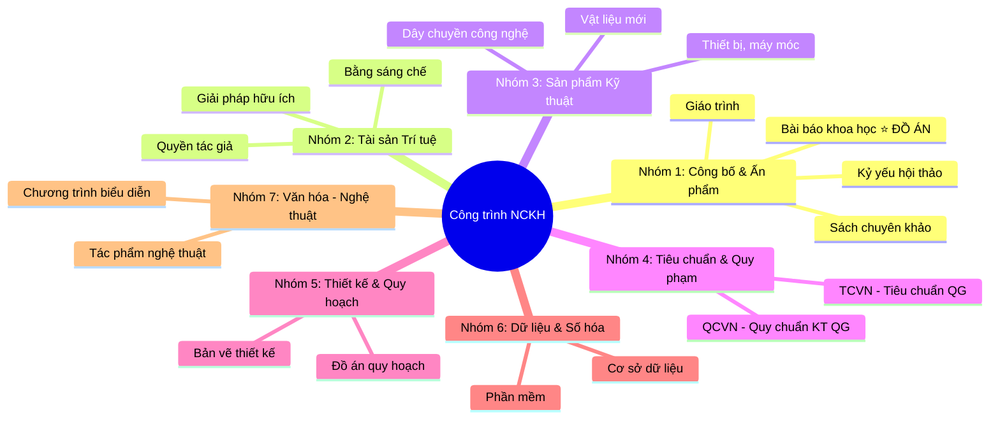
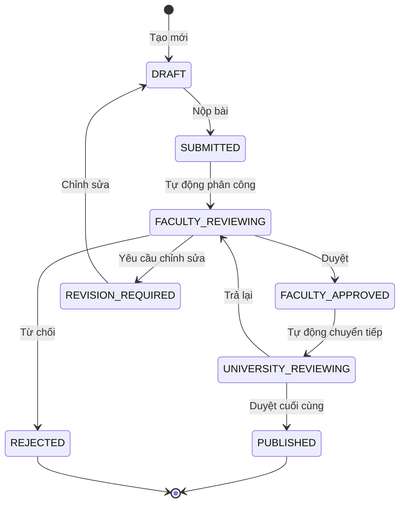
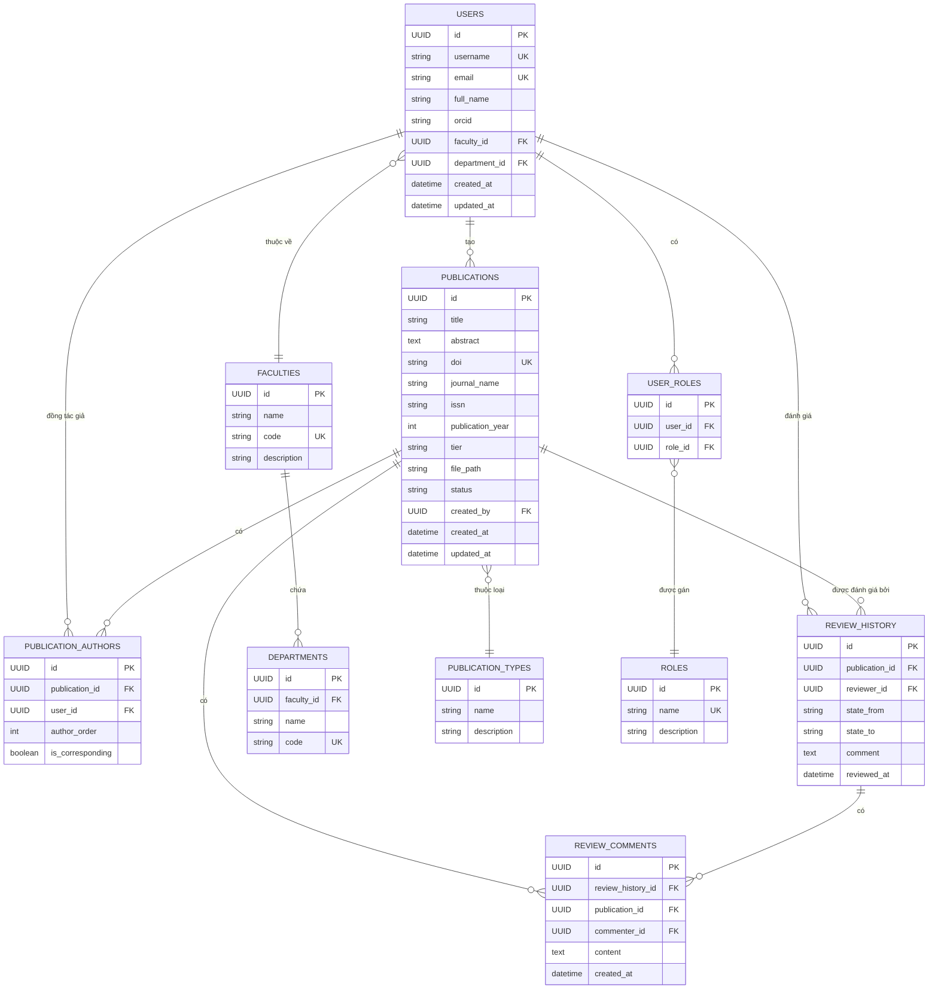

# Tài liệu Thiết kế Phần mềm (SDD)
# Hệ Thống Quản Lý Bài Báo Khoa Học

> 📋 **Loại tài liệu**: Tài liệu Thiết kế Phần mềm
> 📅 **Ngày tạo**: 11/02/2026
> 🎯 **Đối tượng**: Các bên liên quan (Kỹ thuật + Kinh doanh)
> 📌 **Phiên bản**: 1.0

---

## 1. Giới Thiệu & Phạm Vi

> 📚 **Tài liệu chi tiết**: [Làm rõ hệ thống](../02_System_Clarification/), [Bối cảnh vấn đề](../02_System_Clarification/Business_Context/problem_statement.md)

### 1.1. Lý Do Xây Dựng Hệ Thống

**Bối cảnh nghiệp vụ:**

Tại các trường đại học Việt Nam, việc quản lý công trình nghiên cứu khoa học của giảng viên đang gặp phải nhiều thách thức nghiêm trọng:

**❌ Vấn đề 1: Dữ liệu phân tán và thiếu tính nhất quán**
- Mỗi giảng viên tự quản lý dữ liệu riêng (file Word/PDF)
- Phòng Quản lý Khoa học (QLKH) lưu trữ phân tán trong Excel
- Không có nguồn dữ liệu duy nhất (Single Source of Truth)
- **Hậu quả**: Dữ liệu trùng lặp 15-20%, khó tổng hợp, dễ sai sót

**❌ Vấn đề 2: Quy trình báo cáo thủ công, tốn thời gian**
- Mỗi kỳ phải thu thập lại dữ liệu từ giảng viên
- Nhập liệu thủ công cho nhiều loại báo cáo khác nhau
- **Hậu quả**: Mất 2-3 ngày cho một báo cáo, chi phí nhân lực cao

**❌ Vấn đề 3: Thiếu tính minh bạch và khả năng truy cập**
- Sinh viên không biết giảng viên đang nghiên cứu gì
- Khó tìm người hướng dẫn phù hợp với hướng nghiên cứu
- **Hậu quả**: Giảm cơ hội hợp tác, hạn chế phát triển nghiên cứu

**❌ Vấn đề 4: Thiếu kiểm soát chất lượng**
- Không có quy trình xác thực công trình trước khi công bố
- Khó theo dõi lịch sử thay đổi và phê duyệt
- **Hậu quả**: Rủi ro về tính chính xác và uy tín của dữ liệu

### 1.2. Giải Pháp Đề Xuất

**Hệ thống Quản lý Bài báo Khoa học Giảng viên (UFPMS)** là một hệ thống quản lý tập trung, cung cấp:

✅ **Tập trung hóa (Centralization)** - Nguồn dữ liệu duy nhất cho tất cả bài báo khoa học  
✅ **Tự động hóa quy trình (Workflow Automation)** - Quy trình phê duyệt 2 cấp tự động (Khoa → Trường)  
✅ **Minh bạch (Transparency)** - Hồ sơ công khai cho giảng viên  
✅ **Hiệu quả (Efficiency)** - Giảm thời gian báo cáo từ 2-3 ngày → < 5 phút  

### 1.3. Phạm Vi Dự Án

**Trong phạm vi:**

🎯 **Loại công trình**: CHỈ bài báo khoa học (Journal Articles, Conference Papers)  
🎯 **Người dùng**: 5 vai trò (Nhà nghiên cứu, Người duyệt cấp khoa, Người duyệt cấp trường, Quản trị viên, Người xem công khai)  
🎯 **Chức năng chính**: 6 phân hệ (Quản lý bài báo, Phê duyệt, Tìm kiếm, Hồ sơ, Báo cáo, Quản trị)  
🎯 **Hệ thống Chế độ Kép (Dual-Mode System)**: 
- **Chế độ Riêng tư (Private Mode)**: Quy trình làm việc nội bộ với xác thực LDAP
- **Chế độ Công khai (Public Mode)**: Hồ sơ công khai (CHỈ công trình đã ĐƯỢC CÔNG BỐ)

**Ngoài phạm vi:**

❌ Quản lý các loại công trình khác (sách, bằng sáng chế, phần mềm)  
❌ Quản lý đề tài nghiên cứu (quản lý kinh phí, nghiệm thu)  
❌ Hệ thống phản biện ngang hàng (peer review) (không phải hệ thống phản biện tạp chí)  
❌ Tích hợp thanh toán (phí xuất bản APC)  

### 1.4. Mục Tiêu Kinh Doanh

| Mục tiêu | Hiện tại (As-Is) | Mục tiêu (To-Be) | Cải thiện |
|----------|------------------|------------------|-----------|
| **Thời gian nhập liệu** | 15-30 phút/bài báo | < 5 phút | **83-93%** ↓ |
| **Thời gian tạo báo cáo** | 2-3 ngày | < 5 phút | **99.9%** ↓ |
| **Tỉ lệ tham gia** | ~60% giảng viên | > 80% | **+33%** |
| **Tỉ lệ trùng lặp** | 15-20% | ~0% | **100%** ↓ |
| **Thời gian phê duyệt** | Không có (tự phát) | 6-14 ngày | Có cam kết chất lượng dịch vụ (SLA) |

### 1.5. Ngữ Cảnh Tổng Quát: Quản Lý Công Trình NCKH tại Việt Nam

> 📚 **Tài liệu chi tiết**: [Bối cảnh vấn đề](../00_Problem_Context/README.md), [Danh mục kết quả nghiên cứu](../00_Problem_Context/research_output_catalog.md), [Khung pháp lý](../00_Problem_Context/legal_framework.md)

#### **1.5.1. Bức Tranh Toàn Cảnh**

Hệ thống UFPMS (đồ án này) là **một phân hệ nhỏ** trong bức tranh lớn hơn về quản lý công trình nghiên cứu khoa học tại Việt Nam.

**Theo Luật Khoa học, Công nghệ và Đổi mới sáng tạo (93/2025/QH15)**, công trình NCKH được phân thành **7 nhóm chính** với **28 loại cụ thể**:



#### **1.5.2. Vì Sao Chọn "Bài Báo Khoa Học"?**

Đồ án tập trung vào **bài báo khoa học** (Journal Articles) - chỉ 1 trong 28 loại công trình, vì:

**✅ Quan trọng nhất trong đánh giá nghiên cứu:**
- Chiếm **70-80%** chỉ tiêu kpi (KPI) đánh giá giảng viên
- Ảnh hưởng trực tiếp đến xếp hạng trường ĐH (QS, THE, ARWU)
- Dễ định lượng: Chỉ số ảnh hưởng (Impact Factor), Trích dẫn (Citations), Phân vị (Quartile - Q1/Q2/Q3/Q4)

**✅ Dữ liệu có chuẩn quốc tế:**
- Có **DOI** (Digital Object Identifier) duy nhất
- Có **ISSN** cho tạp chí
- Metadata đã chuẩn hóa (Dublin Core, DataCite)
- API từ ORCID, CrossRef, Scopus, Web of Science

**✅ Phù hợp quy mô đồ án:**
- Không quá phức tạp như quản lý bằng sáng chế (pháp lý)
- Không quá đơn giản như quản lý file PDF
- Có đủ thách thức kỹ thuật: Quy trình (Workflow), Tìm kiếm (Search), Báo cáo (Reporting)

**✅ Có thể mở rộng sau:**
- Kiến trúc thiết kế cho phép thêm các loại công trình khác
- Lược đồ cơ sở dữ liệu linh hoạt (thiết kế dựa trên loại - type-based design)

#### **1.5.3. Khung Pháp Lý Áp Dụng**

Hệ thống UFPMS tuân thủ các văn bản pháp luật chính:

| Văn bản | Số hiệu | Yêu cầu liên quan |
|---------|---------|-------------------|
| **Luật KH, CN & ĐMST** | 93/2025/QH15 | Nguyên tắc quản lý công trình NCKH |
| **Nghị định quản lý nhiệm vụ** | 267/2025/NĐ-CP | Quy trình nghiệm thu, đánh giá |
| **Thông tư CSDL quốc gia** | 11/2023/TT-BKHCN | Báo cáo công trình **trong 30 ngày** sau nghiệm thu |
| **Thông tư quản lý cấp Bộ** | 44/2025/TT-BKHCN | Tiêu chí đánh giá sản phẩm NCKH |

> **Lưu ý**: Theo **Thông tư 11/2023**, các trường ĐH có nghĩa vụ báo cáo công trình lên **Cơ sở dữ liệu Quốc gia về KH&CN** trong vòng **30 ngày** sau khi nghiệm thu. Hệ thống UFPMS hỗ trợ xuất dữ liệu theo format chuẩn để đáp ứng yêu cầu này.

#### **1.5.4. Các Bên Liên Quan (Stakeholders) Rộng**

**Cấp Quốc gia:**
- **Bộ Khoa học và Công nghệ**: Quản lý CSDL quốc gia
- **Quỹ Phát triển KH&CN**: Tài trợ đề tài

**Cấp Trường ĐH (UFPMS):** ⭐ **PHẠM VI ĐỒ ÁN**
- **Lãnh đạo trường**: Báo cáo năng suất nghiên cứu
- **Phòng QLKH**: Quản lý, xét duyệt công trình
- **Giảng viên**: Đăng ký, cập nhật công trình
- **Sinh viên**: Tìm người hướng dẫn

**Cộng đồng:**
- **Nhà nghiên cứu khác**: Tìm kiếm tài liệu tham khảo
- **Doanh nghiệp**: Tìm kiếm chuyên gia, công nghệ

#### **1.5.5. Tầm Nhìn Mở Rộng**

**Giai đoạn 1 (Đồ án - 3 tháng):** ✅ **Sản phẩm khả dụng tối thiểu (MVP)**
- CHỈ quản lý **bài báo khoa học**
- CHỈ cho **1 trường Đại học**
- 6 phân hệ cơ bản (Thêm/Sửa/Xóa, Phê duyệt, Tìm kiếm, Hồ sơ, Báo cáo, Quản trị)

**Giai đoạn 2 (6-12 tháng):**
- Thêm loại công trình: **Kỷ yếu hội thảo**, **Sách**, **Phần mềm**
- Tích hợp **ORCID API** (tự động nhập ấn phẩm)
- Tích hợp **DOI Resolver** (tự động lấy metadata)

**Giai đoạn 3 (1-2 năm):**
- Mở rộng lên **liên trường** (Liên minh Đại học)
- Tích hợp **CSDL Quốc gia KH&CN** (đồng bộ qua API)
- Hỗ trợ đầy đủ **7 nhóm công trình** (28 loại)

**Giai đoạn 4 (Tương lai):**
- **Blockchain** cho xác thực công trình
- **AI** phân tích xu hướng nghiên cứu, đề xuất hợp tác
- **Kết nối doanh nghiệp** - thị trường chuyển giao công nghệ

#### **1.5.6. Giá Trị Đóng Góp Của Đồ Án**

Dù chỉ là **1 phân hệ nhỏ** (bài báo khoa học), UFPMS vẫn mang lại giá trị thiết thực:

✅ **Cho trường ĐH:**
- Giảm **99%** thời gian tạo báo cáo (3 ngày → 5 phút)
- Tăng tỷ lệ tham gia từ 60% → 80% giảng viên
- Hỗ trợ xếp hạng ĐH (theo dõi ấn phẩm Q1/Q2)

✅ **Cho giảng viên:**
- Hồ sơ nghiên cứu chuyên nghiệp (hồ sơ công khai)
- Tăng khả năng hiển thị công trình
- Không phải nhập liệu nhiều lần

✅ **Cho sinh viên:**
- Tìm người hướng dẫn phù hợp với hướng nghiên cứu
- Khám phá kiến thức khoa học

✅ **Cho cộng đồng:**
- Truy cập miễn phí vào công trình đã công bố
- Tăng tác động (impact) của nghiên cứu

> **📌 Kết luận**: UFPMS là **mô hình thử nghiệm (proof-of-concept)** cho hệ thống quản lý NCKH toàn diện hơn trong tương lai. Thiết kế phân hệ hiện tại đã cân nhắc khả năng mở rộng (extensibility) để dễ dàng thêm các loại công trình khác.


## 2. Đặc Tả Yêu Cầu

> 📚 **Tài liệu chi tiết**: [Yêu cầu](../03_Requirements/README.md), [User Stories](../04_User_Stories/README.md)

### 2.1. Yêu Cầu Chức Năng Chính

Hệ thống bao gồm **65 yêu cầu chức năng** được tổ chức thành 6 phân hệ:

#### **Phân hệ 1: Quản lý Bài báo (Publication Management)** (15 FRs)

> 📄 **Chi tiết**: [quản lý bài báo](../03_Requirements/Functional/module_publication_management.md)

**Mục đích**: Quản lý vòng đời của bài báo khoa học

- **FR-PUB-001**: Tạo bài báo mới với trạng thái NHÁP
  - **Input**: Tiêu đề, Tác giả, Tạp chí, Năm, DOI, Tóm tắt, Từ khóa
  - **Output**: Bản ghi bài báo với UUID, trạng thái NHÁP
  - **Validation**: Định dạng DOI (10.xxxx/xxxxx), định dạng ISSN

- **FR-PUB-002**: Tải lên file PDF bài báo (tối đa 10MB)
  - **Lưu trữ**: Hệ thống tệp cục bộ (`/uploads/publications/`)
  - **Validation**: Loại file (.pdf), kích thước (< 10MB), quét virus

- **FR-PUB-003**: Phân loại bài báo theo thứ hạng (Q1/Q2/Q3/Q4 - Scopus)
  - **Quy tắc nghiệp vụ**: Xác định thứ hạng dựa trên ISSN của tạp chí

- **FR-PUB-004**: Thêm/xóa đồng tác giả (giảng viên khác trong trường)
  - **Quy tắc nghiệp vụ**: Đồng tác giả có quyền XEM (VIEW only), không được SỬA (EDIT)

- **FR-PUB-005**: Chỉnh sửa bài báo (CHỈ khi ở trạng thái NHÁP hoặc YÊU CẦU CHỈNH SỬA)
  - **Quy tắc nghiệp vụ**: Không được sửa khi đang ở trạng thái ĐANG DUYỆT hoặc ĐÃ CÔNG BỐ

- **FR-PUB-006**: Xóa bài báo (CHỈ khi ở trạng thái NHÁP)
  - **Quy tắc nghiệp vụ**: Xóa mềm (soft delete), giữ nhật ký kiểm tra (audit trail)

- **FR-PUB-007**: Xem lịch sử thay đổi (Audit trail)
  - **Output**: Thời gian, Người dùng, Hành động, Các trường thay đổi

- **FR-PUB-008**: Thêm/xóa đồng tác giả (giảng viên khác trong trường)
  - **Tự động hoàn thành**: Tìm kiếm từ danh sách giảng viên trong hệ thống
  - **Quy tắc nghiệp vụ**: Tác giả chính không thể bị xóa, đồng tác giả chỉ được xem

- **FR-PUB-009**: Gắn thẻ/từ khóa (Tags/Keywords)
  - **Input**: Từ khóa phân tách bằng dấu phẩy
  - **Hiển thị**: Các thẻ có thể xóa từng cái

- **FR-PUB-010**: Phân loại theo Phân vị (Q1/Q2/Q3/Q4)
  - **Quy tắc nghiệp vụ**: Tra cứu xếp hạng Scopus dựa trên ISSN
  - **Hiển thị**: Huy hiệu Q1/Q2/Q3/Q4

- **FR-PUB-011**: Xem chi tiết bài báo
  - **Xem**: Metadata đầy đủ, trạng thái, lịch sử duyệt, file PDF, liên kết DOI

- **FR-PUB-012**: Tải xuống file PDF
  - **Bảo mật**: CHỈ tải xuống nếu có quyền (chủ sở hữu/quản trị viên/người duyệt/ĐÃ CÔNG BỐ)
  - **Audit**: Ghi lại ai tải, khi nào

- **FR-PUB-013**: Xác thực định dạng DOI
  - **Định dạng**: `10.xxxx/xxxxx`
  - **Output**: Liên kết đến https://doi.org/[DOI]

- **FR-PUB-014**: Xác thực định dạng ISSN
  - **Định dạng**: `xxxx-xxxx`

- **FR-PUB-015**: Phát hiện trùng lặp
  - **Cảnh báo**: Cảnh báo khi DOI đã tồn tại
  - **Gợi ý**: "Thêm làm đồng tác giả?"

---

#### **Phân hệ 2: Quy trình Phê duyệt (Approval Workflow)** (20 FRs) - **Trọng tâm của Hệ thống**

> 📄 **Chi tiết**: [quy trình phê duyệt](../03_Requirements/Functional/module_approval_workflow.md)

**Mục đích**: Quy trình phê duyệt 2 cấp với đầy đủ nhật ký kiểm tra

**Máy trạng thái (9 trạng thái):**



**Yêu cầu chức năng chi tiết:**

- **FR-APR-001**: Giảng viên nộp bài báo xét duyệt (NHÁP → ĐÃ NỘP)
  - **Input**: ID bài báo
  - **Validation**: Kiểm tra đầy đủ metadata (tiêu đề, tác giả, tạp chí, năm)
  - **Output**: Email thông báo đến CB Khoa

- **FR-APR-002**: Tự động gán người duyệt cấp Khoa
  - **Quy tắc nghiệp vụ**: Dựa trên Khoa của giảng viên
  - **SLA**: Người duyệt nhận thông báo trong < 1 phút

- **FR-APR-003**: CB Khoa xem danh sách chờ duyệt (ĐÃ NỘP hoặc KHOA ĐANG DUYỆT)
  - **Bộ lọc**: Theo Khoa, theo ngày nộp
  - **Sắp xếp**: Theo độ ưu tiên, theo ngày

- **FR-APR-004**: CB Khoa phê duyệt (KHOA ĐANG DUYỆT → KHOA ĐÃ DUYỆT)
  - **Input**: Nhận xét phê duyệt (tùy chọn)
  - **Output**: Email thông báo giảng viên, CB Trường

- **FR-APR-005**: CB Khoa yêu cầu sửa (KHOA ĐANG DUYỆT → YÊU CẦU CHỈNH SỬA)
  - **Input**: Nhận xét yêu cầu sửa (bắt buộc)
  - **Output**: Email thông báo giảng viên

- **FR-APR-006**: CB Khoa từ chối (KHOA ĐANG DUYỆT → TỪ CHỐI)
  - **Input**: Lý do từ chối (bắt buộc)
  - **Output**: Email thông báo giảng viên

- **FR-APR-007**: CB Trường xem danh sách đã được Khoa duyệt (KHOA ĐÃ DUYỆT hoặc TRƯỜNG ĐANG DUYỆT)
  - **Xem**: Ý kiến của CB Khoa, metadata đầy đủ

- **FR-APR-008**: CB Trường phê duyệt cuối cùng (TRƯỜNG ĐANG DUYỆT → ĐÃ CÔNG BỐ)
  - **Output**: Bài báo xuất hiện trên Chế độ Công khai, email thông báo giảng viên

- **FR-APR-009**: Lưu nhật ký kiểm tra đầy đủ cho mọi thay đổi trạng thái
  - **Các trường**: Trạng thái TỪ, Trạng thái ĐẾN, Người duyệt, Thời gian, Nhận xét
  - **Quy tắc nghiệp vụ**: Bất biến (không được xóa/sửa)

- **FR-APR-010**: Thông báo Email khi chuyển trạng thái
  - **Kích hoạt**: ĐÃ NỘP, KHOA ĐÃ DUYỆT, YÊU CẦU CHỈNH SỬA, TỪ CHỐI, ĐÃ CÔNG BỐ
  - **Người nhận**: Nhà nghiên cứu (chủ sở hữu), Người duyệt (theo vai trò)

- **FR-APR-011**: Bảng điều khiển (Dashboard) cho Nhà nghiên cứu
  - **Xem**: Bài báo của tôi với biểu đồ theo trạng thái
  - **Nút hành động**: Sửa (nếu NHÁP), Nộp (nếu NHÁP), Xem phản hồi

- **FR-APR-012**: Bảng điều khiển cho Người duyệt cấp Khoa
  - **Xem**: Bài chờ duyệt của Khoa mình
  - **Bộ lọc**: Theo trạng thái, theo ngày nộp
  - **Thao tác hàng loạt**: Duyệt nhiều, Từ chối nhiều

- **FR-APR-013**: Bảng điều khiển cho Người duyệt cấp Trường
  - **Xem**: Bài báo đã được Khoa duyệt
  - **Xem**: Ý kiến của Người duyệt cấp Khoa

- **FR-APR-014**: Theo dõi SLA
  - **Mục tiêu**: Duyệt cấp Khoa trong 7 ngày, duyệt cấp Trường trong 7 ngày
  - **Cảnh báo**: Email nhắc nhở nếu quá hạn

- **FR-APR-015**: Quy tắc gán người duyệt
  - **Tự động gán**: Dựa trên Khoa của nhà nghiên cứu
  - **Ghi đè thủ công**: Admin có thể gán lại người duyệt

- **FR-APR-016**: Quy trình chỉnh sửa
  - **Luồng**: YÊU CẦU CHỈNH SỬA → NHÁP → NỘP LẠI
  - **Theo dõi**: Số lần chỉnh sửa (tối đa 3 lần)

- **FR-APR-017**: Hệ thống Bình luận/Phản hồi
  - **Luồng thảo luận**: Người duyệt có thể bình luận cho từng bài báo
  - **Hiển thị**: Nhà nghiên cứu xem được tất cả bình luận

- **FR-APR-018**: Yêu cầu rút bài
  - **Quy tắc nghiệp vụ**: Nhà nghiên cứu có thể rút bài nếu đang ĐÃ NỘP hoặc ĐANG DUYỆT
  - **Output**: Chuyển về NHÁP

- **FR-APR-019**: Duyệt hàng loạt (Người duyệt cấp Khoa)
  - **Tính năng**: Chọn nhiều bài báo cùng lúc để duyệt
  - **Validation**: Kiểm tra đủ metadata trước khi duyệt

- **FR-APR-020**: Thống kê phê duyệt
  - **Chỉ số**: Tỷ lệ duyệt/từ chối, thời gian duyệt trung bình
  - **Báo cáo**: Theo Khoa, theo thời gian

---

#### **Phân hệ 3: Tìm kiếm & Duyệt (Search & Browse)** (7 FRs)

> 📄 **Chi tiết**: [tìm kiếm](../03_Requirements/Functional/module_search.md)

**Mục đích**: Tìm kiếm và truy cập công trình đã công bố

- **FR-SRC-001**: Tìm kiếm toàn văn (Full-text search)
  - **Chỉ mục**: Tiêu đề, Tóm tắt, Từ khóa, Tác giả
  - **Hiệu năng**: < 1s với 10K bài báo

- **FR-SRC-002**: Lọc theo tiêu chí
  - **Bộ lọc**: Năm, Hạng tạp chí (Q1/Q2/Q3/Q4), Khoa, Bộ môn

- **FR-SRC-003**: Sắp xếp kết quả
  - **Sắp xếp theo**: Mức độ liên quan, Ngày công bố, Chỉ số ảnh hưởng, Số trích dẫn

- **FR-SRC-004**: Duyệt theo danh mục
  - **Danh mục**: Theo Khoa, Theo Năm, Theo Lĩnh vực nghiên cứu, Theo Phân vị tạp chí

- **FR-SRC-005**: Phân trang
  - **Mặc định**: 20 kết quả/trang
  - **Tùy chọn**: 10, 20, 50, 100

- **FR-SRC-006**: Xuất kết quả tìm kiếm
  - **Định dạng**: BibTeX, RIS, CSV, JSON
  - **Trường hợp sử dụng**: Nhập vào phần mềm quản lý trích dẫn (Zotero, Mendeley)

- **FR-SRC-007**: Xem chi tiết bài báo (Công khai)
  - **Xem**: Metadata đầy đủ, liên kết DOI, Tải PDF, Hồ sơ tác giả

---

#### **Phân hệ 4: Hồ sơ Nhà nghiên cứu (Researcher Profile)** (6 FRs)

> 📄 **Chi tiết**: [hồ sơ](../03_Requirements/Functional/module_profile.md)

**Mục đích**: Hồ sơ công khai cho giảng viên

- **FR-PRF-001**: Trang hồ sơ công khai với đường dẫn đại diện (slug URL) (`/profile/{username}`)
- **FR-PRF-002**: Danh sách bài báo đã CÔNG BỐ
- **FR-PRF-003**: Biểu đồ năng suất nghiên cứu theo năm
- **FR-PRF-004**: Đám mây từ khóa (word cloud) từ keywords (lĩnh vực chuyên môn)

- **FR-PRF-005**: Chỉnh sửa hồ sơ
  - **Có thể sửa**: Ảnh đại diện, Tiểu sử (tối đa 500 ký tự), Hướng nghiên cứu, ORCID, Link Google Scholar

- **FR-PRF-006**: Biểu đồ phân tích
  - **Biểu đồ**: Số bài báo theo năm (cột), Theo loại tạp chí (tròn), Các năm năng suất nhất

---

#### **Phân hệ 5: Báo cáo & Phân tích (Reporting & Analytics)** (7 FRs)

> 📄 **Chi tiết**: [báo cáo](../03_Requirements/Functional/module_reporting.md)

**Mục đích**: Báo cáo và thống kê cho lãnh đạo

- **FR-RPT-001**: Báo cáo số lượng bài báo theo đơn vị (Khoa/Bộ môn)
- **FR-RPT-002**: Báo cáo theo hạng (Q1/Q2/Q3/Q4)
- **FR-RPT-003**: Xu hướng xuất bản theo năm (Biểu đồ đường)
- **FR-RPT-004**: Top giảng viên có năng suất cao nhất
  - **Xếp hạng theo**: Tổng số bài báo, Số bài báo Q1, Năng suất nhất trong năm nay

- **FR-RPT-005**: Xuất báo cáo (Excel/PDF/CSV)
  - **Mục tiêu tốc độ**: < 5 phút (so với 2-3 ngày hiện tại)

- **FR-RPT-006**: Phân tích xu hướng
  - **Hiển thị**: Tăng trưởng theo năm, Các khoa tăng trưởng nhanh nhất, Các lĩnh vực nghiên cứu mới nổi

- **FR-RPT-007**: Báo cáo định kỳ
  - **Tự động tạo**: Báo cáo tháng/quý, Email gửi lãnh đạo trường

---

#### **Phân hệ 6: Quản trị & Quản lý Người dùng (Admin & User Management)** (10 FRs)

> 📄 **Chi tiết**: [quản trị](../03_Requirements/Functional/module_admin.md)

**Mục đích**: Quản trị hệ thống

- **FR-ADM-001**: Tích hợp LDAP/AD cho Đăng nhập một lần (SSO)
- **FR-ADM-002**: Gán vai trò người dùng (5 vai trò: Quản trị viên cấp cao, Nhà nghiên cứu, Người duyệt cấp Khoa, Người duyệt cấp Trường, Người xem)
- **FR-ADM-003**: Quản lý đơn vị (Khoa, Bộ môn)
- **FR-ADM-004**: Xem nhật ký kiểm tra (audit logs) toàn hệ thống

- **FR-ADM-005**: Nhập/Xuất người dùng
  - **Nhập**: Từ Excel hoặc đồng bộ LDAP
  - **Xuất**: Danh sách người dùng ra CSV

- **FR-ADM-006**: Quản lý khoa và bộ môn
  - **Thêm/Sửa/Xóa**: Các đơn vị tổ chức
  - **Validation**: Không xóa được nếu có người dùng thuộc đơn vị đó

- **FR-ADM-007**: Cấu hình hệ thống
  - **Cài đặt**: Kết nối LDAP, Máy chủ Email, Giới hạn tải lên file, Các ngưỡng SLA

- **FR-ADM-008**: Sao lưu/Khôi phục cơ sở dữ liệu
  - **Tự động sao lưu**: Hàng ngày
  - **Sao lưu thủ công**: Theo yêu cầu

- **FR-ADM-009**: Quản lý mẫu email
  - **Mẫu**: Email thông báo cho các sự kiện
  - **Tùy chỉnh**: Tiêu đề, nội dung, biến số

- **FR-ADM-010**: Thống kê sử dụng
  - **Chỉ số**: Người dùng hoạt động, Tần suất đăng nhập, Các phân hệ hoạt động nhiều nhất

---

### 2.2. Yêu Cầu Phi Chức Năng

> 📚 **Tài liệu chi tiết**: [Hiệu năng](../03_Requirements/Non_Functional/performance.md), [Bảo mật](../03_Requirements/Non_Functional/security.md), [Khả năng sử dụng](../03_Requirements/Non_Functional/usability.md), [Khả năng mở rộng](../03_Requirements/Non_Functional/scalability.md)

#### **2.2.1. Hiệu Năng (Performance)**

| Chỉ số | Mục tiêu | Lý do/Căn cứ |
|--------|--------|-----------|
| **Thời gian tải trang** | < 2s (phân vị thứ 95) | Trải nghiệm người dùng tốt |
| **Phản hồi tìm kiếm** | < 1s (với 10K bài báo) | Trải nghiệm tìm kiếm thời gian thực |
| **Phản hồi API** | < 500ms (CRUD) | Tương tác mượt mà |
| **Người dùng đồng thời** | 100 người | Đủ cho 300-500 giảng viên |
| **Truy vấn CSDL** | < 200ms (truy vấn đơn) | Đánh chỉ mục hiệu quả |

---

#### **2.2.2. Bảo Mật (Security)**

**Xác thực (Authentication):**
- ✅ Tích hợp LDAP/AD (Đăng nhập một lần - SSO)
- ✅ JWT tokens (token truy cập: 15 phút, token làm mới: 7 ngày)
- ✅ Chính sách mật khẩu: tối thiểu 8 ký tự, 1 chữ hoa, 1 số, 1 ký tự đặc biệt

**Phân quyền (Authorization):**
- ✅ Kiểm soát truy cập dựa trên vai trò (RBAC) với 5 vai trò
- ✅ Phân quyền cấp tài nguyên (chủ sở hữu vs đồng tác giả)

**Bảo vệ dữ liệu:**
- ✅ Bắt buộc HTTPS (TLS 1.3)
- ✅ Ngăn chặn SQL injection (PreparedStatement)
- ✅ Ngăn chặn XSS (CSP headers)
- ✅ Bảo vệ CSRF (CSRF tokens)
- ✅ Kiểm tra file tải lên (quét virus, kiểm tra định dạng)

**Kiểm toán & Tuân thủ:**
- ✅ Nhật ký kiểm tra (audit trail) cho mọi thao tác quan trọng
- ✅ Tuân thủ GDPR (nếu có dữ liệu EU)

---

#### **2.2.3. Khả Năng Sử Dụng (Usability)**

- **Giao diện tiếng Việt** (sẵn sàng i18n cho tiếng Anh sau này)
- **Thiết kế thân thiện (Responsive)** (PC: 1920x1080, Tablet: 768x1024, Mobile: 375x667)
- **Thời gian hoàn thành biểu mẫu** < 5 phút (80% tác vụ người dùng)
- **Khả năng tiếp cận (Accessibility)**: WCAG 2.1 Mức AA
  - Điều hướng bằng bàn phím
  - Hỗ trợ trình đọc màn hình
  - Tỷ lệ tương phản màu ≥ 4.5:1

---

#### **2.2.4. Khả Năng Mở Rộng (Scalability)**

- **Bài báo**: 20K bản ghi (đủ cho 5 năm với 300 GV x 2 bài/năm)
- **Người dùng**: 1,000 người (300-500 GV + 500 sinh viên/người xem công khai)
- **Lưu trữ file**: 200GB (20K bài báo x 10MB/file)
- **Kiến trúc**: Không trạng thái (Stateless - sẵn sàng mở rộng theo chiều ngang)

---

#### **2.2.5. Tương Thích (Compatibility)**

**Trình duyệt:**
- Chrome 90+, Firefox 88+, Edge 90+ (Máy tính)
- Safari 14+ (iOS), Chrome 90+ (Android)

**Cơ sở dữ liệu:**
- MySQL 8.0+ (InnoDB engine)

**Hệ điều hành:**
- Máy chủ: Windows Server 2019+ hoặc Linux (Ubuntu 20.04+)
- Máy trạm: Bất kỳ HĐH nào có trình duyệt hiện đại

---

## 3. Thiết Kế Hệ Thống

> 📚 **Tài liệu chi tiết**: [Use Cases](../05_Use_Cases/README.md), [Sơ đồ](../06_Diagrams/README.md)

### 3.1. Kiến Trúc Tổng Thể

> 📄 **Sơ đồ chi tiết**: [Ngữ cảnh hệ thống](../06_Diagrams/Context/system_context.md)


---

### 3.2. Kiến Trúc Chi Tiết

**Kiến trúc N-Tầng (N-Tier Architecture)** với 4 tầng:

```
┌─────────────────────────────────────────────────────────┐
│  Tầng Trình Diễn (Frontend)                             │
│  - React 18 + TypeScript                                │
│  - Material-UI (MUI)                                    │
│  - Redux Toolkit (Quản lý trạng thái)                   │
│  - React Router (Điều hướng)                            │
└─────────────────────────────────────────────────────────┘
                    ↕ (RESTful API / JSON)
┌─────────────────────────────────────────────────────────┐
│  Tầng Ứng Dụng (Backend - Spring Boot)                  │
│  - Controllers (Các điểm cuối REST)                     │
│  - DTOs (Đối tượng chuyển tải dữ liệu)                  │
│  - Xác thực Yêu cầu/Phản hồi (Validation)               │
└─────────────────────────────────────────────────────────┘
                    ↕
┌─────────────────────────────────────────────────────────┐
│  Tầng Nghiệp Vụ (Service Layer)                         │
│  - PublicationService (Dịch vụ bài báo)                 │
│  - ApprovalWorkflowService (Máy trạng thái)             │
│  - SearchService (Dịch vụ tìm kiếm)                     │
│  - NotificationService (Dịch vụ thông báo)              │
│  - ReportingService (Dịch vụ báo cáo)                   │
└─────────────────────────────────────────────────────────┘
                    ↕
┌─────────────────────────────────────────────────────────┐
│  Tầng Truy Cập Dữ Liệu (Repository)                     │
│  - Spring Data JPA Repositories                         │
│  - Các mô hình thực thể (Entity models)                 │
│  - Các phương thức truy vấn tùy chỉnh                   │
└─────────────────────────────────────────────────────────┘
                    ↕
┌─────────────────────────────────────────────────────────┐
│  Tầng Dữ Liệu                                           │
│  - MySQL 8.0+ (InnoDB)                                  │
│  - Hệ thống tệp cục bộ (Lưu trữ PDF)                    │
└─────────────────────────────────────────────────────────┘
```

---

### 3.3. Mô Hình Dữ Liệu

> 📄 **Sơ đồ chi tiết**: [ERD đầy đủ](../06_Diagrams/ER_Diagrams/complete_erd.md), [Đặc tả thực thể](../06_Diagrams/ER_Diagrams/entity_specifications.md)

#### **Sơ đồ Thực thể - Quan hệ (ERD)**



---

#### **Đặc tả các Bảng cốt lõi**

**1. USERS (Người dùng)**
```sql
CREATE TABLE users (
    id                  CHAR(36) PRIMARY KEY,  -- UUID
    username            VARCHAR(50) UNIQUE NOT NULL,
    email               VARCHAR(100) UNIQUE NOT NULL,
    full_name           VARCHAR(100) NOT NULL,
    orcid               VARCHAR(19),  -- Định dạng: 0000-0002-1825-0097
    faculty_id          CHAR(36),
    department_id       CHAR(36),
    created_at          TIMESTAMP DEFAULT CURRENT_TIMESTAMP,
    updated_at          TIMESTAMP DEFAULT CURRENT_TIMESTAMP ON UPDATE CURRENT_TIMESTAMP,
    INDEX idx_faculty (faculty_id),
    INDEX idx_department (department_id),
    INDEX idx_orcid (orcid)
);
```

**2. PUBLICATIONS (Bài báo)**
```sql
CREATE TABLE publications (
    id                  CHAR(36) PRIMARY KEY,  -- UUID
    title               VARCHAR(500) NOT NULL,
    abstract            TEXT,
    doi                 VARCHAR(100) UNIQUE,  -- Định dạng: 10.xxxx/xxxxx
    journal_name        VARCHAR(200) NOT NULL,
    issn                VARCHAR(9),  -- Định dạng: 0028-0836
    publication_year    INT NOT NULL,
    tier                ENUM('Q1', 'Q2', 'Q3', 'Q4', 'Other'),
    file_path           VARCHAR(500),  -- /uploads/publications/{uuid}.pdf
    status              ENUM('DRAFT', 'SUBMITTED', 'FACULTY_REVIEWING', 
                             'FACULTY_APPROVED', 'REVISION_REQUIRED', 
                             'REJECTED', 'UNIVERSITY_REVIEWING', 'PUBLISHED') 
                        DEFAULT 'DRAFT',
    created_by          CHAR(36) NOT NULL,
    created_at          TIMESTAMP DEFAULT CURRENT_TIMESTAMP,
    updated_at          TIMESTAMP DEFAULT CURRENT_TIMESTAMP ON UPDATE CURRENT_TIMESTAMP,
    INDEX idx_status (status),
    INDEX idx_created_by (created_by),
    INDEX idx_year (publication_year),
    INDEX idx_tier (tier),
    FULLTEXT idx_fulltext (title, abstract)
);
```

**3. REVIEW_HISTORY (Lịch sử đánh giá)**
```sql
CREATE TABLE review_history (
    id                  CHAR(36) PRIMARY KEY,
    publication_id      CHAR(36) NOT NULL,
    reviewer_id         CHAR(36) NOT NULL,
    state_from          VARCHAR(50) NOT NULL,
    state_to            VARCHAR(50) NOT NULL,
    comment             TEXT,
    reviewed_at         TIMESTAMP DEFAULT CURRENT_TIMESTAMP,
    INDEX idx_publication (publication_id),
    INDEX idx_reviewer (reviewer_id),
    INDEX idx_reviewed_at (reviewed_at)
);
```

---

### 3.4. Máy Trạng Thái Quy Trình (Workflow State Machine)

> 📄 **Sơ đồ chi tiết**: [Hoạt động quy trình duyệt](../06_Diagrams/Activity/act_approval_workflow.md), [Sơ đồ tuần tự](../06_Diagrams/Sequence/)

**Ma trận Chuyển đổi Trạng thái:**

| Trạng thái Hiện tại | Sự kiện | Trạng thái Tiếp theo | Điều kiện | Tác nhân |
|-------------------|-------|----------------------|-----------|----------|
| DRAFT (NHÁP) | submit() | SUBMITTED (ĐÃ NỘP) | Metadata đầy đủ | Nhà nghiên cứu |
| SUBMITTED | auto_assign() | FACULTY_REVIEWING (KHOA ĐANG DUYỆT) | - | Hệ thống |
| FACULTY_REVIEWING | approve() | FACULTY_APPROVED (KHOA ĐÃ DUYỆT) | - | Người duyệt cấp Khoa |
| FACULTY_REVIEWING | request_revision() | REVISION_REQUIRED (YÊU CẦU CHỈNH SỬA) | - | Người duyệt cấp Khoa |
| FACULTY_REVIEWING | reject() | REJECTED (TỪ CHỐI) | - | Người duyệt cấp Khoa |
| REVISION_REQUIRED | edit() | DRAFT (NHÁP) | - | Nhà nghiên cứu |
| FACULTY_APPROVED | auto_transition() | UNIVERSITY_REVIEWING (TRƯỜNG ĐANG DUYỆT) | - | Hệ thống |
| UNIVERSITY_REVIEWING | approve() | PUBLISHED (ĐÃ CÔNG BỐ) | - | Người duyệt cấp Trường |
| UNIVERSITY_REVIEWING | send_back() | FACULTY_REVIEWING (KHOA ĐANG DUYỆT) | - | Người duyệt cấp Trường |

---

### 3.5. Thiết Kế API (RESTful Endpoints)

**Base URL**: `https://ufpms.university.edu.vn/api/v1`

#### **Quản lý Bài báo**

```
GET    /publications              - Danh sách bài báo (lọc theo trạng thái, khoa)
POST   /publications              - Tạo bài báo mới
GET    /publications/{id}         - Lấy chi tiết bài báo
PUT    /publications/{id}         - Cập nhật bài báo
DELETE /publications/{id}         - Xóa bài báo (xóa mềm)
POST   /publications/{id}/upload  - Tải lên file PDF
```

#### **Quy trình Phê duyệt**

```
POST   /publications/{id}/submit          - Nộp để duyệt
GET    /publications/pending-faculty      - Danh sách chờ duyệt (Khoa)
GET    /publications/pending-university   - Danh sách chờ duyệt (Trường)
POST   /publications/{id}/review/approve  - Duyệt (Khoa hoặc Trường)
POST   /publications/{id}/review/revision - Yêu cầu chỉnh sửa
POST   /publications/{id}/review/reject   - Từ chối
GET    /publications/{id}/history         - Lấy lịch sử đánh giá
```

#### **Tìm kiếm & Duyệt**

```
GET    /search/publications?q={query}&tier={Q1}&year={2024}  - Tìm kiếm toàn văn
GET    /browse/faculties/{id}/publications                    - Duyệt theo khoa
```

#### **Hồ sơ**

```
GET    /profiles/{username}         - Hồ sơ công khai
GET    /profiles/{username}/stats   - Thống kê nghiên cứu
```

#### **Quản trị (Admin)**

```
GET    /admin/users                 - Danh sách người dùng
POST   /admin/users/{id}/roles      - Gán vai trò
GET    /admin/audit-logs            - Nhật ký kiểm tra hệ thống
```

---

### 3.6. Lý Do Chọn Công Nghệ

| Thành phần | Công nghệ | Lý do lựa chọn |
|-----------|------------|----------------|
| **Backend** | Java Spring Boot 3.x | - Phổ biến tại VN, dễ tuyển nhân sự<br>- Hệ sinh thái mạnh (Spring Security, JPA)<br>- Ổn định cấp doanh nghiệp |
| **Database** | MySQL 8.0+ | - Miễn phí, mã nguồn mở<br>- Tuân thủ ACID<br>- Cộng đồng hỗ trợ mạnh |
| **Frontend** | React 18 + TypeScript | - Kiến trúc dựa trên thành phần (Component-based)<br>- Hệ sinh thái lớn (thư viện, công cụ)<br>- TypeScript: Kiểu dữ liệu an toàn |
| **Storage** | Hệ thống tệp cục bộ | - Đơn giản cho MVP<br>- Không phát sinh chi phí<br>- Dễ chuyển đổi sang S3 sau này |
| **Auth** | LDAP/AD + JWT | - SSO với hệ thống của trường<br>- JWT: Không trạng thái, dễ mở rộng |
| **Email** | SMTP (JavaMail) | - Tích hợp sẵn với Spring Boot<br>- Hỗ trợ mẫu email (Template) (Thymeleaf) |

---

## 4. Lộ Trình & Rủi Ro

> 📚 **Tài liệu liên quan**: [Quy định Hệ thống](../01_System_Specification/README.md), [Ngăn xếp Công nghệ](../01_System_Specification/technology_stack.md)

### 4.1. Lộ Trình Phát Triển

#### **Giai đoạn 1: MVP (Tháng 1-3)** - **Yêu cầu P0**

**Phạm vi:** 42 Yêu cầu chức năng P0

**Sprint 1 (2 tuần): Nền tảng**
- [ ] Thiết lập môi trường phát triển (Docker, MySQL, Spring Boot)
- [ ] Triển khai sơ đồ cơ sở dữ liệu
- [ ] Tích hợp LDAP/AD
- [ ] Xác thực người dùng (đăng nhập/đăng xuất)

**Sprint 2-3 (4 tuần): Các tính năng cốt lõi**
- [ ] Phân hệ 1: Quản lý bài báo (Thêm/Sửa/Xóa)
- [ ] Phân hệ 6: Quản trị (Quản lý người dùng, Gán vai trò)
- [ ] Chức năng tải lên file

**Sprint 4-5 (4 tuần): Quy trình phê duyệt**
- [ ] Phân hệ 2: Triển khai máy trạng thái
- [ ] Dịch vụ thông báo email
- [ ] Bảng điều khiển theo vai trò (Nhà nghiên cứu, Người duyệt Khoa, Người duyệt Trường)

**Sprint 6 (2 tuần): Giao diện công khai**
- [ ] Phân hệ 3: Tìm kiếm cơ bản
- [ ] Phân hệ 4: Trang hồ sơ công khai
- [ ] Phân hệ 5: Báo cáo cơ bản

**Sprint 7 (2 tuần): Kiểm thử & Vận hành**
- [ ] Kiểm thử chấp nhận người dùng (UAT)
- [ ] Kiểm thử hiệu năng
- [ ] Kiểm tra bảo mật
- [ ] Tài liệu đào tạo
- [ ] Triển khai thực tế (Production)

---

#### **Giai đoạn 2: Nâng cấp (Tháng 4-6)** - **Yêu cầu P1**

**Phạm vi:** 17 Yêu cầu chức năng P1

- [ ] Bộ lọc tìm kiếm nâng cao (từ khóa, trích dẫn)
- [ ] Các tính năng hồ sơ nâng cao (từ điển đám mây, biểu đồ)
- [ ] Báo cáo nâng cao (xu hướng, phân tích)
- [ ] Các thao tác hàng loạt (duyệt nhiều, xuất báo cáo)
- [ ] Tích hợp hệ thống nhân sự (đồng bộ người dùng)

---

#### **Giai đoạn 3: Tùy chọn (Tháng 7+)** - **Yêu cầu P2**

**Phạm vi:** 6 Yêu cầu chức năng P2

- [ ] Tự động lấy metadata từ DOI (CrossRef API)
- [ ] Tích hợp ORCID (nhập bài báo)
- [ ] Phân tích nâng cao (thông tin dự báo)
- [ ] Ứng dụng di động (React Native)

---

### 4.2. Rủi Ro Kỹ Thuật & Giảm Thiểu

| Rủi ro | Tác động | Khả năng | Chiến lược giảm thiểu |
|---------|--------|-------------|---------------------|
| **Chậm trễ tích hợp LDAP/AD** | 🔴 Cao | Trung bình | **Phương án dự phòng**: Triển khai xác thực username/password cơ bản cho MVP; LDAP chuyển sang P1 |
| **Phạm vi bị phình to (Scope creep)** (thêm loại công trình khác) | 🟡 Trung bình | Cao | **Thực thi nghiêm ngặt**: Ưu tiên P0/P1/P2; Quy trình yêu cầu thay đổi |
| **Tỷ lệ người dùng chấp nhận thấp** | 🔴 Cao | Trung bình | **Các buổi đào tạo**, hướng dẫn sử dụng, khuyến khích (liên kết KPI) |
| **Di chuyển dữ liệu từ Excel** | 🟡 Trung bình | Cao | **Tập lệnh (Scripts)** để nhập, xác thực dữ liệu, chạy thử |
| **Vấn đề hiệu năng với tập dữ liệu lớn** | 🟡 Trung bình | Thấp | **Đánh chỉ mục (Indexing)** (tiêu đề, tác giả, năm); Phân trang; Bộ nhớ đệm (Caching - Redis) |
| **Đầy dung lượng lưu trữ file** | 🟢 Thấp | Thấp | **Giám sát** dung lượng ổ đĩa; Cảnh báo khi > 80%; Lên kế hoạch chuyển sang đám mây |
| **Vi phạm bảo mật** | 🔴 Cao | Thấp | Tuân thủ **OWASP Top 10**; Kiểm thử xâm nhập; Kiểm tra bảo mật định kỳ |

---

### 4.3. Giả Định

✅ **Kỹ năng người dùng:**
- Giảng viên có kỹ năng máy tính cơ bản (sử dụng email, trình duyệt)
- Không cần đào tạo chuyên sâu (chỉ cần hướng dẫn sử dụng)

✅ **Hạ tầng:**
- Kết nối internet ổn định (tốc độ ≥ 10 Mbps)
- Máy chủ Windows hoặc Linux (4 CPU, 8GB RAM, 500GB ổ đĩa)

✅ **Dữ liệu:**
- Giảng viên tự khai báo bài báo (tự giác)
- Cán bộ Khoa/Trường xác thực chất lượng (quy trình phê duyệt)

✅ **Tích hợp:**
- LDAP/AD có sẵn và ổn định
- Máy chủ Email SMTP có sẵn

---

### 4.4. Tiêu Chí Thành Công

**Sau 6 tháng triển khai:**

| Chỉ số | Mục tiêu | Đo lường |
|--------|--------|-------------|
| **Tỷ lệ người dùng chấp nhận** | > 80% giảng viên đã đăng ký ít nhất 1 bài báo | Đếm trong CSDL |
| **Hiệu quả quy trình** | Thời gian tạo báo cáo giảm 99% (3 ngày → 5 phút) | Theo dõi thời gian |
| **Chất lượng dữ liệu** | Tỉ lệ trùng lặp < 1% | Kịch bản phát hiện trùng lặp |
| **Sự hài lòng của người dùng** | Điểm NPS > 50 (90% hài lòng) | Khảo sát |
| **Độ tin cậy hệ thống** | Thời gian hoạt động > 99% (< 7 giờ ngừng hoạt động/tháng) | Nhật ký giám sát |
| **Bảo mật** | Không có sự cố bảo mật nghiêm trọng | Báo cáo sự cố |

---

## 5. Phụ Lục

### 5.1. Thuật ngữ (Glossary)

| Thuật ngữ | Định nghĩa |
|------|------------|
| **UFPMS** | Hệ thống Quản lý Bài báo Khoa học Giảng viên (University Faculty Publication Management System) |
| **FR** | Yêu cầu chức năng (Functional Requirement) |
| **NFR** | Yêu cầu phi chức năng (Non-Functional Requirement) |
| **P0/P1/P2** | Các mức độ ưu tiên (Phải có / Nên có / Có thì tốt) |
| **MVP** | Sản phẩm khả dụng tối thiểu (Minimum Viable Product) |
| **DOI** | Định danh đối tượng số (Digital Object Identifier) (ví dụ: 10.1234/example) |
| **ORCID** | Mã số định danh nhà nghiên cứu và người đóng góp mở |
| **ISSN** | Mã số tiêu chuẩn quốc tế cho xuất bản phẩm nhiều kỳ (đối với tạp chí) |
| **Q1/Q2/Q3/Q4** | Xếp hạng phân vị tạp chí (theo Scopus) |
| **LDAP/AD** | Giao thức truy cập thư mục hạng nhẹ / Active Directory |
| **JWT** | JSON Web Token (xác thực) |
| **RBAC** | Kiểm soát truy cập dựa trên vai trò |

---

### 5.2. Tài liệu tham khảo

- **Quy định Hệ thống**: [docs/01_System_Specification/](../01_System_Specification/)
- **Yêu cầu**: [docs/03_Requirements/](../03_Requirements/)
- **Use Cases**: [docs/05_Use_Cases/](../05_Use_Cases/)
- **Sơ đồ**: [docs/06_Diagrams/](../06_Diagrams/)
- **Tiêu chuẩn Quốc tế**: [docs/00_Problem_Context/international_standards.md](../00_Problem_Context/international_standards.md)

---

### 5.3. Kiểm soát Tài liệu

| Phiên bản | Ngày | Tác giả | Thay đổi |
|---------|------|--------|---------|
| 1.0 | 11/02/2026 | [Tên của bạn] | Phiên bản khởi tạo |

---

**Trạng thái**: ✅ Sẵn sàng cho Stakeholder xem xét  
**Bước tiếp theo**: Thuyết trình cho Chủ sở hữu dự án & Các bên liên quan

---

*Người chuẩn bị: [Tên của bạn]*  
*Liên hệ: [Email của bạn]*  
*Ngày: 11/02/2026*
