# Software Design Document (SDD)
# Hệ Thống Quản Lý Bài Báo Khoa Học

> 📋 **Document Type**: Software Design Document  
> 📅 **Ngày tạo**: 11/02/2026  
> 🎯 **Đối tượng**: Stakeholders (Technical + Business)  
> 📌 **Phiên bản**: 1.0

---

## 1. Giới Thiệu & Phạm Vi (Introduction & Scope)

### 1.1. Lý Do Xây Dựng Hệ Thống

**Bối cảnh nghiệp vụ:**

Tại các trường đại học Việt Nam, việc quản lý công trình nghiên cứu khoa học của giảng viên đang gặp phải nhiều thách thức nghiêm trọng:

**❌ Vấn đề 1: Dữ liệu phân tán và thiếu tính nhất quán**
- Mỗi giảng viên tự quản lý dữ liệu riêng (file Word/PDF)
- Phòng Quản lý Khoa học (QLKH) lưu trữ phân tán trong Excel
- Không có nguồn dữ liệu duy nhất (Single Source of Truth)
- **Hậu quả**: Dữ liệu trùng lặp 15-20%, khó tổng hợp, dễ sai sót

**❌ Vấn đề 2: Quy trình báo cáo thủ công, tốn thời gian**
- Mỗi kỳ phải thu thập lại dữ liệu từ giảng viên
- Nhập liệu thủ công cho nhiều loại báo cáo khác nhau
- **Hậu quả**: Mất 2-3 ngày cho một báo cáo, chi phí nhân lực cao

**❌ Vấn đề 3: Thiếu tính minh bạch và khả năng truy cập**
- Sinh viên không biết giảng viên đang nghiên cứu gì
- Khó tìm người hướng dẫn phù hợp với hướng nghiên cứu
- **Hậu quả**: Giảm cơ hội hợp tác, hạn chế phát triển nghiên cứu

**❌ Vấn đề 4: Thiếu kiểm soát chất lượng**
- Không có quy trình xác thực công trình trước khi công bố
- Khó theo dõi lịch sử thay đổi và phê duyệt
- **Hậu quả**: Rủi ro về tính chính xác và uy tín của dữ liệu

### 1.2. Giải Pháp Đề Xuất

**University Faculty Publication Management System (UFPMS)** là một hệ thống quản lý tập trung, cung cấp:

✅ **Centralization** - Nguồn dữ liệu duy nhất cho tất cả bài báo khoa học  
✅ **Workflow Automation** - Quy trình phê duyệt 2 cấp tự động (Faculty → University)  
✅ **Transparency** - Portfolio công khai cho giảng viên  
✅ **Efficiency** - Giảm thời gian báo cáo từ 2-3 ngày → < 5 phút  

### 1.3. Phạm Vi Dự Án

**Trong phạm vi (In Scope):**

🎯 **Loại công trình**: CHỈ bài báo khoa học (Journal Articles, Conference Papers)  
🎯 **Người dùng**: 5 vai trò (Researcher, Faculty Reviewer, University Reviewer, Admin, Public Viewer)  
🎯 **Chức năng chính**: 6 modules (Publication, Approval, Search, Profile, Reporting, Admin)  
🎯 **Dual-Mode System**: 
- **Private Mode**: Workflow nội bộ với xác thực LDAP
- **Public Mode**: Portfolio công khai (CHỈ công trình đã PUBLISHED)

**Ngoài phạm vi (Out of Scope):**

❌ Quản lý các loại công trình khác (sách, bằng sáng chế, phần mềm)  
❌ Quản lý đề tài nghiên cứu (quản lý kinh phí, nghiệm thu)  
❌ Hệ thống peer review (không phải hệ thống phản biện)  
❌ Tích hợp thanh toán (phí xuất bản APC)  

### 1.4. Mục Tiêu Kinh Doanh

| Mục tiêu | As-Is (Hiện tại) | To-Be (Mục tiêu) | Cải thiện |
|----------|------------------|------------------|-----------|
| **Thời gian nhập liệu** | 15-30 phút/bài báo | < 5 phút | **83-93%** ↓ |
| **Thời gian tạo báo cáo** | 2-3 ngày | < 5 phút | **99.9%** ↓ |
| **Tỉ lệ tham gia** | ~60% giảng viên | > 80% | **+33%** |
| **Tỉ lệ trùng lặp** | 15-20% | ~0% | **100%** ↓ |
| **Thời gian phê duyệt** | Không có (ad-hoc) | 6-14 ngày | Có SLA |

### 1.5. Ngữ Cảnh Tổng Quát: Quản Lý Công Trình NCKH tại Việt Nam

#### **1.5.1. Bức Tranh Toàn Cảnh**

Hệ thống UFPMS (đồ án này) là **một module nhỏ** trong bức tranh lớn hơn về quản lý công trình nghiên cứu khoa học tại Việt Nam.

**Theo Luật Khoa học, Công nghệ và Đổi mới sáng tạo (93/2025/QH15)**, công trình NCKH được phân thành **7 nhóm chính** với **28 loại cụ thể**:

```mermaid
mindmap
  root((Công trình NCKH))
    Nhóm 1: Công bố & Ấn phẩm
      Bài báo khoa học ⭐ ĐỒ ÁN
      Sách chuyên khảo
      Giáo trình
      Kỷ yếu hội thảo
    Nhóm 2: Tài sản Trí tuệ
      Bằng sáng chế
      Giải pháp hữu ích
      Quyền tác giả
    Nhóm 3: Sản phẩm Kỹ thuật
      Vật liệu mới
      Thiết bị, máy móc
      Dây chuyền công nghệ
    Nhóm 4: Tiêu chuẩn & Quy phạm
      TCVN - Tiêu chuẩn QG
      QCVN - Quy chuẩn KT QG
    Nhóm 5: Thiết kế & Quy hoạch
      Bản vẽ thiết kế
      Đồ án quy hoạch
    Nhóm 6: Dữ liệu & Số hóa
      Phần mềm
      Cơ sở dữ liệu
    Nhóm 7: Văn hóa - Nghệ thuật
      Tác phẩm nghệ thuật
      Chương trình biểu diễn
```



#### **1.5.2. Vì Sao Chọn "Bài Báo Khoa Học"?**

Đồ án tập trung vào **bài báo khoa học** (Journal Articles) - chỉ 1 trong 28 loại công trình, vì:

**✅ Quan trọng nhất trong đánh giá nghiên cứu:**
- Chiếm **70-80%** KPI đánh giá giảng viên
- Ảnh hưởng trực tiếp đến xếp hạng trường ĐH (QS, THE, ARWU)
- Dễ định lượng: Impact Factor, Citations, Quartile (Q1/Q2/Q3/Q4)

**✅ Dữ liệu có chuẩn quốc tế:**
- Có **DOI** (Digital Object Identifier) duy nhất
- Có **ISSN** cho tạp chí
- Metadata đã chuẩn hóa (Dublin Core, DataCite)
- API từ ORCID, CrossRef, Scopus, Web of Science

**✅ Phù hợp quy mô đồ án:**
- Không quá phức tạp như quản lý bằng sáng chế (pháp lý)
- Không quá đơn giản như quản lý file PDF
- Có đủ thách thức kỹ thuật: Workflow, Search, Reporting

**✅ Có thể mở rộng sau:**
- Architecture thiết kế cho phép thêm các loại công trình khác
- Database schema linh hoạt (type-based design)

#### **1.5.3. Khung Pháp Lý Áp Dụng**

Hệ thống UFPMS tuân thủ các văn bản pháp luật chính:

| Văn bản | Số hiệu | Yêu cầu liên quan |
|---------|---------|-------------------|
| **Luật KH, CN & ĐMST** | 93/2025/QH15 | Nguyên tắc quản lý công trình NCKH |
| **Nghị định quản lý nhiệm vụ** | 267/2025/NĐ-CP | Quy trình nghiệm thu, đánh giá |
| **Thông tư CSDL quốc gia** | 11/2023/TT-BKHCN | Báo cáo công trình **trong 30 ngày** sau nghiệm thu |
| **Thông tư quản lý cấp Bộ** | 44/2025/TT-BKHCN | Tiêu chí đánh giá sản phẩm NCKH |

> **Lưu ý**: Theo **Thông tư 11/2023**, các trường ĐH có nghĩa vụ báo cáo công trình lên **Cơ sở dữ liệu Quốc gia về KH&CN** trong vòng **30 ngày** sau khi nghiệm thu. Hệ thống UFPMS hỗ trợ xuất dữ liệu theo format chuẩn để đáp ứng yêu cầu này.

#### **1.5.4. Stakeholders Rộng**

**Cấp Quốc gia:**
- **Bộ Khoa học và Công nghệ**: Quản lý CSDL quốc gia
- **Quỹ Phát triển KH&CN**: Tài trợ đề tài

**Cấp Trường ĐH (UFPMS):** ⭐ **PHẠM VI ĐỒ ÁN**
- **Lãnh đạo trường**: Báo cáo năng suất nghiên cứu
- **Phòng QLKH**: Quản lý, xét duyệt công trình
- **Giảng viên**: Đăng ký, cập nhật công trình
- **Sinh viên**: Tìm người hướng dẫn

**Cộng đồng:**
- **Nhà nghiên cứu khác**: Tìm kiếm tài liệu tham khảo
- **Doanh nghiệp**: Tìm kiếm chuyên gia, công nghệ

#### **1.5.5. Tầm Nhìn Mở Rộng**

**Giai đoạn 1 (Đồ án - 3 tháng):** ✅ **MVP**
- CHỈ quản lý **bài báo khoa học**
- CHỈ cho **1 trường Đại học**
- 6 modules cơ bản (CRUD, Approval, Search, Profile, Reporting, Admin)

**Giai đoạn 2 (6-12 tháng):**
- Thêm loại công trình: **Conference Papers**, **Books**, **Software**
- Tích hợp **ORCID API** (tự động import publications)
- Tích hợp **DOI Resolver** (auto-fetch metadata)

**Giai đoạn 3 (1-2 năm):**
- Mở rộng lên **liên trường** (University Consortium)
- Tích hợp **CSDL Quốc gia KH&CN** (API sync)
- Hỗ trợ đầy đủ **7 nhóm công trình** (28 loại)

**Giai đoạn 4 (Tương lai):**
- **Blockchain** cho xác thực công trình
- **AI** phân tích xu hướng nghiên cứu, đề xuất hợp tác
- **Kết nối doanh nghiệp** - marketplace chuyển giao công nghệ

#### **1.5.6. Giá Trị Đóng Góp Của Đồ Án**

Dù chỉ là **1 module nhỏ** (bài báo khoa học), UFPMS vẫn mang lại giá trị thiết thực:

✅ **Cho trường ĐH:**
- Giảm **99%** thời gian tạo báo cáo (3 ngày → 5 phút)
- Tăng tỷ lệ tham gia từ 60% → 80% giảng viên
- Hỗ trợ xếp hạng ĐH (theo dõi Q1/Q2 publications)

✅ **Cho giảng viên:**
- Portfolio nghiên cứu chuyên nghiệp (public profile)
- Tăng khả năng hiển thị công trình
- Không phải nhập liệu nhiều lần

✅ **Cho sinh viên:**
- Tìm người hướng dẫn phù hợp với hướng nghiên cứu
- Khám phá kiến thức khoa học

✅ **Cho cộng đồng:**
- Truy cập miễn phí vào công trình đã công bố
- Tăng tác động (impact) của nghiên cứu

> **📌 Kết luận**: UFPMS là **proof-of-concept** cho hệ thống quản lý NCKH toàn diện hơn trong tương lai. Thiết kế module hiện tại đã cân nhắc khả năng mở rộng (extensibility) để dễ dàng thêm các loại công trình khác.


## 2. Đặc Tả Yêu Cầu (Specifications)

### 2.1. Yêu Cầu Chức Năng Chính (Functional Requirements)

Hệ thống bao gồm **65 yêu cầu chức năng** được tổ chức thành 6 modules:

#### **Module 1: Publication Management** (15 FRs)

**Mục đích**: Quản lý vòng đời của bài báo khoa học

- **FR-PUB-001**: Tạo bài báo mới với trạng thái DRAFT
  - **Input**: Title, Authors, Journal, Year, DOI, Abstract, Keywords
  - **Output**: Publication record với UUID, trạng thái DRAFT
  - **Validation**: DOI format (10.xxxx/xxxxx), ISSN format

- **FR-PUB-002**: Upload file PDF bài báo (max 10MB)
  - **Storage**: Local File System (`/uploads/publications/`)
  - **Validation**: File type (.pdf), size (< 10MB), virus scan

- **FR-PUB-003**: Phân loại bài báo theo tier (Q1/Q2/Q3/Q4 - Scopus)
  - **Business Rule**: Xác định tier dựa trên ISSN của journal

- **FR-PUB-004**: Thêm/xóa co-authors (giảng viên khác trong trường)
  - **Business Rule**: Co-authors có quyền VIEW only, không EDIT

- **FR-PUB-005**: Chỉnh sửa bài báo (CHỈ khi ở trạng thái DRAFT hoặc REVISION_REQUIRED)
  - **Business Rule**: Không được sửa khi đang ở trạng thái REVIEWING hoặc PUBLISHED

- **FR-PUB-006**: Xóa bài báo (CHỈ khi ở trạng thái DRAFT)
  - **Business Rule**: Soft delete, giữ audit trail

- **FR-PUB-007**: Xem lịch sử thay đổi (Audit trail)
  - **Output**: Timestamp, User, Action, Changed Fields

- **FR-PUB-008**: Thêm/xóa co-authors (giảng viên khác trong trường)
  - **Autocomplete**: Tìm kiếm từ danh sách giảng viên trong hệ thống
  - **Business Rule**: Tác giả chính không thể bị xóa, đồng tác giả VIEW only

- **FR-PUB-009**: Gắn tags/keywords
  - **Input**: Keywords phân tách bằng dấu phẩy
  - **Display**: Tags có thể xóa từng cái

- **FR-PUB-010**: Phân loại theo Quartile (Q1/Q2/Q3/Q4)
  - **Business Rule**: Tra cứu Scopus ranking dựa trên ISSN
  - **Display**: Badge Q1/Q2/Q3/Q4

- **FR-PUB-011**: Xem chi tiết bài báo
  - **View**: Full metadata, trạng thái, lịch sử review, file PDF, DOI link

- **FR-PUB-012**: Download file PDF
  - **Security**: CHỈ download nếu có quyền (owner/admin/reviewer/PUBLISHED)
  - **Audit**: Log ai tải, khi nào

- **FR-PUB-013**: Validate DOI format
  - **Format**: `10.xxxx/xxxxx`
  - **Output**: Link đến https://doi.org/[DOI]

- **FR-PUB-014**: Validate ISSN format
  - **Format**: `xxxx-xxxx`

- **FR-PUB-015**: Duplicate detection
  - **Warning**: Cảnh báo khi DOI đã tồn tại
  - **Suggestion**: "Thêm làm đồng tác giả?"

---

#### **Module 2: Approval Workflow** (20 FRs) - **Core of the System**

**Mục đích**: Quy trình phê duyệt 2 cấp với audit trail đầy đủ

**State Machine (9 trạng thái):**


**Yêu cầu chức năng chi tiết:**

- **FR-APR-001**: Giảng viên nộp bài báo xét duyệt (DRAFT → SUBMITTED)
  - **Input**: Publication ID
  - **Validation**: Kiểm tra đầy đủ metadata (title, authors, journal, year)
  - **Output**: Email thông báo đến CB Khoa

- **FR-APR-002**: Tự động gán reviewer cấp Faculty
  - **Business Rule**: Dựa trên Faculty của giảng viên
  - **SLA**: Reviewer nhận thông báo trong < 1 phút

- **FR-APR-003**: CB Khoa xem danh sách chờ duyệt (SUBMITTED hoặc FACULTY_REVIEWING)
  - **Filter**: By Faculty, by submission date
  - **Sort**: By priority, by date

- **FR-APR-004**: CB Khoa phê duyệt (FACULTY_REVIEWING → FACULTY_APPROVED)
  - **Input**: Approval comment (optional)
  - **Output**: Email thông báo giảng viên, CB Trường

- **FR-APR-005**: CB Khoa yêu cầu sửa (FACULTY_REVIEWING → REVISION_REQUIRED)
  - **Input**: Revision comment (required)
  - **Output**: Email thông báo giảng viên

- **FR-APR-006**: CB Khoa từ chối (FACULTY_REVIEWING → REJECTED)
  - **Input**: Rejection reason (required)
  - **Output**: Email thông báo giảng viên

- **FR-APR-007**: CB Trường xem danh sách đã được Khoa duyệt (FACULTY_APPROVED hoặc UNIVERSITY_REVIEWING)
  - **View**: Ý kiến của CB Khoa, metadata đầy đủ

- **FR-APR-008**: CB Trường phê duyệt cuối cùng (UNIVERSITY_REVIEWING → PUBLISHED)
  - **Output**: Bài báo xuất hiện trên Public Mode, email thông báo giảng viên

- **FR-APR-009**: Lưu audit trail đầy đủ cho mọi state transition
  - **Fields**: State FROM, State TO, Reviewer, Timestamp, Comment
  - **Business Rule**: Immutable (không được xóa/sửa)

- **FR-APR-010**: Email notification khi chuyển trạng thái
  - **Trigger**: SUBMITTED, FACULTY_APPROVED, REVISION_REQUIRED, REJECTED, PUBLISHED
  - **Recipients**: Researcher (owner), Reviewers (theo role)

- **FR-APR-011**: Dashboard cho Researcher
  - **View**: My publications với charts theo trạng thái
  - **Action buttons**: Edit (if DRAFT), Submit (if DRAFT), View feedback

- **FR-APR-012**: Dashboard cho Faculty Reviewer
  - **View**: Pending reviews của Faculty mình
  - **Filters**: By status, by submission date
  - **Batch actions**: Approve multiple, Reject multiple

- **FR-APR-013**: Dashboard cho University Reviewer
  - **View**: Publications đã được Faculty approve
  - **View**: Ý kiến của Faculty Reviewer

- **FR-APR-014**: SLA tracking
  - **Target**: Faculty review trong 7 ngày, University review trong 7 ngày
  - **Alert**: Email reminder nếu quá hạn

- **FR-APR-015**: Reviewer assignment rules
  - **Auto-assign**: Dựa trên Faculty của researcher
  - **Manual override**: Admin có thể gán lại reviewer

- **FR-APR-016**: Revision workflow
  - **Flow**: REVISION_REQUIRED → DRAFT → Re-SUBMIT
  - **Track**: Số lần revision (max 3 lần)

- **FR-APR-017**: Comments/Feedback system
  - **Thread**: Reviewer có thể comment cho từng publication
  - **Visibility**: Researcher xem được tất cả comments

- **FR-APR-018**: Withdrawal request
  - **Business Rule**: Researcher có thể withdraw nếu đang SUBMITTED hoặc REVIEWING
  - **Output**: Chuyển về DRAFT

- **FR-APR-019**: Bulk approval (Faculty Reviewer)
  - **Feature**: Chọn nhiều publications cùng lúc để approve
  - **Validation**: Kiểm tra đủ metadata trước khi approve

- **FR-APR-020**: Approval statistics
  - **Metrics**: Tỷ lệ approve/reject, thời gian review trung bình
  - **Report**: Theo Faculty, theo thời gian

---

#### **Module 3: Search & Browse** (7 FRs)

**Mục đích**: Tìm kiếm và truy cập công trình đã công bố

- **FR-SRC-001**: Tìm kiếm toàn văn (Full-text search)
  - **Index**: Title, Abstract, Keywords, Authors
  - **Performance**: < 1s với 10K publications

- **FR-SRC-002**: Lọc theo tiêu chí
  - **Filters**: Year, Journal tier (Q1/Q2/Q3/Q4), Faculty, Department

- **FR-SRC-003**: Sắp xếp kết quả
  - **Sort by**: Relevance, Publication date, Impact factor, Citations

- **FR-SRC-004**: Browse by category
  - **Categories**: By Faculty, By Year, By Research Field, By Journal Quartile

- **FR-SRC-005**: Pagination
  - **Default**: 20 results/page
  - **Options**: 10, 20, 50, 100

- **FR-SRC-006**: Export search results
  - **Formats**: BibTeX, RIS, CSV, JSON
  - **Use case**: Import vào reference managers (Zotero, Mendeley)

- **FR-SRC-007**: View publication details (Public)
  - **View**: Full metadata, DOI link, Download PDF, Author profiles

---

#### **Module 4: Researcher Profile** (6 FRs)

**Mục đích**: Portfolio công khai cho giảng viên

- **FR-PRF-001**: Trang profile công khai với slug URL (`/profile/{username}`)
- **FR-PRF-002**: Danh sách bài báo đã PUBLISHED
- **FR-PRF-003**: Biểu đồ năng suất nghiên cứu theo năm
- **FR-PRF-004**: Word cloud từ keywords (lĩnh vực chuyên môn)

- **FR-PRF-005**: Edit profile
  - **Editable**: Profile photo, Bio (max 500 chars), Research interests, ORCID, Google Scholar link

- **FR-PRF-006**: Analytics charts
  - **Charts**: Publications per year (bar), By journal type (pie), Most productive years

---

#### **Module 5: Reporting & Analytics** (7 FRs)

**Mục đích**: Báo cáo và thống kê cho lãnh đạo

- **FR-RPT-001**: Báo cáo số lượng bài báo theo đơn vị (Faculty/Department)
- **FR-RPT-002**: Báo cáo theo tier (Q1/Q2/Q3/Q4)
- **FR-RPT-003**: Xu hướng xuất bản theo năm (Line chart)
- **FR-RPT-004**: Top giảng viên có năng suất cao nhất
  - **Ranking by**: Total publications, Q1 publications, Most productive this year

- **FR-RPT-005**: Export report (Excel/PDF/CSV)
  - **Speed target**: < 5 phút (vs 2-3 ngày hiện tại)

- **FR-RPT-006**: Trend analysis
  - **Show**: Year-over-year growth, Top growing faculties, Emerging research fields

- **FR-RPT-007**: Scheduled reports
  - **Auto-generate**: Monthly/quarterly reports, Email to university leaders

---

#### **Module 6: Admin & User Management** (10 FRs)

**Mục đích**: Quản trị hệ thống

- **FR-ADM-001**: Tích hợp LDAP/AD cho Single Sign-On (SSO)
- **FR-ADM-002**: Gán vai trò người dùng (5 roles: SuperAdmin, Researcher, Faculty Reviewer, University Reviewer, Viewer)
- **FR-ADM-003**: Quản lý đơn vị (Faculty, Department)
- **FR-ADM-004**: Xem audit logs toàn hệ thống

- **FR-ADM-005**: User import/export
  - **Import**: Từ Excel hoặc LDAP sync
  - **Export**: Danh sách users ra CSV

- **FR-ADM-006**: Manage faculties and departments
  - **CRUD**: Thêm/sửa/xóa đơn vị tổ chức
  - **Validation**: Không xóa được nếu có users thuộc đơn vị đó

- **FR-ADM-007**: System configuration
  - **Settings**: LDAP connection, Email server, File upload limits, SLA thresholds

- **FR-ADM-008**: Database backup/restore
  - **Auto backup**: Daily backup
  - **Manual backup**: On-demand

- **FR-ADM-009**: Email template management
  - **Templates**: Notification emails cho các events
  - **Customization**: Subject, body, variables

- **FR-ADM-010**: Usage statistics
  - **Metrics**: Active users, Login frequency, Most active modules

---

### 2.2. Yêu Cầu Phi Chức Năng (Non-Functional Requirements)

#### **2.2.1. Hiệu Năng (Performance)**

| Metric | Target | Rationale |
|--------|--------|-----------|
| **Page Load Time** | < 2s (95th percentile) | Trải nghiệm người dùng tốt |
| **Search Response** | < 1s (với 10K pubs) | Real-time search experience |
| **API Response** | < 500ms (CRUD) | Smooth interaction |
| **Concurrent Users** | 100 users | Đủ cho 300-500 giảng viên |
| **Database Query** | < 200ms (single query) | Efficient indexing |

---

#### **2.2.2. Bảo Mật (Security)**

**Xác thực (Authentication):**
- ✅ LDAP/AD integration (Single Sign-On)
- ✅ JWT tokens (access token: 15 phút, refresh token: 7 ngày)
- ✅ Password policy: min 8 ký tự, 1 chữ hoa, 1 số, 1 ký tự đặc biệt

**Phân quyền (Authorization):**
- ✅ Role-Based Access Control (RBAC) với 5 roles
- ✅ Resource-level permissions (owner vs co-author)

**Bảo vệ dữ liệu:**
- ✅ HTTPS bắt buộc (TLS 1.3)
- ✅ SQL injection prevention (PreparedStatement)
- ✅ XSS prevention (CSP headers)
- ✅ CSRF protection (CSRF tokens)
- ✅ File upload validation (virus scan, type check)

**Audit & Compliance:**
- ✅ Audit trail cho mọi thao tác quan trọng
- ✅ GDPR compliance (nếu có dữ liệu EU)

---

#### **2.2.3. Khả Năng Sử Dụng (Usability)**

- **Giao diện tiếng Việt** (i18n ready cho tiếng Anh sau)
- **Responsive design** (PC: 1920x1080, Tablet: 768x1024, Mobile: 375x667)
- **Form completion time** < 5 phút (80% user tasks)
- **Accessibility**: WCAG 2.1 Level AA
  - Keyboard navigation
  - Screen reader support
  - Color contrast ratio ≥ 4.5:1

---

#### **2.2.4. Khả Năng Mở Rộng (Scalability)**

- **Publications**: 20K records (đủ cho 5 năm với 300 GV x 2 bài/năm)
- **Users**: 1,000 users (300-500 GV + 500 sinh viên/public viewers)
- **File storage**: 200GB (20K pubs x 10MB/file)
- **Architecture**: Stateless (horizontal scaling ready)

---

#### **2.2.5. Tương Thích (Compatibility)**

**Browsers:**
- Chrome 90+, Firefox 88+, Edge 90+ (Desktop)
- Safari 14+ (iOS), Chrome 90+ (Android)

**Database:**
- MySQL 8.0+ (InnoDB engine)

**Operating System:**
- Server: Windows Server 2019+ hoặc Linux (Ubuntu 20.04+)
- Client: Any OS với modern browser

---

## 3. Thiết Kế Hệ Thống (System Design)

### 3.1. Kiến Trúc Tổng Thể (High-Level Architecture)


---

### 3.2. Kiến Trúc Chi Tiết (Architecture Layers)

**N-Tier Architecture** với 4 layers:

```
┌─────────────────────────────────────────────────────────┐
│  Presentation Layer (Frontend)                          │
│  - React 18 + TypeScript                                │
│  - Material-UI (MUI)                                     │
│  - Redux Toolkit (State Management)                     │
│  - React Router (Navigation)                            │
└─────────────────────────────────────────────────────────┘
                    ↕ (RESTful API / JSON)
┌─────────────────────────────────────────────────────────┐
│  Application Layer (Backend - Spring Boot)              │
│  - Controllers (REST endpoints)                         │
│  - DTOs (Data Transfer Objects)                         │
│  - Request/Response validation                          │
└─────────────────────────────────────────────────────────┘
                    ↕
┌─────────────────────────────────────────────────────────┐
│  Business Logic Layer (Service Layer)                   │
│  - PublicationService                                   │
│  - ApprovalWorkflowService (State Machine)              │
│  - SearchService                                        │
│  - NotificationService                                  │
│  - ReportingService                                     │
└─────────────────────────────────────────────────────────┘
                    ↕
┌─────────────────────────────────────────────────────────┐
│  Data Access Layer (Repository)                         │
│  - Spring Data JPA Repositories                         │
│  - Entity models                                        │
│  - Custom query methods                                 │
└─────────────────────────────────────────────────────────┘
                    ↕
┌─────────────────────────────────────────────────────────┐
│  Data Layer                                             │
│  - MySQL 8.0+ (InnoDB)                                  │
│  - Local File System (PDF storage)                      │
└─────────────────────────────────────────────────────────┘
```

---

### 3.3. Mô Hình Dữ Liệu (Data Model)

#### **Entity Relationship Diagram (ERD)**


---

#### **Core Tables Specifications**

**1. USERS**
```sql
CREATE TABLE users (
    id                  CHAR(36) PRIMARY KEY,  -- UUID
    username            VARCHAR(50) UNIQUE NOT NULL,
    email               VARCHAR(100) UNIQUE NOT NULL,
    full_name           VARCHAR(100) NOT NULL,
    orcid               VARCHAR(19),  -- Format: 0000-0002-1825-0097
    faculty_id          CHAR(36),
    department_id       CHAR(36),
    created_at          TIMESTAMP DEFAULT CURRENT_TIMESTAMP,
    updated_at          TIMESTAMP DEFAULT CURRENT_TIMESTAMP ON UPDATE CURRENT_TIMESTAMP,
    INDEX idx_faculty (faculty_id),
    INDEX idx_department (department_id),
    INDEX idx_orcid (orcid)
);
```

**2. PUBLICATIONS**
```sql
CREATE TABLE publications (
    id                  CHAR(36) PRIMARY KEY,  -- UUID
    title               VARCHAR(500) NOT NULL,
    abstract            TEXT,
    doi                 VARCHAR(100) UNIQUE,  -- Format: 10.xxxx/xxxxx
    journal_name        VARCHAR(200) NOT NULL,
    issn                VARCHAR(9),  -- Format: 0028-0836
    publication_year    INT NOT NULL,
    tier                ENUM('Q1', 'Q2', 'Q3', 'Q4', 'Other'),
    file_path           VARCHAR(500),  -- /uploads/publications/{uuid}.pdf
    status              ENUM('DRAFT', 'SUBMITTED', 'FACULTY_REVIEWING', 
                             'FACULTY_APPROVED', 'REVISION_REQUIRED', 
                             'REJECTED', 'UNIVERSITY_REVIEWING', 'PUBLISHED') 
                        DEFAULT 'DRAFT',
    created_by          CHAR(36) NOT NULL,
    created_at          TIMESTAMP DEFAULT CURRENT_TIMESTAMP,
    updated_at          TIMESTAMP DEFAULT CURRENT_TIMESTAMP ON UPDATE CURRENT_TIMESTAMP,
    INDEX idx_status (status),
    INDEX idx_created_by (created_by),
    INDEX idx_year (publication_year),
    INDEX idx_tier (tier),
    FULLTEXT idx_fulltext (title, abstract)
);
```

**3. REVIEW_HISTORY** (Audit Trail)
```sql
CREATE TABLE review_history (
    id                  CHAR(36) PRIMARY KEY,
    publication_id      CHAR(36) NOT NULL,
    reviewer_id         CHAR(36) NOT NULL,
    state_from          VARCHAR(50) NOT NULL,
    state_to            VARCHAR(50) NOT NULL,
    comment             TEXT,
    reviewed_at         TIMESTAMP DEFAULT CURRENT_TIMESTAMP,
    INDEX idx_publication (publication_id),
    INDEX idx_reviewer (reviewer_id),
    INDEX idx_reviewed_at (reviewed_at)
);
```

---

### 3.4. Workflow State Machine

**State Transition Matrix:**

| Current State | Event | Next State | Condition | Actor |
|---------------|-------|------------|-----------|-------|
| DRAFT | submit() | SUBMITTED | Metadata complete | Researcher |
| SUBMITTED | auto_assign() | FACULTY_REVIEWING | - | System |
| FACULTY_REVIEWING | approve() | FACULTY_APPROVED | - | Faculty Reviewer |
| FACULTY_REVIEWING | request_revision() | REVISION_REQUIRED | - | Faculty Reviewer |
| FACULTY_REVIEWING | reject() | REJECTED | - | Faculty Reviewer |
| REVISION_REQUIRED | edit() | DRAFT | - | Researcher |
| FACULTY_APPROVED | auto_transition() | UNIVERSITY_REVIEWING | - | System |
| UNIVERSITY_REVIEWING | approve() | PUBLISHED | - | University Reviewer |
| UNIVERSITY_REVIEWING | send_back() | FACULTY_REVIEWING | - | University Reviewer |

---

### 3.5. API Design (RESTful Endpoints)

**Base URL**: `https://ufpms.university.edu.vn/api/v1`

#### **Publication Management**

```
GET    /publications              - List publications (filter by status, faculty)
POST   /publications              - Create new publication
GET    /publications/{id}         - Get publication detail
PUT    /publications/{id}         - Update publication
DELETE /publications/{id}         - Delete publication (soft delete)
POST   /publications/{id}/upload  - Upload PDF file
```

#### **Approval Workflow**

```
POST   /publications/{id}/submit          - Submit for review
GET    /publications/pending-faculty      - List pending Faculty review
GET    /publications/pending-university   - List pending University review
POST   /publications/{id}/review/approve  - Approve (Faculty or University)
POST   /publications/{id}/review/revision - Request revision
POST   /publications/{id}/review/reject   - Reject
GET    /publications/{id}/history         - Get review history
```

#### **Search & Browse**

```
GET    /search/publications?q={query}&tier={Q1}&year={2024}  - Full-text search
GET    /browse/faculties/{id}/publications                    - Browse by faculty
```

#### **Profile**

```
GET    /profiles/{username}         - Public profile
GET    /profiles/{username}/stats   - Research statistics
```

#### **Admin**

```
GET    /admin/users                 - List users
POST   /admin/users/{id}/roles      - Assign roles
GET    /admin/audit-logs            - System audit logs
```

---

### 3.6. Technology Stack Rationale

| Component | Technology | Lý do lựa chọn |
|-----------|------------|----------------|
| **Backend** | Java Spring Boot 3.x | - Phổ biến tại VN, dễ tuyển người<br>- Ecosystem mạnh (Spring Security, JPA)<br>- Enterprise-grade stability |
| **Database** | MySQL 8.0+ | - Free, open-source<br>- ACID compliance<br>- Strong community support |
| **Frontend** | React 18 + TypeScript | - Component-based architecture<br>- Large ecosystem (libraries, tools)<br>- TypeScript: Type safety |
| **Storage** | Local File System | - Đơn giản cho MVP<br>- Không phí phát sinh<br>- Dễ migration sang S3 sau |
| **Auth** | LDAP/AD + JWT | - SSO với hệ thống trường<br>- JWT: Stateless, scalable |
| **Email** | SMTP (JavaMail) | - Tích hợp sẵn với Spring Boot<br>- Hỗ trợ template (Thymeleaf) |

---

## 4. Lộ Trình & Rủi Ro (Roadmap & Risks)

### 4.1. Lộ Trình Phát Triển

#### **Phase 1: MVP (Tháng 1-3)** - **P0 Requirements**

**Scope:** 42 P0 FRs

**Sprint 1 (2 tuần): Foundation**
- [ ] Setup development environment (Docker, MySQL, Spring Boot)
- [ ] Database schema implementation
- [ ] LDAP/AD integration
- [ ] User authentication (login/logout)

**Sprint 2-3 (4 tuần): Core Features**
- [ ] Module 1: Publication Management (CRUD)
- [ ] Module 6: Admin (User management, Role assignment)
- [ ] File upload functionality

**Sprint 4-5 (4 tuần): Approval Workflow**
- [ ] Module 2: State machine implementation
- [ ] Email notification service
- [ ] Dashboards by role (Researcher, Faculty Reviewer, University Reviewer)

**Sprint 6 (2 tuần): Public Interface**
- [ ] Module 3: Basic search
- [ ] Module 4: Public profile pages
- [ ] Module 5: Basic reporting

**Sprint 7 (2 tuần): Testing & Go-live**
- [ ] UAT (User Acceptance Testing)
- [ ] Performance testing
- [ ] Security audit
- [ ] Training materials
- [ ] Production deployment

---

#### **Phase 2: Enhancement (Tháng 4-6)** - **P1 Requirements**

**Scope:** 17 P1 FRs

- [ ] Advanced search filters (keywords, citations)
- [ ] Enhanced profile features (word cloud, charts)
- [ ] Advanced reporting (trends, analytics)
- [ ] Batch operations (bulk approve, export)
- [ ] HR system integration (user sync)

---

#### **Phase 3: Optional (Tháng 7+)** - **P2 Requirements**

**Scope:** 6 P2 FRs

- [ ] DOI auto-fetch metadata (CrossRef API)
- [ ] ORCID integration (import publications)
- [ ] Advanced analytics (predictive insights)
- [ ] Mobile app (React Native)

---

### 4.2. Rủi Ro Kỹ Thuật & Giảm Thiểu

| Rủi ro | Impact | Probability | Mitigation Strategy |
|---------|--------|-------------|---------------------|
| **LDAP/AD integration delay** | 🔴 High | Medium | **Fallback**: Implement basic username/password auth cho MVP; LDAP là P1 |
| **Scope creep** (thêm loại công trình khác) | 🟡 Medium | High | **Strict enforcement**: P0/P1/P2 prioritization; Change request process |
| **User adoption thấp** | 🔴 High | Medium | **Training sessions**, user guides, incentives (KPI liên kết) |
| **Data migration từ Excel** | 🟡 Medium | High | **Scripts** để import, data validation, dry-runs |
| **Performance issues với large dataset** | 🟡 Medium | Low | **Indexing** (title, authors, year); Pagination; Caching (Redis) |
| **File storage đầy** | 🟢 Low | Low | **Monitoring** disk usage; Alert khi > 80%; Plan migration sang cloud |
| **Security breach** | 🔴 High | Low | **OWASP Top 10** compliance; Penetration testing; Regular security audits |

---

### 4.3. Giả Định (Assumptions)

✅ **Kỹ năng người dùng:**
- Giảng viên có kỹ năng máy tính cơ bản (sử dụng email, browser)
- Không cần training chuyên sâu (chỉ user guide)

✅ **Hạ tầng:**
- Kết nối internet ổn định (tốc độ ≥ 10 Mbps)
- Server Windows hoặc Linux (4 CPU, 8GB RAM, 500GB disk)

✅ **Dữ liệu:**
- Giảng viên tự khai báo bài báo (honor system)
- CB Khoa/Trường xác thực chất lượng (approval workflow)

✅ **Tích hợp:**
- LDAP/AD có sẵn và stable
- Email server SMTP có sẵn

---

### 4.4. Tiêu Chí Thành Công (Success Criteria)

**Sau 6 tháng triển khai:**

| Metric | Target | Measurement |
|--------|--------|-------------|
| **User Adoption** | > 80% giảng viên đã đăng ký ít nhất 1 bài báo | Database count |
| **Process Efficiency** | Thời gian tạo báo cáo giảm 99% (3 ngày → 5 phút) | Time tracking |
| **Data Quality** | Tỉ lệ trùng lặp < 1% | Duplicate detection script |
| **User Satisfaction** | NPS score > 50 (90% hài lòng) | Survey |
| **System Reliability** | Uptime > 99% (< 7 giờ downtime/tháng) | Monitoring logs |
| **Security** | Không có sự cố bảo mật nghiêm trọng | Incident reports |

---

## 5. Phụ Lục (Appendix)

### 5.1. Glossary

| Term | Definition |
|------|------------|
| **UFPMS** | University Faculty Publication Management System |
| **FR** | Functional Requirement |
| **NFR** | Non-Functional Requirement |
| **P0/P1/P2** | Priority levels (Must Have / Should Have / Nice to Have) |
| **MVP** | Minimum Viable Product |
| **DOI** | Digital Object Identifier (e.g., 10.1234/example) |
| **ORCID** | Open Researcher and Contributor ID |
| **ISSN** | International Standard Serial Number (for journals) |
| **Q1/Q2/Q3/Q4** | Journal quartile rankings (Scopus) |
| **LDAP/AD** | Lightweight Directory Access Protocol / Active Directory |
| **JWT** | JSON Web Token (authentication) |
| **RBAC** | Role-Based Access Control |

---

### 5.2. References

- **System Specification**: [docs/01_System_Specification/](../01_System_Specification/)
- **Requirements**: [docs/03_Requirements/](../03_Requirements/)
- **Use Cases**: [docs/05_Use_Cases/](../05_Use_Cases/)
- **Diagrams**: [docs/06_Diagrams/](../06_Diagrams/)
- **International Standards**: [docs/00_Problem_Context/international_standards.md](../00_Problem_Context/international_standards.md)

---

### 5.3. Document Control

| Version | Date | Author | Changes |
|---------|------|--------|---------|
| 1.0 | 11/02/2026 | [Tên của bạn] | Initial version |

---

**Status**: ✅ Ready for Stakeholder Review  
**Next Step**: Presentation to Project Owner & Stakeholders

---

*Prepared by: [Tên của bạn]*  
*Contact: [Email của bạn]*  
*Date: 11/02/2026*
